# Setup
## Install necessary packages


```r
# For Maps
library(sf); packageVersion("sf")
library(ggspatial); packageVersion("ggspatial")

# For data wrangling
library(plyr); packageVersion("plyr")
library(dplyr); packageVersion("dplyr")
library(tidyverse); packageVersion("tidyverse")
library(broom); packageVersion("broom")
library(readxl); packageVersion("readxl")

# For microbiome and statistical analyses
library(vegan); packageVersion("vegan")
library(phyloseq); packageVersion("phyloseq")
library(fantaxtic); packageVersion("fantaxtic")
library(rstatix); packageVersion("rstatix")
library(FactoMineR); packageVersion("FactoMineR")
library(breakaway); packageVersion("breakaway")
library(corncob); packageVersion("corncob")
library(speedyseq); packageVersion("speedyseq")
library(randomForest); packageVersion("randomForest")

# For visualization
library(ggplot2); packageVersion("ggplot2")
theme_set(theme_bw()) # get rid of the gray background
library(knitr); packageVersion("knitr")
library(rcartocolor); packageVersion("rcartocolor")
library(ggpubr); packageVersion("ggpubr")
library(factoextra); packageVersion("factoextra")
library(ggpmisc); packageVersion("ggpmisc")
library(pals); packageVersion("pals")
library(patchwork); packageVersion("patchwork")
```

## Read in prepped data

The shapefiles for making the map can be downloaded at the following links:
United States and Territories <https://earthworks.stanford.edu/catalog/stanford-vt021tk4894> 
US Virgin Islands and Puerto Rico Habitats <https://products.coastalscience.noaa.gov/collections/benthic/e95usvi_pr/>
US National Parks <https://public-nps.opendata.arcgis.com/datasets/nps::nps-land-resources-division-boundary-and-tract-data-service/explore?layer=2&location=0.239390%2C-12.497900%2C2.00>


```r
# path to the shapefiles. Download the shapefiles linked above and change the path to use this code
usa <- st_read("/Users/cynthiabecker/Documents/Apprill_lab/USVI_Projects/SiteMap/stanford-vt021tk4894-shapefile/", "vt021tk4894")
sttstj <- st_read("/Users/cynthiabecker/Documents/Apprill_lab/USVI_Projects/SiteMap/stsj_fin")
nps <- st_read("/Users/cynthiabecker/Documents/Apprill_lab/USVI_Projects/SiteMap/NPS_-_Land_Resources_Division_Boundary_and_Tract_Data_Service")
```

Environmental Data


```r
envdata <- read_xlsx("data/Env_Data_USVI.xlsx", na = "NA")
reefs <- read.table("data/St.John_sites_latlon.txt", sep = "\t", header = TRUE)
precip <- read.csv("data/EastEndVI_Precip.csv", sep = ",")
temperaturepath <- "data/StJohn_temperature.xlsx"
```


Taxonomic microbiome data (16S rRNA gene abundances)
Import the data that has been filtered for contaminants and low abundance reads

```r
## Read in data - use the low abundance filtered dataset
asv <- read.table("data/ASV_lowabund_filt.txt",sep="\t",header=TRUE, row.names=1)
taxa <- as.matrix(read.table("data/taxonomy_lowabund_filt.txt", sep="\t", header=TRUE, row.names=1))
samples <- read.table("data/metadata_lowabund_filt.txt",sep="\t",header=T,row.names=1)

colnames(asv) <- str_replace_all(colnames(asv), pattern = "[X]", "")

# Create phyloseq object
ASV = otu_table(asv, taxa_are_rows = TRUE)
TAX = tax_table(taxa)
META = sample_data(samples)

ps <- phyloseq(ASV, TAX, META)
```


## Generate functions used in analysis

```r
# function for reading in multiple excel sheets
multiplesheets <- function(fname) {
   
  # getting info about all excel sheets
  sheets <- readxl::excel_sheets(fname)
  tibble <- lapply(sheets, function(x) readxl::read_excel(fname, sheet = x))
  data_frame <- lapply(tibble, as.data.frame)
    
  # assigning names to data frames
  names(data_frame) <- sheets
    
  # print data frame
  print(data_frame)
}


# create a function that will return the values of interest from the Differential abundance test
# THis is for when there are two variables tested or compared to the control
extractmods1 <- function(model) {
  result <- data.frame("Estimate" = model$coefficients[2:3, 1], 
                        "Std.Error" = model$coefficients[2:3, 2], 
                        "p" = model$coefficients[2:3, 4])
  return(result)
}

# create a function that will return the values of interest
# This one is for when there is only one comparison
extractmods2 <- function(model) {
  result <- data.frame("Estimate" = model$coefficients[2, 1], 
                        "Std.Error" = model$coefficients[2, 2], 
                        "p" = model$coefficients[2, 4])
  return(result)
}
```

# Figure 1 - Map

```r
# site metadata
reefs$Site <- factor(reefs$Site, levels = c("Dittlif", "Cocoloba", "Joels Shoal", "Europa", "Yawzi", "Tektite", "Booby Rock", "Ram Head"))

# Make color palette from colorblind friendly palettes in rcartocolor Safe palette
reefpalette <- c("#88CCEE", "gray60", "#DDCC77", "#117733", 
                 "#332288", "#AA4499", "#44AA99", "tan3")

# Filter to only layers you want
usvi <- usa %>% filter(state == "United States Virgin Islands")
reefZONE <- sttstj %>%
  filter(ZONE %in% c("Forereef", "Reef Crest", "Backreef"))
vicoral <- nps %>% filter(PARKNAME %in% c("Virgin Islands", "Virgin Islands Coral Reef"))

ggplot() +
  geom_sf(data = usvi, fill = "darkgray", color = "darkgray") +
  geom_sf(data = reefZONE, fill = "pink", color = "coral") +
  geom_sf(data = vicoral, fill = NA, color = "tan4", linewidth = 1) +
  coord_sf(xlim = c(-64.8038, -64.685), ylim = c(18.2895, 18.375364), expand = FALSE) +
  geom_point(data = reefs, mapping = aes(x = Lon, y = Lat, fill = Site), pch = 21, size = 4.5) +
  scale_fill_manual(values = reefpalette) +
  annotation_scale(location = "bl", width_hint = 0.2) +
  theme(panel.grid.major = element_blank(), panel.background = element_rect(fill = "white")) +
  ggtitle("Figure 1a. Map of St. John and reef sites")
```

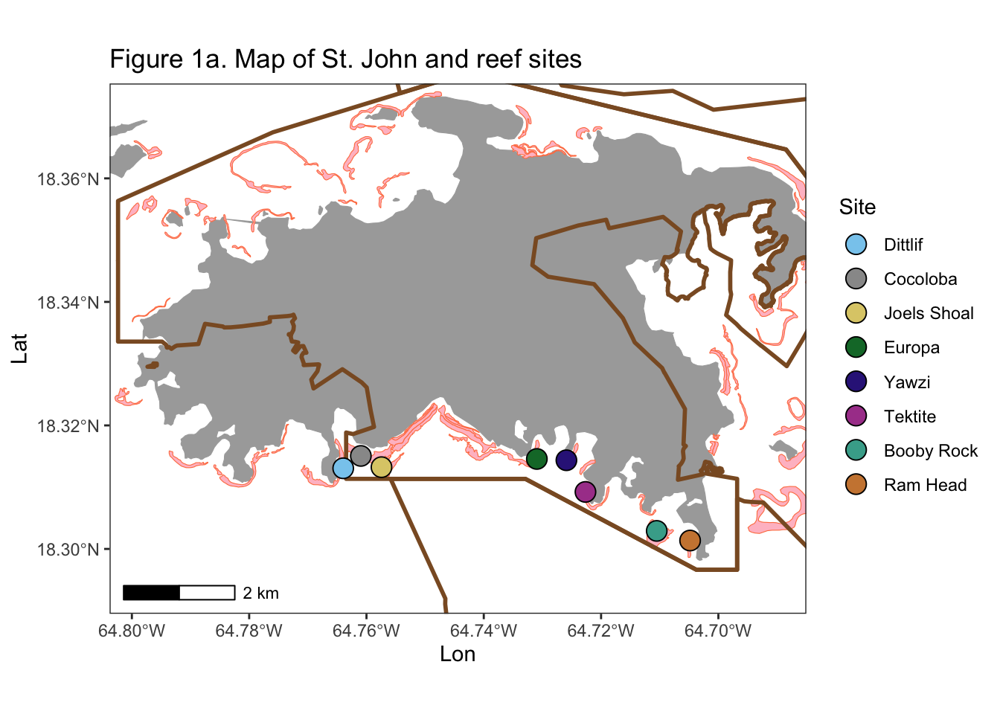

```r
#ggsave("figures/STJ_map_3.14.23.pdf")

benthic <- envdata %>%
  filter(site != "USVI Blue Water") %>%
  filter(yearmonth == "2016-06") %>%
  filter(depthtype == "benthic") %>%
  select(site, siteacronym, yearmonth, disturbance, BleachCoral:TurfAlgae) %>%
  select(-BleachCoral, -DiseasedCoral, -Ramicrusta) %>% #no need for these sections since they are zero
  mutate(site = factor(site, levels = c("Dittlif", "Cocoloba", "Joels Shoal", "Europa", "Yawzi", "Tektite", "Booby Rock", "Ram Head", "Sand patch"))) %>%
  filter(site != "Sand patch") %>% #no need to calculate sand patch stuff
  mutate(Algae = Macroalgae + TurfAlgae) %>%
  mutate(Coral = HardCoral + SoftCoral) %>%
  mutate(Other = Other + Sponge + Substrate + CCA + CYAN) %>%
  select(site, siteacronym, yearmonth, Algae, Coral, Other) %>%
  gather(key = "cover", value = "percent", Algae:Other) %>%
  mutate(cover = factor(cover, levels = c("Coral", "Algae", "Other")))

ggplot(benthic, aes(x = "", y = percent, fill = cover, color = site)) +
  geom_bar(width = 1, position = "fill", stat="identity", linewidth = 1.5) +
  coord_polar("y", start=0) +
  facet_wrap( ~ site, ncol = 8) +
  theme_void() +
  scale_color_manual(values = reefpalette) +
  scale_fill_manual(values = c("black", "gray70", "gray95")) +
  theme(legend.position = "bottom") +
  ggtitle("Figure 1a. Benthic cover at different reef sites")
```

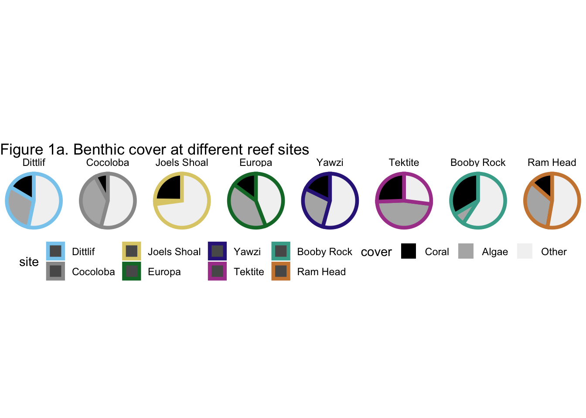

```r
#ggsave("figures/Benthic_piechart_June2016_3.14.23.pdf", width = 10)
```

# Figures 2-4, Environmental Data analysis

## Manipulate data

```r
## Look at pairwise correlation between the variables in all the environmental data
envdata2 <- envdata %>%       
  filter(site != "USVI Blue Water") %>%
  filter(site != "Sand patch") %>%
  mutate(TON = tn_um - (no2no3_um + nh4_um)) %>%
  mutate(no3_um = no2no3_um - no2_um) %>%
  dplyr::select(-Phaeo_ug_per_l, -no2no3_um, -tn_um, -temp_c, -salinity) %>%
  mutate(cellRatio = hbact_per_ml / (pro_per_ml + syn_per_ml + peuk_per_ml)) %>%
  mutate(Pro_fgC = pro_per_ml * 30) %>%
  mutate(Syn_fgC = syn_per_ml * 100) %>%
  mutate(Hbact_fgC = hbact_per_ml * 10) %>%
  mutate(biomassRatio = Hbact_fgC / (Pro_fgC + Syn_fgC)) %>%
  dplyr::select(-Pro_fgC, -Syn_fgC, -Hbact_fgC) %>%
  mutate(Chl_ug_per_l = ifelse(depthtype == "surface", NA, Chl_ug_per_l)) %>% #remove surface chlorophyll values
  mutate(BenthicAlgae = Ramicrusta + Macroalgae + TurfAlgae) %>% # choose true algae only, since CYAN aren't and ignore CCA b/c it is beneficial
  mutate(coral = HardCoral + SoftCoral) %>%
  mutate(AlgaeToCoral = BenthicAlgae / (HardCoral + SoftCoral)) %>%
  dplyr::select(-BleachCoral, -Other, -CYAN, -CCA, -DiseasedCoral, -Sponge, -Substrate) %>% # no need for non-coral or non-algae groups
  mutate(disturbance = factor(disturbance, levels = c("historic", "hurricane", "disease"))) %>%
  mutate(site = factor(site, levels = c("Dittlif", "Cocoloba", "Joels Shoal", "Europa", "Yawzi", "Tektite", "Booby Rock", "Ram Head"))) %>%
  mutate(disturbance = factor(disturbance, levels = c("historic", "hurricane", "disease"))) 

env.long <- envdata2 %>%
  gather(key = "datatype", value = "value", npoc_um:AlgaeToCoral) %>%
  drop_na(value)

# Remove outliers for the likely erroneously high Chl, ammonium, nitrate, and npoc, since this could cause significant relationships when there potentially are none. This way I am being more cautious. Outliers are ±3 std deviations away from the mean. Remove them.
envdata_olrm <- env.long %>%
  filter(datatype %in% c("Chl_ug_per_l", "nh4_um", "no3_um", "npoc_um")) %>%
  group_by(datatype) %>%
  filter(!(abs(value - median(value)) > 3*sd(value)))

# Add the envdata_olrm back to the env.long dataframe
env.long.olrm <- env.long %>%
  filter(datatype != "Chl_ug_per_l") %>%
  filter(datatype != "nh4_um") %>%
  filter(datatype != "no3_um") %>%
  filter(datatype != "npoc_um") %>%
  bind_rows(envdata_olrm)
```


## Are surface and benthic values distinct?

```r
# For the benthic data. Do a shapiro-wilk test to test for normality. If normal, do an ANOVA followed by a Tukey HSD post-hoc test. 
surfacebenthic.long <- env.long.olrm %>%
  filter(datatype %in% c("po4_um",
                         "silicate_um",
                         "no2_um",
                         "pro_per_ml",
                         "syn_per_ml",
                         "peuk_per_ml",
                         "hbact_per_ml",
                         "TON",
                         "cellRatio",
                         "biomassRatio",
                         "npoc_um",
                         "nh4_um",
                         "no3_um")) %>%
  filter(value != "Inf")

#check data are normally distributed
normal <- surfacebenthic.long %>%
  group_by(datatype, depthtype) %>%
  do(tidy(shapiro.test(.$value))) %>% 
  ungroup() %>%
  mutate(normal = ifelse(p.value < 0.05, "not_normal", "yes_normal")) %>%
  dplyr::select(datatype, depthtype, normal) %>%
  spread(key = "depthtype", value = "normal")

# Check for homogeneity of variances. This is an assumption of the ANOVA test
variance <- surfacebenthic.long %>%
  group_by(datatype) %>%
  levene_test(value ~ disturbance, center = median) %>% 
  mutate(equalvariance = ifelse(p < 0.05, "no", "yes")) %>%
  dplyr::select(datatype, equalvariance)

# t-test results
ttest <- surfacebenthic.long %>%
  group_by(datatype) %>%
  t_test(value ~ depthtype) %>%
  mutate(t.test.sig = ifelse(p < 0.05, "yes", "no")) %>%
  dplyr::select(datatype, p, t.test.sig)

# Do wilcox test, which is a non-parametric alternative to a t-test
wilcox <- surfacebenthic.long %>%
  group_by(datatype) %>%
  wilcox_test(value ~ depthtype) %>%
  mutate(Wilcox.Sig = ifelse(p < 0.05, "yes", "no")) %>%
  dplyr::select(datatype, p, Wilcox.Sig)

surf_benth_envdata_results <- normal %>%
  left_join(variance, by = "datatype") %>%
  left_join(ttest, by = "datatype") %>%
  left_join(wilcox, by = "datatype") %>%
  mutate(test2use = ifelse(surface == "yes_normal" & benthic == "yes_normal" & equalvariance == "yes", "ttest", "wicox")) %>%
  mutate(Significant = ifelse(test2use == "ttest", t.test.sig, Wilcox.Sig)) %>%
  mutate(p = ifelse(test2use == "ttest", p.x, p.y)) %>%
  dplyr::select(datatype, benthic, surface, test2use, Significant, p)

kable(surf_benth_envdata_results)
```


|datatype     |benthic    |surface    |test2use |Significant |       p|
|:------------|:----------|:----------|:--------|:-----------|-------:|
|biomassRatio |not_normal |not_normal |wicox    |no          | 0.99600|
|cellRatio    |not_normal |not_normal |wicox    |no          | 0.98800|
|hbact_per_ml |yes_normal |not_normal |wicox    |yes         | 0.00747|
|nh4_um       |not_normal |not_normal |wicox    |no          | 0.79600|
|no2_um       |yes_normal |yes_normal |ttest    |no          | 0.18800|
|no3_um       |not_normal |not_normal |wicox    |yes         | 0.00478|
|npoc_um      |not_normal |not_normal |wicox    |no          | 0.21400|
|peuk_per_ml  |not_normal |not_normal |wicox    |no          | 0.42400|
|po4_um       |not_normal |not_normal |wicox    |no          | 0.33000|
|pro_per_ml   |not_normal |not_normal |wicox    |no          | 0.33100|
|silicate_um  |yes_normal |not_normal |wicox    |no          | 0.89600|
|syn_per_ml   |yes_normal |not_normal |wicox    |no          | 0.35200|
|TON          |yes_normal |yes_normal |wicox    |no          | 0.13000|
## ANOVA or Kruskal Wallis tests

Based on the previous results it makes sense to combine the benthic and surface values. Most of the values are NOT different between surface and benthic. Since they aren't much different, I will combine them for the ANOVA and Kruskal-Wallis tests. This will make it easier to interpret and actually addresses the main questions I am interested in.

Default asterisk values are as follows:
<0.05 = *
<0.01 = **
<0.001 = ***
<0.0001 = ****


```r
env.data.foranalysis <- env.long.olrm %>%
  filter(datatype != "SCTLDprevalence") %>%
  filter(datatype != "BenthicAlgae") %>%
  filter(datatype != "coral") %>%
  filter(datatype != "cellRatio") %>%
  drop_na(value) %>%
  filter(value != "Inf")

# check if data are normally distributed. This is an assumption of the ANOVA test
normal <- env.data.foranalysis %>%
  group_by(datatype, disturbance) %>%
  shapiro_test(value) %>% 
  mutate(normal = ifelse(p < 0.05, "not_normal", "yes_normal")) %>%
  dplyr::select(datatype, disturbance, normal) %>%
  spread(key = "disturbance", value = "normal")

# Check for homogeneity of variances. This is an assumption of the ANOVA test
variance <- env.data.foranalysis %>%
  group_by(datatype) %>%
  levene_test(value ~ disturbance, center = median) %>% 
  mutate(equalvariance = ifelse(p < 0.05, "no", "yes")) %>%
  dplyr::select(datatype, equalvariance)

# ANOVA results
anova <- env.data.foranalysis %>%
  group_by(datatype) %>%
  do(tidy(aov(.$value ~ .$disturbance))) %>%
  filter(term == ".$disturbance") %>%
  mutate(sig05 = ifelse(p.value < 0.05, "yes", "no")) %>%
  dplyr::select(datatype, sig05, p.value) %>%
  dplyr::rename(p = p.value)

# Pairwise results with the Tukey Honest significant differences
ANOVA.tukey <- env.data.foranalysis %>%
  group_by(datatype) %>%
  tukey_hsd(value ~ disturbance) %>%
  mutate(TukeyHSDtest = paste0(group1, "-", group2), 
         p.adj.signif = paste("Tukey", p.adj.signif)) %>%
  dplyr::select(datatype, TukeyHSDtest, p.adj.signif) %>%
  spread(key = "TukeyHSDtest", value = "p.adj.signif") %>%
  left_join(anova, by = "datatype")

# Do kruskal wallis test since for many of the variables, the assumptions are not met for an ANOVA
KW <- env.data.foranalysis %>%
  group_by(datatype) %>%
  kruskal_test(value ~ disturbance) %>%
  mutate(sig05 = ifelse(p < 0.05, "yes", "no")) %>%
  dplyr::select(datatype, sig05, p)

# Dunns post-hoc test
KW.dunn <- env.data.foranalysis %>%
  group_by(datatype) %>%
  dunn_test(value ~ disturbance) %>%
  mutate(DunnPostHoc = paste0(group1, "-", group2), 
         p.adj.signif = paste("Dunn", p.adj.signif)) %>%
  dplyr::select(datatype, DunnPostHoc, p.adj.signif) %>%
  spread(key = "DunnPostHoc", value = "p.adj.signif") %>%
  left_join(KW, by = "datatype")

#put it all together and summarize p-values
statresults <- normal %>%
  left_join(variance, by = "datatype") %>%
  mutate(test2use = ifelse(historic == "yes_normal" & hurricane == "yes_normal" & disease == "yes_normal" & equalvariance == "yes", "ANOVA", "Kruskal-Wallis"))

statresults.ANOVA <- statresults %>%
  filter(test2use == "ANOVA") %>%
  left_join(ANOVA.tukey, by = "datatype")

statresults.KW <- statresults %>%
  filter(test2use == "Kruskal-Wallis") %>%
  left_join(KW.dunn, by = "datatype")

statsummaries <- bind_rows(statresults.ANOVA, statresults.KW) %>%
  mutate(sig01 = ifelse(p < 0.01, "yes", "no")) %>%
  mutate(sigBonf = ifelse(p < (0.05/nrow(statresults)), "yes", "no"))

kable(statsummaries)
```


|datatype     |historic   |hurricane  |disease    |equalvariance |test2use       |historic-disease |historic-hurricane |hurricane-disease |sig05 |         p|sig01 |sigBonf |
|:------------|:----------|:----------|:----------|:-------------|:--------------|:----------------|:------------------|:-----------------|:-----|---------:|:-----|:-------|
|Macroalgae   |yes_normal |yes_normal |yes_normal |yes           |ANOVA          |Tukey ns         |Tukey ns           |Tukey *           |yes   | 0.0379295|no    |no      |
|no2_um       |yes_normal |yes_normal |yes_normal |yes           |ANOVA          |Tukey ns         |Tukey ns           |Tukey ns          |no    | 0.6328373|no    |no      |
|AlgaeToCoral |yes_normal |not_normal |not_normal |yes           |Kruskal-Wallis |Dunn *           |Dunn ns            |Dunn ns           |yes   | 0.0330000|no    |no      |
|biomassRatio |yes_normal |not_normal |not_normal |yes           |Kruskal-Wallis |Dunn ***         |Dunn ns            |Dunn ***          |yes   | 0.0000710|yes   |yes     |
|Chl_ug_per_l |not_normal |yes_normal |yes_normal |yes           |Kruskal-Wallis |Dunn ns          |Dunn ns            |Dunn *            |yes   | 0.0330000|no    |no      |
|HardCoral    |yes_normal |not_normal |not_normal |yes           |Kruskal-Wallis |Dunn ns          |Dunn ns            |Dunn ns           |no    | 0.0611000|no    |no      |
|hbact_per_ml |yes_normal |not_normal |yes_normal |yes           |Kruskal-Wallis |Dunn ns          |Dunn ns            |Dunn ns           |no    | 0.1190000|no    |no      |
|nh4_um       |not_normal |not_normal |not_normal |no            |Kruskal-Wallis |Dunn ****        |Dunn ns            |Dunn ****         |yes   | 0.0000000|yes   |yes     |
|no3_um       |not_normal |not_normal |not_normal |no            |Kruskal-Wallis |Dunn ns          |Dunn ns            |Dunn ns           |no    | 0.3410000|no    |no      |
|npoc_um      |not_normal |not_normal |not_normal |yes           |Kruskal-Wallis |Dunn ns          |Dunn ns            |Dunn ns           |no    | 0.1520000|no    |no      |
|peuk_per_ml  |not_normal |not_normal |not_normal |yes           |Kruskal-Wallis |Dunn ***         |Dunn ***           |Dunn ns           |yes   | 0.0000340|yes   |yes     |
|po4_um       |not_normal |not_normal |not_normal |no            |Kruskal-Wallis |Dunn ns          |Dunn ****          |Dunn ****         |yes   | 0.0000000|yes   |yes     |
|pro_per_ml   |not_normal |not_normal |not_normal |no            |Kruskal-Wallis |Dunn ****        |Dunn ns            |Dunn ****         |yes   | 0.0000002|yes   |yes     |
|Ramicrusta   |not_normal |not_normal |not_normal |yes           |Kruskal-Wallis |Dunn **          |Dunn ns            |Dunn **           |yes   | 0.0005430|yes   |yes     |
|silicate_um  |not_normal |not_normal |not_normal |no            |Kruskal-Wallis |Dunn ns          |Dunn ****          |Dunn ****         |yes   | 0.0000000|yes   |yes     |
|SoftCoral    |not_normal |not_normal |not_normal |yes           |Kruskal-Wallis |Dunn ns          |Dunn ns            |Dunn ns           |no    | 0.4770000|no    |no      |
|syn_per_ml   |not_normal |yes_normal |yes_normal |yes           |Kruskal-Wallis |Dunn ns          |Dunn ns            |Dunn ns           |no    | 0.9840000|no    |no      |
|TON          |yes_normal |yes_normal |yes_normal |no            |Kruskal-Wallis |Dunn **          |Dunn ns            |Dunn ns           |yes   | 0.0028100|yes   |no      |
|TurfAlgae    |not_normal |not_normal |not_normal |yes           |Kruskal-Wallis |Dunn ****        |Dunn ns            |Dunn ***          |yes   | 0.0000012|yes   |yes     |

## Benthic changes with disturbance


```r
## Conduct a PCA
benthic <- envdata %>%
  filter(site != "USVI Blue Water") %>%
  dplyr::select(Date, site, siteacronym, depthtype, yearmonth, disturbance, BleachCoral, CCA, CYAN, DiseasedCoral, HardCoral, Macroalgae, Other, Ramicrusta, SoftCoral, Sponge, Substrate, TurfAlgae) %>%
  mutate(site = factor(site, levels = c("Dittlif", "Cocoloba", "Joels Shoal", "Europa", "Yawzi", "Tektite", "Booby Rock", "Ram Head", "Sand patch"))) %>%
  drop_na(HardCoral) %>%
  filter(site != "Sand patch") %>% #no need to calculate sand patch stuff
  mutate(Other = Other + BleachCoral) %>%
  dplyr::select(-BleachCoral) #no need for this section

# Prep the benthic data 
pca_data_short_final <- as.matrix(benthic) #change from tibble to matrix
rownames(pca_data_short_final) <- pca_data_short_final[,3] #make rownames the unique sites
pca_data_short_final <- pca_data_short_final[,7:17] #select numeric variables
class(pca_data_short_final) <- "numeric" #change from character to numeric values for pca

#Do the PCA
pca <- PCA(pca_data_short_final, scale.unit=TRUE, graph = FALSE) #performs the Principal component analysis #scale.unit=TRUE then data are scaled to unit variance

# how many dimensions explain the data?
# fviz_eig(pca) #1st dimension is most. 2,3,and 4 are a lot of them too

#All pca values for density plots to acompany the ggplot summary figure
pcaAll <- cbind(benthic, pca$ind$coord[,1:2]) %>%
  mutate(disturbance = factor(disturbance, levels = c("historic", "hurricane", "disease")))

pcaplot2 <- ggscatter(pcaAll, x = "Dim.1", y = "Dim.2", color = "disturbance", size = 4, alpha = 0.7, palette = "Dark2") +
  labs(x = "PC1 (27.2%)", y = "PC2 (15.2%)") +
  border()+
  theme(legend.position = "none")

cx <- ggplot(pcaAll, aes(x = disturbance, y = Dim.1, fill = disturbance)) +
  geom_boxplot() +
  scale_fill_brewer(palette = "Dark2") +
  rotate() +
  clean_theme()+
  theme(legend.position = "none")

dy <- ggplot(pcaAll, aes(x = disturbance, y = Dim.2, fill = disturbance)) +
  geom_boxplot() +
  scale_fill_brewer(palette = "Dark2") +
  clean_theme() +
  theme(legend.position = "none")

## Create graphs of significant and not significant variables from ANOVA and Kruskal-Wallis tests
benthic_vars <- c("HardCoral","Macroalgae","Ramicrusta","SoftCoral","TurfAlgae")

benthic_sigvars <- c("Macroalgae","Ramicrusta","TurfAlgae")

benthic_notsigvars <- c("HardCoral","SoftCoral")

benthic.forFigures <- env.long.olrm %>%
  filter(datatype %in% benthic_vars) %>%
  drop_na(value) %>%
  mutate(datatype = factor(datatype, levels = c("Ramicrusta","TurfAlgae","Macroalgae","HardCoral","SoftCoral")))

sig <- benthic.forFigures %>%
  filter(datatype %in% benthic_sigvars) %>%
  mutate(datatype = factor(datatype, levels = c("Ramicrusta","TurfAlgae","Macroalgae")))

notsig <- benthic.forFigures %>%
  filter(datatype %in% benthic_notsigvars) %>%
  mutate(datatype = factor(datatype, levels = c("HardCoral","SoftCoral")))

# significantly changing by disturbance (p<0.05 and <bonf corrected p)
bplot <- ggplot(sig, aes(x = disturbance, y = value)) +
  geom_boxplot(outlier.shape = NA) +
  geom_jitter(position = position_jitter(width=.1, height=0), aes(colour = disturbance), size = 3, alpha = 0.7) +
  labs(y = "Relative cover", x = "Disturbance event", color = "Disturbance") +
  theme(axis.text.x = element_text(angle = 45, hjust = 1, vjust = 1)) +
  scale_color_brewer(palette = "Dark2") +
  facet_wrap( ~ datatype, scales = "free_y", ncol = 2)

# FIGURE 2

# Arranging the plot
fig2 <- ggarrange(ggarrange(cx, NULL, pcaplot2, dy, 
          ncol = 2, nrow = 2,  align = "hv", 
          widths = c(4,1), heights = c(1, 4)), 
          bplot, labels = c("a.", "b."))
annotate_figure(fig2, top = "Figure 2. Benthic composition at eight reefs significantly changed with disturbances")
```

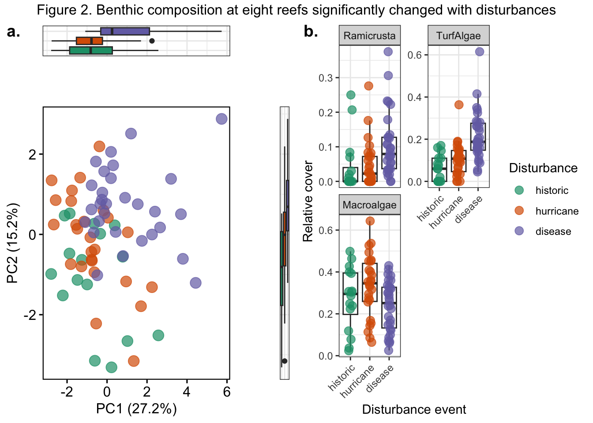

```r
#Use vegan for the benthic pca stuff - PCAs are made with euclidian distance so use adonis function but make sure method = "eu"
# Interested in how environmental variables influence benthic composition
site <- adonis2(pca_data_short_final ~ site, data = benthic, method = "eu")
site
```

```
## Permutation test for adonis under reduced model
## Terms added sequentially (first to last)
## Permutation: free
## Number of permutations: 999
## 
## adonis2(formula = pca_data_short_final ~ site, data = benthic, method = "eu")
##          Df SumOfSqs      R2      F Pr(>F)    
## site      7   1.7506 0.34489 4.8135  0.001 ***
## Residual 64   3.3252 0.65511                  
## Total    71   5.0759 1.00000                  
## ---
## Signif. codes:  0 '***' 0.001 '**' 0.01 '*' 0.05 '.' 0.1 ' ' 1
```

```r
dist <- adonis2(pca_data_short_final ~ disturbance, data = benthic, method = "eu")
dist
```

```
## Permutation test for adonis under reduced model
## Terms added sequentially (first to last)
## Permutation: free
## Number of permutations: 999
## 
## adonis2(formula = pca_data_short_final ~ disturbance, data = benthic, method = "eu")
##             Df SumOfSqs      R2      F Pr(>F)    
## disturbance  2   1.0434 0.20556 8.9268  0.001 ***
## Residual    69   4.0325 0.79444                  
## Total       71   5.0759 1.00000                  
## ---
## Signif. codes:  0 '***' 0.001 '**' 0.01 '*' 0.05 '.' 0.1 ' ' 1
```

```r
date <- adonis2(pca_data_short_final ~ Date, data = benthic, method = "eu")
date
```

```
## Permutation test for adonis under reduced model
## Terms added sequentially (first to last)
## Permutation: free
## Number of permutations: 999
## 
## adonis2(formula = pca_data_short_final ~ Date, data = benthic, method = "eu")
##          Df SumOfSqs      R2      F Pr(>F)    
## Date      1   0.9907 0.19518 16.977  0.001 ***
## Residual 70   4.0851 0.80482                  
## Total    71   5.0759 1.00000                  
## ---
## Signif. codes:  0 '***' 0.001 '**' 0.01 '*' 0.05 '.' 0.1 ' ' 1
```

```r
# not significantly changing benthic variables
ggplot(notsig, aes(x = disturbance, y = value)) +
  geom_boxplot(outlier.shape = NA) +
  geom_jitter(position = position_jitter(width=.1, height=0), aes(colour = disturbance), size = 3, alpha = 0.7) +
  labs(y = "Relative cover", x = "Disturbance event", color = "Disturbance", title = "Supplementary Figure S2") +
  theme(axis.text.x = element_text(angle = 45, hjust = 1, vjust = 1)) +
  scale_color_brewer(palette = "Dark2") +
  facet_wrap( ~ datatype, scales = "free_y")
```

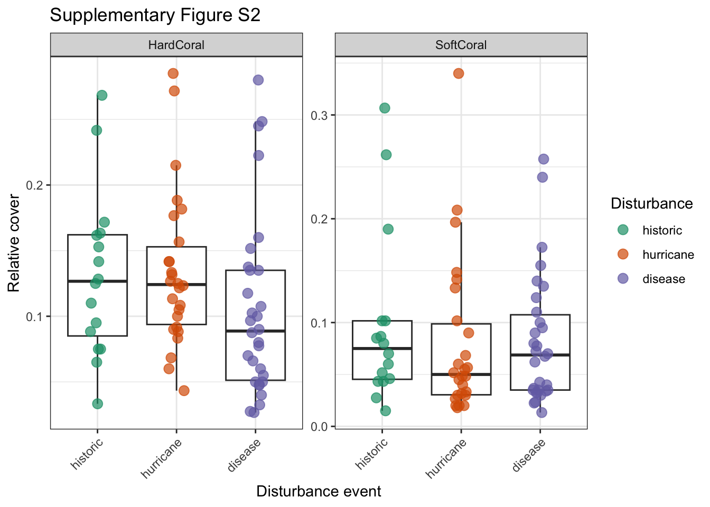

```r
# phase shift diagram
phaseshift <- env.long.olrm %>%
  filter(datatype %in% c("BenthicAlgae", "coral", "AlgaeToCoral")) %>%
  spread(key = "datatype", value = "value")

phase <- ggplot(phaseshift, aes(x = coral, y = BenthicAlgae, color = disturbance)) +
  geom_point(size = 4, alpha = 0.8) +
  scale_color_brewer(palette = "Dark2") +
  labs(x = "Hard and soft coral cover", y = "Algal cover", color = "Disturbance", title = "Figure S3")

ratio <- ggplot(phaseshift, aes(x = disturbance, y = AlgaeToCoral)) +
  geom_boxplot(outlier.shape = NA) +
  geom_jitter(position = position_jitter(width=.1, height=0), aes(colour = disturbance), size = 3, alpha = 0.7) +
  labs(y = "Ratio of algae to coral", x = "Disturbance event", color = "Disturbance", title = "Figure S3") +
  theme(axis.text.x = element_text(angle = 45, hjust = 1, vjust = 1)) +
  scale_color_brewer(palette = "Dark2") 

ggarrange(phase, ratio, ncol = 2, labels = c("a.",  "b."), common.legend = TRUE) + 
  ggtitle("Supplementary Figure S3")
```

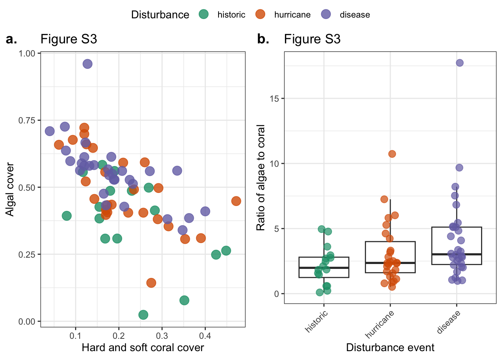
By what percent did hard coral decrease from the hurricane period to the end of the study in the disease period? Average (within reefs) hurricane values and disease values and get a percent per reef before and after.

```r
hardcoral <- benthic.forFigures %>%
  filter(datatype == "HardCoral") %>%
  filter(disturbance != "historic") %>%
  group_by(disturbance, site) %>%
  summarise(avg_HardCoral = mean(value)) %>%
  tidyr::spread(key = disturbance, value = avg_HardCoral) %>%
  mutate(coral_change = hurricane - disease) %>%
  mutate(percent_decrease = (coral_change / hurricane)* 100)
```

```
## `summarise()` has grouped output by 'disturbance'. You can override using the
## `.groups` argument.
```

```r
kable(hardcoral)
```


|site        | hurricane|   disease| coral_change| percent_decrease|
|:-----------|---------:|---------:|------------:|----------------:|
|Dittlif     | 0.1438889| 0.1316667|    0.0122222|         8.494208|
|Cocoloba    | 0.0933333| 0.0563889|    0.0369444|        39.583333|
|Joels Shoal | 0.1488889| 0.0596250|    0.0892639|        59.953358|
|Europa      | 0.0866667| 0.0733333|    0.0133333|        15.384615|
|Yawzi       | 0.1444444| 0.1041667|    0.0402778|        27.884615|
|Tektite     | 0.2572222| 0.2270833|    0.0301389|        11.717063|
|Booby Rock  | 0.1305556| 0.0845000|    0.0460556|        35.276596|
|Ram Head    | 0.0922222| 0.0825000|    0.0097222|        10.542169|


## Nutrient changes with disturbance


```r
nuts_vars <- c("po4_um","silicate_um","no2_um", "TON", "npoc_um","nh4_um","Chl_ug_per_l","no3_um")

nuts_sigvars <- c("po4_um","silicate_um","TON","nh4_um","Chl_ug_per_l")

nuts_notsigvars <- c("no2_um", "npoc_um", "no3_um")

nuts.forFigures <- env.long.olrm %>%
  filter(datatype %in% nuts_vars) %>%
  drop_na(value) %>%
  mutate(datatype = factor(datatype, levels = c("nh4_um","TON","Chl_ug_per_l","po4_um","silicate_um", "npoc_um","no2_um", "no3_um")))

sig <- nuts.forFigures %>%
  filter(datatype %in% nuts_sigvars) %>%
  mutate(datatype = factor(datatype, levels = c("nh4_um","TON","Chl_ug_per_l","po4_um","silicate_um")))

notsig <- nuts.forFigures %>%
  filter(datatype %in% nuts_notsigvars) %>%
  mutate(datatype = factor(datatype, levels = c("npoc_um","no2_um", "no3_um")))

# significantly changing by disturbance (p<0.05 and <bonf corrected p)
ggplot(sig, aes(x = disturbance, y = value)) +
  geom_boxplot(outlier.shape = NA) +
  geom_jitter(position = position_jitter(width=.1, height=0), aes(colour = disturbance), size = 3, alpha = 0.7) +
  labs(y = "Concentration", x = "Disturbance event", color = "Disturbance", title = "Figure 3.") +
  theme(axis.text.x = element_text(angle = 45, hjust = 1, vjust = 1)) +
  scale_color_brewer(palette = "Dark2") +
  facet_wrap( ~ datatype, scales = "free_y")
```


```r
#ggsave("../figures/Nutrients_significant.pdf")

# not significantly changing
ggplot(notsig, aes(x = disturbance, y = value)) +
  geom_boxplot(outlier.shape = NA) +
  geom_jitter(position = position_jitter(width=.1, height=0), aes(colour = disturbance), size = 3, alpha = 0.7) +
  labs(y = "Concentration", x = "Disturbance event", color = "Disturbance", title = "Supplementary Figure S4") +
  theme(axis.text.x = element_text(angle = 45, hjust = 1, vjust = 1)) +
  scale_color_brewer(palette = "Dark2") +
  facet_wrap( ~ datatype, scales = "free_y")
```


```r
#ggsave("../figures/Nutrients_NOT_sig.pdf")
```

## Cell abundance changes with disturbance


```r
cells_vars <- c("pro_per_ml","syn_per_ml","peuk_per_ml","hbact_per_ml","biomassRatio")

cells_sigvars <- c("pro_per_ml","peuk_per_ml","biomassRatio")

cells_notsigvars <- c("syn_per_ml","hbact_per_ml")

cells.forFigures <- env.long.olrm %>%
  filter(datatype %in% cells_vars) %>%
  drop_na(value) %>%
  mutate(datatype = factor(datatype, levels = c("pro_per_ml","peuk_per_ml","syn_per_ml","hbact_per_ml","biomassRatio")))

sig <- cells.forFigures %>%
  filter(datatype %in% cells_sigvars) %>%
  mutate(datatype = factor(datatype, levels = c("pro_per_ml","peuk_per_ml","biomassRatio")))

notsig <- cells.forFigures %>%
  filter(datatype %in% cells_notsigvars) %>%
  mutate(datatype = factor(datatype, levels = c("syn_per_ml","hbact_per_ml")))

# significantly changing by disturbance (p<0.05 and <bonf corrected p)
ggplot(sig, aes(x = disturbance, y = value)) +
  geom_boxplot(outlier.shape = NA) +
  geom_jitter(position = position_jitter(width=.1, height=0), aes(colour = disturbance), size = 3, alpha = 0.7) +
  labs(y = "Abundance (cells per milliliter)", x = "Disturbance event", color = "Disturbance", title = "Figure 4") +
  theme(axis.text.x = element_text(angle = 45, hjust = 1, vjust = 1)) +
  scale_color_brewer(palette = "Dark2") +
  facet_wrap( ~ datatype, scales = "free_y")
```


```r
#ggsave("../figures/Cells_sig_disturbance.pdf")

# not significantly changing
ggplot(notsig, aes(x = disturbance, y = value)) +
  geom_boxplot(outlier.shape = NA) +
  geom_jitter(position = position_jitter(width=.1, height=0), aes(colour = disturbance), size = 3, alpha = 0.7) +
  labs(y = "Abundance (cells per milliliter)", x = "Disturbance event", color = "Disturbance", title = "Figure S6") +
  theme(axis.text.x = element_text(angle = 45, hjust = 1, vjust = 1)) +
  scale_color_brewer(palette = "Dark2") +
  facet_wrap( ~ datatype, scales = "free_y")
```


```r
#ggsave("../figures/Cells_NOT_sig_disturbance.pdf")
```

By what percent did prochlorococcus decrease between historic and disease time points? Average (within reefs) historic values and disease values and get a percent per reef before and after. This shows the cumulative change in prochlorococcus over the course ofthe study. 

```r
pro_cumulative_change <- cells.forFigures %>%
  filter(datatype == "pro_per_ml") %>%
  filter(disturbance != "hurricane") %>%
  group_by(disturbance, site) %>%
  summarise(avg_Pro = mean(value)) %>%
  tidyr::spread(key = disturbance, value = avg_Pro) %>%
  mutate(Pro_change = historic - disease) %>%
  mutate(percent_decrease = (Pro_change / historic)* 100)
```

```
## `summarise()` has grouped output by 'disturbance'. You can override using the
## `.groups` argument.
```

```r
kable(pro_cumulative_change)
```


|site        | historic|   disease| Pro_change| percent_decrease|
|:-----------|--------:|---------:|----------:|----------------:|
|Dittlif     | 45927.25| 12760.816|   33166.43|         72.21515|
|Cocoloba    | 39569.24| 10383.167|   29186.07|         73.75950|
|Joels Shoal | 63707.52| 37562.939|   26144.58|         41.03845|
|Europa      | 49433.20|  5915.494|   43517.71|         88.03336|
|Yawzi       | 50497.56| 30456.892|   20040.67|         39.68641|
|Tektite     | 54505.37| 37414.004|   17091.37|         31.35722|
|Booby Rock  | 63652.15| 39009.527|   24642.62|         38.71452|
|Ram Head    | 57219.43| 31732.839|   25486.60|         44.54185|


# Alpha and beta diversity analyses

## Alpha diversity

### Does depth influence alpha diversity?

```r
#set levels
sample_data(ps)$date <- as.Date(sample_data(ps)$date)
sample_data(ps)$site <- factor(sample_data(ps)$site, levels = c("Dittlif", "Cocoloba", "Joels Shoal", "Europa", "Yawzi", "Tektite", "Booby Rock", "Ram Head", "Sand patch"))
sample_data(ps)$disturbance <- factor(sample_data(ps)$disturbance, levels = c("historic", "hurricane", "disease"))
sample_data(ps)$depthtype <- factor(sample_data(ps)$depthtype, levels = c("benthic", "surface"))

### Does Alpha diversity change with depth?? ###
# estimate richness
richness <- ps %>% breakaway        # estimate true richness

# Do inference on richness - I hypothesize that richness changes with depth
meta_richness <- ps %>%
  sample_data %>%
  as_tibble %>%
  mutate("sample_names" = ps %>% sample_names) %>%
  left_join(summary(richness),
            by = "sample_names") 

# Test the effect of depth on estimated richness
bt_depth_fixed <- betta(formula = estimate ~ depthtype, 
                      ses = error, data = meta_richness)
bt_depth_fixed$table
```

```
##                  Estimates Standard Errors p-values
## (Intercept)      317.68087        3.057728        0
## depthtypesurface -22.36315        4.377124        0
```

```r
bt_depth_fixed$global[2]
```

```
## [1] 0
```

```r
alphadepth <- ggplot(meta_richness, aes(x = depthtype, y = estimate)) +
  geom_boxplot(outlier.shape = NA) +
  geom_jitter(position = position_jitter(width=.1, height=0), aes(colour = depthtype, shape = disturbance), size = 3, alpha = 0.7) +
  labs(y = "Breakaway estimate of richness", x = "Disturbance", color = "Depth", shape = "Disturbance", 
       title = "Benthic microbial richness changes with disturbance") +
  theme(panel.grid.minor = element_blank(), 
        panel.background = element_blank()) +
  theme(axis.text.x = element_text(angle = 45, hjust = 1, vjust = 1))
```
Based on this, alpha diversity significantly changes with depth, therefore, I will split up the alpha diversity analyses. 

### Benthic - Does disturbance and reef influence alpha diversity?

```r
## BENTHIC ANALYSIS FIRST #####
ps.a_benthic <- ps %>%
  subset_samples(site != "Sand patch") %>%  # get rid of sandpatch
  subset_samples(depth == "Benthic")        # only interested in benthic data

benthic_richness <- ps.a_benthic %>% breakaway        # estimate true richness

# Do inference on richness - I hypothesize that richness changes by reef and disturbance
benthic_meta_richness <- ps.a_benthic %>%
  sample_data %>%
  as_tibble %>%
  mutate("sample_names" = ps.a_benthic %>% sample_names) %>%
  left_join(summary(benthic_richness),
            by = "sample_names")

# Test the effect of Reef (site), disturbance, and disturbance with reef as a random effect
set.seed(100)
bt_site_fixed <- betta(formula = estimate ~ site, 
                      ses = error, data = benthic_meta_richness)
bt_site_fixed$table
```

```
##                  Estimates Standard Errors p-values
## (Intercept)     356.898607        5.196239    0.000
## siteCocoloba    -19.381770       15.128294    0.200
## siteJoels Shoal -54.434820       14.151207    0.000
## siteEuropa       -7.745673       15.128318    0.609
## siteYawzi       -20.524564       14.455543    0.156
## siteTektite     -49.406088       14.151186    0.000
## siteBooby Rock  -80.214826       14.780399    0.000
## siteRam Head    -64.855645       14.455570    0.000
```

```r
bt_site_fixed$global[2] # get global p-value to see if there are changes across all reefs
```

```
## [1] 0
```

```r
bt_disturbance_fixed <- betta(formula = estimate ~ disturbance, 
                      ses = error, data = benthic_meta_richness)
bt_disturbance_fixed$table
```

```
##                      Estimates Standard Errors p-values
## (Intercept)          324.40004        5.476359    0.000
## disturbancehurricane  21.05442       10.891716    0.053
## disturbancedisease   -28.72136        8.860273    0.001
```

```r
bt_disturbance_fixed$global[2] # get global p-value to see if there are overall changes across disturbance
```

```
## [1] 0
```

```r
# check if the richness changes with disturbance within each reef site (adding in random effects)
bt_disturbance_fixed_site_random <- betta_random(chats = benthic_meta_richness$estimate,
                                       ses = benthic_meta_richness$error,
                                       X = model.matrix(~ disturbance, data = benthic_meta_richness),
                                       groups = benthic_meta_richness$site)
bt_disturbance_fixed_site_random$table
```

```
##                      Estimates Standard Errors p-values
## (Intercept)          310.04255        4.242080    0.000
## disturbancehurricane  13.16257        8.388385    0.117
## disturbancedisease   -16.69561        6.931589    0.016
```

```r
bt_disturbance_fixed_site_random$global[2]
```

```
## [1] 0
```

```r
## Make graphs that display the different alpha diversity metrics:

b <- ggplot(benthic_meta_richness, aes(x = disturbance, y = estimate)) +
  geom_boxplot(outlier.shape = NA) +
  geom_jitter(position = position_jitter(width=.1, height=0), aes(colour = disturbance), size = 3, alpha = 0.7) +
  labs(y = "Breakaway estimate of richness", x = "Disturbance", color = "Disturbance", 
       title = "Figure 5b. Benthic richness") +
  scale_color_brewer(palette = "Dark2") +
  theme(panel.grid.minor = element_blank(), 
        panel.background = element_blank()) +
  theme(axis.text.x = element_text(angle = 45, hjust = 1, vjust = 1))


# Graph disturbance and reef together
c <- ggplot(benthic_meta_richness, aes(x = disturbance, y = estimate)) +
  geom_boxplot(outlier.shape = NA) +
  geom_jitter(position = position_jitter(width=.1, height=0), aes(color = disturbance), size = 3, alpha = 0.7)+
  facet_wrap(~ site, ncol = 8) +
  labs(y = "Breakaway estimate of richness", x = "Disturbance", color = "Disturbance", 
       title = "Figure S8 b. Benthic microbial richness changes with disturbance") +
  scale_color_brewer(palette = "Dark2") +
  theme(panel.grid.minor = element_blank(), 
        panel.background = element_blank(),
        legend.position = "none") +
  theme(axis.text.x = element_text(angle = 45, hjust = 1, vjust = 1))


# Can I get individual p-values and tests of changes in richness on the disturbance within each reef for benthic waters?
reefs <- benthic_meta_richness$site %>% unique %>% as.character()

betta_disturbance_results <- list()
global_p <- c()
for (i in 1:length(reefs)) {
  reefdata <- benthic_meta_richness %>% 
    filter(site == reefs[i])
  bt_disturbance_reef <- betta(formula = estimate ~ disturbance, 
                      ses = error, data = reefdata)
  bt_disturbance_reef_table <- bt_disturbance_reef$table
  betta_disturbance_results[[i]] <- bt_disturbance_reef_table
  pval <- bt_disturbance_reef$global[2]
  global_p <- rbind(global_p, pval)
}
names(betta_disturbance_results) <- reefs
```
From this, I can see that reefs harbor significantly different microbial richness and richness is significantly different across disturbance events, and across disturbance effects when accounting for the random effect of reef. 

### Surface - Does disturbance and reef influence alpha diversity?

```r
## SURFACE DATA - USE Alpha diversity phyloseq object from last chunk
ps.a_surface <- ps %>%
  subset_samples(site != "Sand patch") %>%  # get rid of sandpatch
  subset_samples(depth == "Surface")        # only interested in benthic data

surface_richness <- ps.a_surface %>% breakaway        # estimate true richness

# Do inference on richness - I hypothesize that richness changes by reef and disturbance
surface_meta_richness <- ps.a_surface %>%
  sample_data %>%
  as_tibble %>%
  mutate("sample_names" = ps.a_surface %>% sample_names) %>%
  left_join(summary(surface_richness),
            by = "sample_names")

# Test the effect of Reef (site), disturbance, and disturbance with reef as a random effect
set.seed(100)
surf_bt_site_fixed <- betta(formula = estimate ~ site, 
                      ses = error, data = surface_meta_richness)
surf_bt_site_fixed$table
```

```
##                  Estimates Standard Errors p-values
## (Intercept)     312.988274        2.976490    0.000
## siteCocoloba      3.083546        8.493747    0.717
## siteJoels Shoal -32.805420        8.298245    0.000
## siteEuropa      -19.387419        8.298397    0.019
## siteYawzi       -32.443156        8.298371    0.000
## siteTektite      -8.630685        8.298351    0.298
## siteBooby Rock  -29.331319        8.298173    0.000
## siteRam Head    -14.361182        8.493565    0.091
```

```r
surf_bt_site_fixed$global[2] # get global p-value to see if there are changes across all reefs
```

```
## [1] 0
```

```r
surf_bt_disturbance_fixed <- betta(formula = estimate ~ disturbance, 
                      ses = error, data = surface_meta_richness)
surf_bt_disturbance_fixed$table
```

```
##                       Estimates Standard Errors p-values
## (Intercept)          299.378693        3.085920    0.000
## disturbancehurricane   2.939194        5.824589    0.614
## disturbancedisease   -12.060593        5.124897    0.019
```

```r
surf_bt_disturbance_fixed$global[2] # get global p-value to see if there are overall changes across disturbance
```

```
## [1] 0
```

```r
# Old way (still works) - check if the richness changes with disturbance within each reef site (adding in random effects)
surf_bt_disturbance_fixed_site_random <- betta_random(chats = surface_meta_richness$estimate,
                                       ses = surface_meta_richness$error,
                                       X = model.matrix(~ disturbance, data = surface_meta_richness),
                                       groups = surface_meta_richness$site)
surf_bt_disturbance_fixed_site_random$table
```

```
##                      Estimates Standard Errors p-values
## (Intercept)          298.64754        2.845371    0.000
## disturbancehurricane   3.93951        5.385633    0.464
## disturbancedisease   -13.02446        4.726265    0.006
```

```r
surf_bt_disturbance_fixed_site_random$global[2]
```

```
## [1] 0
```

```r
## Make graphs that display the different alpha diversity metrics:
e <- ggplot(surface_meta_richness, aes(x = disturbance, y = estimate)) +
  geom_boxplot(outlier.shape = NA) +
  geom_jitter(position = position_jitter(width=.1, height=0), aes(colour = disturbance), size = 3, alpha = 0.7)+
  scale_color_brewer(palette = "Dark2") +
  labs(y = "Breakaway estimate of richness", x = "Disturbance", color = "Disturbance", 
       title = "Figure 5c. Surface richness") +
  theme(panel.grid.minor = element_blank(), 
        panel.background = element_blank()) +
  theme(axis.text.x = element_text(angle = 45, hjust = 1, vjust = 1))

# Graph disturbance and reef together
f <- ggplot(surface_meta_richness, aes(x = disturbance, y = estimate)) +
  geom_boxplot(outlier.shape = NA) +
  geom_jitter(position = position_jitter(width=.1, height=0), aes(color = disturbance), size = 3, alpha = 0.7)+
  facet_wrap(~ site, ncol = 8) +
  scale_color_brewer(palette = "Dark2") +
  labs(y = "Breakaway estimate of richness", x = "Disturbance", color = "Disturbance",
       title = "Figure S8 c. Surface microbial richness changes with disturbance") +
  theme(panel.grid.minor = element_blank(), 
        panel.background = element_blank(),
        legend.position = "none") +
  theme(axis.text.x = element_text(angle = 45, hjust = 1, vjust = 1))

# Can I get individual p-values and tests of changes in richness on the disturbance within each reef for benthic waters?
reefs <- surface_meta_richness$site %>% unique %>% as.character()

surface_betta_disturbance_results <- list()
surface_global_p <- c()
for (i in 1:length(reefs)) {
  reefdata <- surface_meta_richness %>% 
    filter(site == reefs[i])
  bt_disturbance_reef <- betta(formula = estimate ~ disturbance, 
                      ses = error, data = reefdata)
  bt_disturbance_reef_table <- bt_disturbance_reef$table
  surface_betta_disturbance_results[[i]] <- bt_disturbance_reef_table
  pval <- bt_disturbance_reef$global[2]
  global_p <- rbind(global_p, pval)
}
names(surface_betta_disturbance_results) <- reefs
```
From this, I can see that reefs harbor significantly different microbial richness in surface waters and richness is significantly different across disturbance events, and across disturbance effects when accounting for the random effect of reef. 


## Beta diversity

### Does depth influence beta diversity?


```r
sample_data(ps)$date <- as.Date(sample_data(ps)$date)
sample_data(ps)$site <- factor(sample_data(ps)$site, levels = c("Dittlif", "Cocoloba", "Joels Shoal", "Europa", "Yawzi", "Tektite", "Booby Rock", "Ram Head", "Sand patch"))
sample_data(ps)$disturbance <- factor(sample_data(ps)$disturbance, levels = c("historic", "hurricane", "disease"))
sample_data(ps)$depthtype <- factor(sample_data(ps)$depthtype, levels = c("benthic", "surface"))

# remove sand patch from dataset
ps.beta <- ps %>% subset_samples(site != "Sand patch")

# transform the data
ps.beta_clr <- microbiome::transform(ps.beta, 'clr')
ps.beta_clr_euc <- ordinate(ps.beta_clr, "RDA", "euclidean")

# plot PCA
betadepth <- plot_ordination(ps.beta_clr, ps.beta_clr_euc, 
                             type="samples", color="depthtype", shape = "disturbance") +
  coord_fixed() +
  geom_point(size = 3, alpha = 0.7) +
  labs(color = "Depth", shape = "Disturbance", title = "Figure S7 a. Beta diversity") +
  theme(panel.grid.minor = element_blank(), 
        panel.background = element_blank())

# Do permanova (adonis test) to evaluate effect of reef and disturbance on composition.
clr_meta <- as(sample_data(ps.beta_clr), "data.frame")
clr_otu <- otu_table(ps.beta_clr) %>% as.matrix %>% t() #samples must be rows, so transpose

#get dissimilarity matrix 
euc_diss <- vegdist(clr_otu, method = "euclidean")

# permanova test to evaluate if depth is significantly structures microbial community beta diversity
set.seed(10)
adonis2(formula = euc_diss ~ depthtype, data = clr_meta, permutations = 999) 
```

```
## Permutation test for adonis under reduced model
## Terms added sequentially (first to last)
## Permutation: free
## Number of permutations: 999
## 
## adonis2(formula = euc_diss ~ depthtype, data = clr_meta, permutations = 999)
##            Df SumOfSqs     R2      F Pr(>F)
## depthtype   1     2861 0.0035 1.2192  0.113
## Residual  347   814187 0.9965              
## Total     348   817048 1.0000
```
From this, I conclude that depth is not a strong driver of changes in microbial community composition. I will proceed with analyses that combine both surface and benthic depth reef waters. 

### Does disturbance and reef influence beta diversity?

```r
# Since it is not significantly different by depth, proceed by combining these together for the analyses:
# plot PCA showing reef and disturbance and disturbance nested within reef
betadisturbance <- plot_ordination(ps.beta_clr, ps.beta_clr_euc, type="samples", color= "disturbance") +
  coord_fixed() +
  scale_color_brewer(palette = "Dark2") +
  geom_point(size = 3, alpha = 0.7) +
  labs(color = "Disturbance", title = "Figure 5a. Beta diversity in benthic and surface reef water", ) +
  theme(panel.grid.minor = element_blank(), 
        panel.background = element_blank())

betareef <- plot_ordination(ps.beta_clr, ps.beta_clr_euc, type="samples", color = "disturbance") +
  coord_fixed() +
  facet_wrap(~ site, ncol = 8) +
  geom_point(size = 3, alpha =  0.7) +
  scale_color_brewer(palette = "Dark2") +
  labs(color = "Disturbance", title = "Figure S8 a. PCA on seawater microbial community faceted by reef") +
  theme(panel.grid.minor = element_blank(), 
        panel.background = element_blank(), 
        legend.position = "none")

# Does site and disturbance influence microbial community composition?
adonis2(formula = euc_diss ~ site, data = clr_meta, permutations = 999) 
```

```
## Permutation test for adonis under reduced model
## Terms added sequentially (first to last)
## Permutation: free
## Number of permutations: 999
## 
## adonis2(formula = euc_diss ~ site, data = clr_meta, permutations = 999)
##           Df SumOfSqs      R2      F Pr(>F)    
## site       7    38855 0.04756 2.4323  0.001 ***
## Residual 341   778193 0.95244                  
## Total    348   817048 1.00000                  
## ---
## Signif. codes:  0 '***' 0.001 '**' 0.01 '*' 0.05 '.' 0.1 ' ' 1
```

```r
adonis2(formula = euc_diss ~ disturbance, data = clr_meta, permutations = 999) 
```

```
## Permutation test for adonis under reduced model
## Terms added sequentially (first to last)
## Permutation: free
## Number of permutations: 999
## 
## adonis2(formula = euc_diss ~ disturbance, data = clr_meta, permutations = 999)
##              Df SumOfSqs      R2      F Pr(>F)    
## disturbance   2    49912 0.06109 11.256  0.001 ***
## Residual    346   767136 0.93891                  
## Total       348   817048 1.00000                  
## ---
## Signif. codes:  0 '***' 0.001 '**' 0.01 '*' 0.05 '.' 0.1 ' ' 1
```

```r
adonis2(formula = euc_diss ~ site/disturbance, data = clr_meta, permutations = 999) #disturbance nested within site
```

```
## Permutation test for adonis under reduced model
## Terms added sequentially (first to last)
## Permutation: free
## Number of permutations: 999
## 
## adonis2(formula = euc_diss ~ site/disturbance, data = clr_meta, permutations = 999)
##                   Df SumOfSqs      R2      F Pr(>F)    
## site               7    38855 0.04756 2.5981  0.001 ***
## site:disturbance  16    83845 0.10262 2.4528  0.001 ***
## Residual         325   694347 0.84982                  
## Total            348   817048 1.00000                  
## ---
## Signif. codes:  0 '***' 0.001 '**' 0.01 '*' 0.05 '.' 0.1 ' ' 1
```

# Figure 5 
Also associated alpha and beta diversity **supplementary graphs**

```r
# Figure 5
# Microbial beta diversity, alpha diversity benthic, alpha diversity surface
ggarrange(betadisturbance, b, e, ncol = 3, labels = c("a.", "b.", "c."), common.legend = TRUE, widths = c(2,1,1))
```

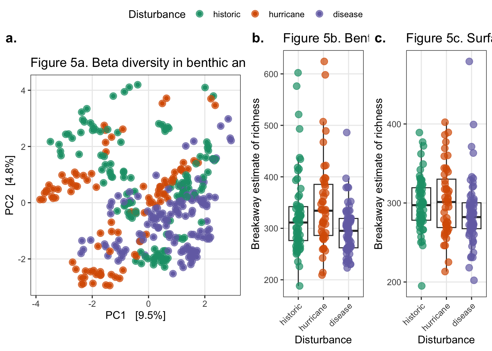

```r
#ggsave("figures/Alpha_Beta_Diversity_disturbance.pdf", width = 7.5, height = 4)

# Supplementary Figure S7
# Microbial beta diversity, alpha diversity depth tests and results
ggarrange(betadepth, alphadepth, ncol = 2, labels = c("a.", "b."), common.legend = TRUE, widths = c(2,1))
```

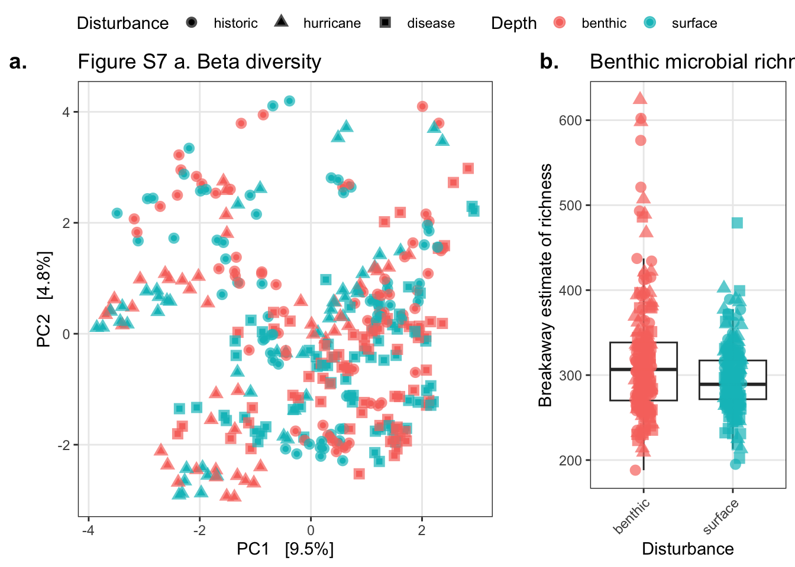

```r
# Supplementary Figure S8
# Microbial alpha and beta diversity across disturbbances within individual reefs
ggarrange(betareef, c, f, nrow = 3, labels = c("a.", "b.", "c."), 
          common.legend = TRUE)
```

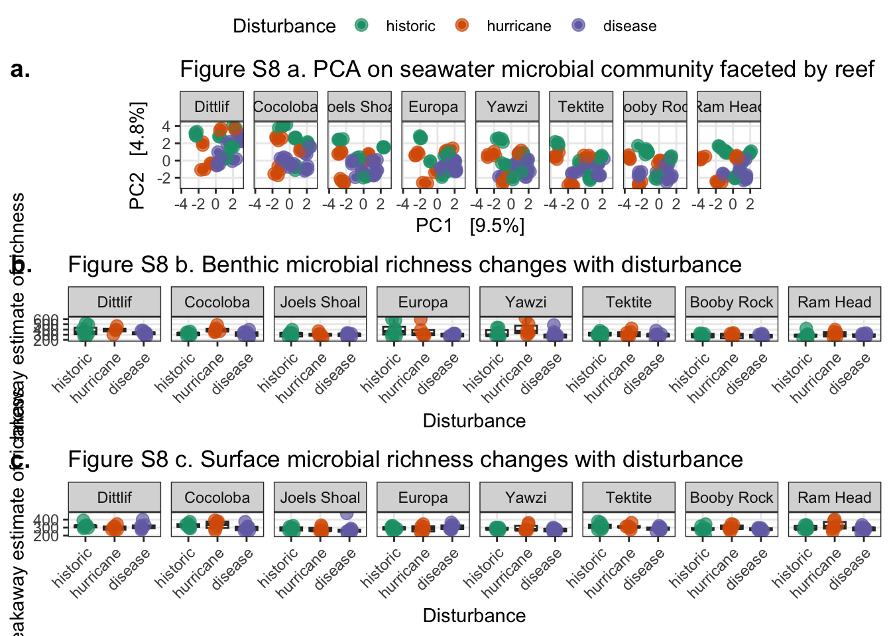

# Differential Abundance 
### Load data

```r
# Prep the phyloseq object
sample_data(ps)$date <- as.Date(sample_data(ps)$date)
sample_data(ps)$site <- factor(sample_data(ps)$site, levels = c("Dittlif", "Cocoloba", "Joels Shoal", "Europa", "Yawzi", "Tektite", "Booby Rock", "Ram Head", "Sand patch"))
sample_data(ps)$disturbance <- factor(sample_data(ps)$disturbance, levels = c("historic", "hurricane", "disease"))

# BENTHIC DATA
ps.benthic <- ps %>% 
  subset_samples(site != "Sand patch") %>%
  subset_samples(depth == "Benthic")

# test differential abundance between all 3 timepoints, then just between hurricane and disease
ps.benthic.disturbances <- ps.benthic %>% 
  subset_samples(disturbance %in% c("hurricane", "disease"))

# Try renaming all the NA taxa using the fantaxtic package Natasha sent me
ps.benthic.disturbances <- name_na_taxa(ps.benthic.disturbances, 
                                        na_label = "Unclassified <tax> (<rank>)")
ps.benthic <- name_na_taxa(ps.benthic, 
                           na_label = "Unclassified <tax> (<rank>)")
```


### Benthic community


```r
# What microorganisms are significantly changing across disturbances? Reef and timpoint are important covariates too, so control for the effect of reef site and month year timepoint abundance and dispersion
# Note historic is the control so plots will show hurricane and diseae relative to that timepoint
set.seed(1)
disturbance.da <- differentialTest(formula = ~ disturbance + site, 
                             phi.formula = ~ disturbance + site,
                             formula_null = ~ site,
                             phi.formula_null = ~ disturbance + site,
                             test = "Wald", boot = FALSE,
                             data = ps.benthic,
                             fdr_cutoff = 0.05)


# What microorganisms are significantly changing between hurricane and disease disturbances? Reef and timpoint are important covariates too, so control for the effect of reef site and month year timepoint abundance and dispersion
# Note historic is the control so plots will show hurricane and diseae relative to that timepoint
set.seed(1)
hurr.sctld.da <- differentialTest(formula = ~ disturbance + site, 
                             phi.formula = ~ disturbance + site,
                             formula_null = ~ site,
                             phi.formula_null = ~ disturbance + site,
                             test = "Wald", boot = FALSE,
                             data = ps.benthic.disturbances,
                             fdr_cutoff = 0.05)


# save the disturbance.da output and add asv, p.adj values to it, and ultimately taxonomny info
dist.da.models <- lapply(disturbance.da$significant_models, extractmods1)
names(dist.da.models) <- disturbance.da$significant_taxa

# Add ASVs to the taxonomy table and save the significant asvs
tax_table(ps.benthic)[,7] <- rownames(tax_table(ps.benthic))
sig.taxonomy <- as.data.frame(tax_table(ps.benthic)[disturbance.da$significant_taxa,]) 

# Move the data from a list to a dataframe and add taxonomy info
dist.da.models.df <- ldply(dist.da.models, data.frame) %>% 
  mutate(test = rep(c("disturbancehurricane", "disturbancedisease"), times = 354/2)) %>% 
  left_join(sig.taxonomy, by = c(".id" = "Species")) %>%
  mutate(genusasv = paste0(Genus, "_(", .id,")"))

## hurr.sctld.da output ##

# save the disturbance.da output and add asv, p.adj values to it, and ultimately taxonomny info
hurr.sctld.da.models <- lapply(hurr.sctld.da$significant_models, extractmods2)
names(hurr.sctld.da.models) <- hurr.sctld.da$significant_taxa

# Add ASVs to the taxonomy table and save the significant asvs
tax_table(ps.benthic.disturbances)[,7] <- rownames(tax_table(ps.benthic.disturbances))
sig.taxonomy2 <- as.data.frame(tax_table(ps.benthic.disturbances)[hurr.sctld.da$significant_taxa,]) 

# Move the data from a list to a dataframe and add taxonomy info
hurr.sctld.da.models.df <- ldply(hurr.sctld.da.models, data.frame) %>%
  mutate(test = rep("hurricanedisease")) %>% 
  left_join(sig.taxonomy2, by = c(".id" = "Species")) %>%
  mutate(genusasv = paste0(Genus, "_(", .id,")"))

# Add the data together, sort by ASV, then save
allresults <- rbind(dist.da.models.df, hurr.sctld.da.models.df) %>%
  arrange(.id, test) %>%
  mutate(coefNOTzero = Estimate + Std.Error >= 0 & Estimate - Std.Error >= 0 | Estimate + Std.Error <= 0 & Estimate - Std.Error <= 0) %>%
  mutate(coefABOVEtwo = abs(Estimate) > 2) %>%
  mutate(coefABOVEone = abs(Estimate) > 1)

### Save these data so you don't have to re-run the model ###
# write.table(allresults, "data/Sig_ASVs_Disturbance_Feb23.txt", sep="\t",row.names = FALSE)
```
So I saved the output of all the ASVs that were differentially enriched or depleted between the following conditions:
historic disturbance and hurricane (historic is baseline)
historic disturbacne and disease (historic is baseline)
hurricane and disease (hurricane is baseline)

### What are the taxonomic assignments of differentially abundant taxa?


```r
DAdisturbance <- read_delim("data/Sig_ASVs_Disturbance_Feb23.txt", delim = "\t", col_names = TRUE)

# remove all FALSE asvs - these are ones where the coeficient passes through zero with the standard error and I'd rather not graph those
DA_nozero <- DAdisturbance %>%
  filter(coefNOTzero == TRUE)

# how many differentially abundant ASVs - ~200!
DA_nozero$.id %>% unique %>% length
```

```
## [1] 199
```

```r
DAresults <- DA_nozero %>% 
  dplyr::select(.id, Estimate, test, Kingdom, Class, Order, Family, genusasv) %>%
  arrange(desc(Class), Estimate)

kable(DAresults)
```


|.id     |   Estimate|test                 |Kingdom  |Class                                               |Order                                               |Family                                              |genusasv                                                     |
|:-------|----------:|:--------------------|:--------|:---------------------------------------------------|:---------------------------------------------------|:---------------------------------------------------|:------------------------------------------------------------|
|ASV787  | -6.0750142|disturbancedisease   |Bacteria |Verrucomicrobiae                                    |Opitutales                                          |Puniceicoccaceae                                    |Coraliomargarita_(ASV787)                                    |
|ASV674  | -6.0278962|disturbancedisease   |Bacteria |Verrucomicrobiae                                    |Verrucomicrobiales                                  |Rubritaleaceae                                      |Rubritalea_(ASV674)                                          |
|ASV1035 | -4.0285928|disturbancehurricane |Bacteria |Verrucomicrobiae                                    |Verrucomicrobiales                                  |Unclassified Verrucomicrobiales (Order)             |Unclassified Verrucomicrobiales (Order)_(ASV1035)            |
|ASV1035 | -2.2538616|disturbancedisease   |Bacteria |Verrucomicrobiae                                    |Verrucomicrobiales                                  |Unclassified Verrucomicrobiales (Order)             |Unclassified Verrucomicrobiales (Order)_(ASV1035)            |
|ASV527  | -1.8793174|hurricanedisease     |Bacteria |Verrucomicrobiae                                    |Opitutales                                          |Puniceicoccaceae                                    |Pelagicoccus_(ASV527)                                        |
|ASV387  | -1.8396741|hurricanedisease     |Bacteria |Verrucomicrobiae                                    |Pedosphaerales                                      |Pedosphaeraceae                                     |SCGC AAA164-E04_(ASV387)                                     |
|ASV52   |  0.8669961|disturbancedisease   |Bacteria |Verrucomicrobiae                                    |Opitutales                                          |Puniceicoccaceae                                    |Coraliomargarita_(ASV52)                                     |
|ASV293  |  0.8950262|disturbancehurricane |Bacteria |Verrucomicrobiae                                    |Opitutales                                          |Puniceicoccaceae                                    |MB11C04 marine group_(ASV293)                                |
|ASV52   |  1.1525527|hurricanedisease     |Bacteria |Verrucomicrobiae                                    |Opitutales                                          |Puniceicoccaceae                                    |Coraliomargarita_(ASV52)                                     |
|ASV431  |  1.2672294|disturbancedisease   |Bacteria |Verrucomicrobiae                                    |Pedosphaerales                                      |Pedosphaeraceae                                     |SCGC AAA164-E04_(ASV431)                                     |
|ASV527  |  1.5246232|disturbancehurricane |Bacteria |Verrucomicrobiae                                    |Opitutales                                          |Puniceicoccaceae                                    |Pelagicoccus_(ASV527)                                        |
|ASV293  |  1.8953702|disturbancedisease   |Bacteria |Verrucomicrobiae                                    |Opitutales                                          |Puniceicoccaceae                                    |MB11C04 marine group_(ASV293)                                |
|ASV496  |  2.5715784|hurricanedisease     |Bacteria |Verrucomicrobiae                                    |Verrucomicrobiales                                  |DEV007                                              |Unclassified DEV007 (Family)_(ASV496)                        |
|ASV431  |  3.2119358|disturbancehurricane |Bacteria |Verrucomicrobiae                                    |Pedosphaerales                                      |Pedosphaeraceae                                     |SCGC AAA164-E04_(ASV431)                                     |
|ASV538  |  3.7726770|disturbancehurricane |Bacteria |Verrucomicrobiae                                    |Arctic97B-4 marine group                            |Unclassified Arctic97B-4 marine group (Order)       |Unclassified Arctic97B-4 marine group (Order)_(ASV538)       |
|ASV68   | -1.0693856|hurricanedisease     |Bacteria |Unclassified SAR324 clade(Marine group B) (Phylum)  |Unclassified SAR324 clade(Marine group B) (Phylum)  |Unclassified SAR324 clade(Marine group B) (Phylum)  |Unclassified SAR324 clade(Marine group B) (Phylum)_(ASV68)   |
|ASV241  | -0.9099618|hurricanedisease     |Bacteria |Unclassified SAR324 clade(Marine group B) (Phylum)  |Unclassified SAR324 clade(Marine group B) (Phylum)  |Unclassified SAR324 clade(Marine group B) (Phylum)  |Unclassified SAR324 clade(Marine group B) (Phylum)_(ASV241)  |
|ASV68   | -0.9028148|disturbancedisease   |Bacteria |Unclassified SAR324 clade(Marine group B) (Phylum)  |Unclassified SAR324 clade(Marine group B) (Phylum)  |Unclassified SAR324 clade(Marine group B) (Phylum)  |Unclassified SAR324 clade(Marine group B) (Phylum)_(ASV68)   |
|ASV241  |  0.6222320|disturbancehurricane |Bacteria |Unclassified SAR324 clade(Marine group B) (Phylum)  |Unclassified SAR324 clade(Marine group B) (Phylum)  |Unclassified SAR324 clade(Marine group B) (Phylum)  |Unclassified SAR324 clade(Marine group B) (Phylum)_(ASV241)  |
|ASV624  | -3.7300646|hurricanedisease     |Bacteria |Unclassified Marinimicrobia (SAR406 clade) (Phylum) |Unclassified Marinimicrobia (SAR406 clade) (Phylum) |Unclassified Marinimicrobia (SAR406 clade) (Phylum) |Unclassified Marinimicrobia (SAR406 clade) (Phylum)_(ASV624) |
|ASV483  | -3.1887945|hurricanedisease     |Bacteria |Unclassified Marinimicrobia (SAR406 clade) (Phylum) |Unclassified Marinimicrobia (SAR406 clade) (Phylum) |Unclassified Marinimicrobia (SAR406 clade) (Phylum) |Unclassified Marinimicrobia (SAR406 clade) (Phylum)_(ASV483) |
|ASV270  | -1.9503369|hurricanedisease     |Bacteria |Unclassified Marinimicrobia (SAR406 clade) (Phylum) |Unclassified Marinimicrobia (SAR406 clade) (Phylum) |Unclassified Marinimicrobia (SAR406 clade) (Phylum) |Unclassified Marinimicrobia (SAR406 clade) (Phylum)_(ASV270) |
|ASV87   | -0.5139585|hurricanedisease     |Bacteria |Unclassified Marinimicrobia (SAR406 clade) (Phylum) |Unclassified Marinimicrobia (SAR406 clade) (Phylum) |Unclassified Marinimicrobia (SAR406 clade) (Phylum) |Unclassified Marinimicrobia (SAR406 clade) (Phylum)_(ASV87)  |
|ASV27   | -0.2129639|disturbancehurricane |Bacteria |Unclassified Marinimicrobia (SAR406 clade) (Phylum) |Unclassified Marinimicrobia (SAR406 clade) (Phylum) |Unclassified Marinimicrobia (SAR406 clade) (Phylum) |Unclassified Marinimicrobia (SAR406 clade) (Phylum)_(ASV27)  |
|ASV27   |  0.1512551|disturbancedisease   |Bacteria |Unclassified Marinimicrobia (SAR406 clade) (Phylum) |Unclassified Marinimicrobia (SAR406 clade) (Phylum) |Unclassified Marinimicrobia (SAR406 clade) (Phylum) |Unclassified Marinimicrobia (SAR406 clade) (Phylum)_(ASV27)  |
|ASV27   |  0.3646508|hurricanedisease     |Bacteria |Unclassified Marinimicrobia (SAR406 clade) (Phylum) |Unclassified Marinimicrobia (SAR406 clade) (Phylum) |Unclassified Marinimicrobia (SAR406 clade) (Phylum) |Unclassified Marinimicrobia (SAR406 clade) (Phylum)_(ASV27)  |
|ASV87   |  0.6031552|disturbancehurricane |Bacteria |Unclassified Marinimicrobia (SAR406 clade) (Phylum) |Unclassified Marinimicrobia (SAR406 clade) (Phylum) |Unclassified Marinimicrobia (SAR406 clade) (Phylum) |Unclassified Marinimicrobia (SAR406 clade) (Phylum)_(ASV87)  |
|ASV270  |  1.3510414|disturbancehurricane |Bacteria |Unclassified Marinimicrobia (SAR406 clade) (Phylum) |Unclassified Marinimicrobia (SAR406 clade) (Phylum) |Unclassified Marinimicrobia (SAR406 clade) (Phylum) |Unclassified Marinimicrobia (SAR406 clade) (Phylum)_(ASV270) |
|ASV173  |  1.5643009|disturbancedisease   |Bacteria |Unclassified Marinimicrobia (SAR406 clade) (Phylum) |Unclassified Marinimicrobia (SAR406 clade) (Phylum) |Unclassified Marinimicrobia (SAR406 clade) (Phylum) |Unclassified Marinimicrobia (SAR406 clade) (Phylum)_(ASV173) |
|ASV473  |  1.9570672|disturbancedisease   |Bacteria |Unclassified Marinimicrobia (SAR406 clade) (Phylum) |Unclassified Marinimicrobia (SAR406 clade) (Phylum) |Unclassified Marinimicrobia (SAR406 clade) (Phylum) |Unclassified Marinimicrobia (SAR406 clade) (Phylum)_(ASV473) |
|ASV483  |  2.0696670|disturbancedisease   |Bacteria |Unclassified Marinimicrobia (SAR406 clade) (Phylum) |Unclassified Marinimicrobia (SAR406 clade) (Phylum) |Unclassified Marinimicrobia (SAR406 clade) (Phylum) |Unclassified Marinimicrobia (SAR406 clade) (Phylum)_(ASV483) |
|ASV173  |  2.3806444|disturbancehurricane |Bacteria |Unclassified Marinimicrobia (SAR406 clade) (Phylum) |Unclassified Marinimicrobia (SAR406 clade) (Phylum) |Unclassified Marinimicrobia (SAR406 clade) (Phylum) |Unclassified Marinimicrobia (SAR406 clade) (Phylum)_(ASV173) |
|ASV473  |  2.8682745|disturbancehurricane |Bacteria |Unclassified Marinimicrobia (SAR406 clade) (Phylum) |Unclassified Marinimicrobia (SAR406 clade) (Phylum) |Unclassified Marinimicrobia (SAR406 clade) (Phylum) |Unclassified Marinimicrobia (SAR406 clade) (Phylum)_(ASV473) |
|ASV483  |  4.9025770|disturbancehurricane |Bacteria |Unclassified Marinimicrobia (SAR406 clade) (Phylum) |Unclassified Marinimicrobia (SAR406 clade) (Phylum) |Unclassified Marinimicrobia (SAR406 clade) (Phylum) |Unclassified Marinimicrobia (SAR406 clade) (Phylum)_(ASV483) |
|ASV346  |  5.7903132|disturbancehurricane |Bacteria |Unclassified Marinimicrobia (SAR406 clade) (Phylum) |Unclassified Marinimicrobia (SAR406 clade) (Phylum) |Unclassified Marinimicrobia (SAR406 clade) (Phylum) |Unclassified Marinimicrobia (SAR406 clade) (Phylum)_(ASV346) |
|ASV346  |  6.6561993|disturbancedisease   |Bacteria |Unclassified Marinimicrobia (SAR406 clade) (Phylum) |Unclassified Marinimicrobia (SAR406 clade) (Phylum) |Unclassified Marinimicrobia (SAR406 clade) (Phylum) |Unclassified Marinimicrobia (SAR406 clade) (Phylum)_(ASV346) |
|ASV834  | -6.2452038|hurricanedisease     |Bacteria |Unclassified Bacteria (Kingdom)                     |Unclassified Bacteria (Kingdom)                     |Unclassified Bacteria (Kingdom)                     |Unclassified Bacteria (Kingdom)_(ASV834)                     |
|ASV867  | -4.3284282|disturbancehurricane |Bacteria |Unclassified Bacteria (Kingdom)                     |Unclassified Bacteria (Kingdom)                     |Unclassified Bacteria (Kingdom)                     |Unclassified Bacteria (Kingdom)_(ASV867)                     |
|ASV422  | -2.0929941|disturbancehurricane |Bacteria |Unclassified Bacteria (Kingdom)                     |Unclassified Bacteria (Kingdom)                     |Unclassified Bacteria (Kingdom)                     |Unclassified Bacteria (Kingdom)_(ASV422)                     |
|ASV422  |  2.2207244|hurricanedisease     |Bacteria |Unclassified Bacteria (Kingdom)                     |Unclassified Bacteria (Kingdom)                     |Unclassified Bacteria (Kingdom)                     |Unclassified Bacteria (Kingdom)_(ASV422)                     |
|ASV834  |  6.6062210|disturbancehurricane |Bacteria |Unclassified Bacteria (Kingdom)                     |Unclassified Bacteria (Kingdom)                     |Unclassified Bacteria (Kingdom)                     |Unclassified Bacteria (Kingdom)_(ASV834)                     |
|ASV131  | -2.7093554|hurricanedisease     |Archaea  |Thermoplasmata                                      |Marine Group II                                     |Unclassified Marine Group II (Order)                |Unclassified Marine Group II (Order)_(ASV131)                |
|ASV189  | -2.6103288|hurricanedisease     |Archaea  |Thermoplasmata                                      |Marine Group II                                     |Unclassified Marine Group II (Order)                |Unclassified Marine Group II (Order)_(ASV189)                |
|ASV329  | -2.5587792|hurricanedisease     |Archaea  |Thermoplasmata                                      |Marine Group II                                     |Unclassified Marine Group II (Order)                |Unclassified Marine Group II (Order)_(ASV329)                |
|ASV131  | -2.3395830|disturbancedisease   |Archaea  |Thermoplasmata                                      |Marine Group II                                     |Unclassified Marine Group II (Order)                |Unclassified Marine Group II (Order)_(ASV131)                |
|ASV329  | -2.2609414|disturbancedisease   |Archaea  |Thermoplasmata                                      |Marine Group II                                     |Unclassified Marine Group II (Order)                |Unclassified Marine Group II (Order)_(ASV329)                |
|ASV99   | -2.2472405|hurricanedisease     |Archaea  |Thermoplasmata                                      |Marine Group III                                    |Unclassified Marine Group III (Order)               |Unclassified Marine Group III (Order)_(ASV99)                |
|ASV112  | -1.7077798|hurricanedisease     |Archaea  |Thermoplasmata                                      |Marine Group II                                     |Unclassified Marine Group II (Order)                |Unclassified Marine Group II (Order)_(ASV112)                |
|ASV189  | -1.3450677|disturbancedisease   |Archaea  |Thermoplasmata                                      |Marine Group II                                     |Unclassified Marine Group II (Order)                |Unclassified Marine Group II (Order)_(ASV189)                |
|ASV246  | -1.2077511|hurricanedisease     |Archaea  |Thermoplasmata                                      |Marine Group II                                     |Unclassified Marine Group II (Order)                |Unclassified Marine Group II (Order)_(ASV246)                |
|ASV99   | -1.0544638|disturbancedisease   |Archaea  |Thermoplasmata                                      |Marine Group III                                    |Unclassified Marine Group III (Order)               |Unclassified Marine Group III (Order)_(ASV99)                |
|ASV62   | -0.6480917|disturbancedisease   |Archaea  |Thermoplasmata                                      |Marine Group II                                     |Unclassified Marine Group II (Order)                |Unclassified Marine Group II (Order)_(ASV62)                 |
|ASV45   | -0.6269052|disturbancedisease   |Archaea  |Thermoplasmata                                      |Marine Group II                                     |Unclassified Marine Group II (Order)                |Unclassified Marine Group II (Order)_(ASV45)                 |
|ASV62   | -0.5727482|hurricanedisease     |Archaea  |Thermoplasmata                                      |Marine Group II                                     |Unclassified Marine Group II (Order)                |Unclassified Marine Group II (Order)_(ASV62)                 |
|ASV89   | -0.5581895|hurricanedisease     |Archaea  |Thermoplasmata                                      |Marine Group II                                     |Unclassified Marine Group II (Order)                |Unclassified Marine Group II (Order)_(ASV89)                 |
|ASV45   | -0.4542779|disturbancehurricane |Archaea  |Thermoplasmata                                      |Marine Group II                                     |Unclassified Marine Group II (Order)                |Unclassified Marine Group II (Order)_(ASV45)                 |
|ASV246  | -0.2981566|disturbancedisease   |Archaea  |Thermoplasmata                                      |Marine Group II                                     |Unclassified Marine Group II (Order)                |Unclassified Marine Group II (Order)_(ASV246)                |
|ASV89   |  0.5006105|disturbancehurricane |Archaea  |Thermoplasmata                                      |Marine Group II                                     |Unclassified Marine Group II (Order)                |Unclassified Marine Group II (Order)_(ASV89)                 |
|ASV329  |  0.7038825|disturbancehurricane |Archaea  |Thermoplasmata                                      |Marine Group II                                     |Unclassified Marine Group II (Order)                |Unclassified Marine Group II (Order)_(ASV329)                |
|ASV246  |  0.9217496|disturbancehurricane |Archaea  |Thermoplasmata                                      |Marine Group II                                     |Unclassified Marine Group II (Order)                |Unclassified Marine Group II (Order)_(ASV246)                |
|ASV189  |  1.0810987|disturbancehurricane |Archaea  |Thermoplasmata                                      |Marine Group II                                     |Unclassified Marine Group II (Order)                |Unclassified Marine Group II (Order)_(ASV189)                |
|ASV99   |  1.1575203|disturbancehurricane |Archaea  |Thermoplasmata                                      |Marine Group III                                    |Unclassified Marine Group III (Order)               |Unclassified Marine Group III (Order)_(ASV99)                |
|ASV337  | -3.5120023|hurricanedisease     |Bacteria |Planctomycetes                                      |Pirellulales                                        |Pirellulaceae                                       |Pirellula_(ASV337)                                           |
|ASV337  | -2.9906885|disturbancedisease   |Bacteria |Planctomycetes                                      |Pirellulales                                        |Pirellulaceae                                       |Pirellula_(ASV337)                                           |
|ASV211  | -0.7365596|disturbancehurricane |Bacteria |Planctomycetes                                      |Pirellulales                                        |Pirellulaceae                                       |Unclassified Pirellulaceae (Family)_(ASV211)                 |
|ASV211  | -0.5131827|disturbancedisease   |Bacteria |Planctomycetes                                      |Pirellulales                                        |Pirellulaceae                                       |Unclassified Pirellulaceae (Family)_(ASV211)                 |
|ASV746  | -6.2536054|hurricanedisease     |Bacteria |Phycisphaerae                                       |Phycisphaerales                                     |Phycisphaeraceae                                    |CL500-3_(ASV746)                                             |
|ASV746  | -5.2727954|disturbancedisease   |Bacteria |Phycisphaerae                                       |Phycisphaerales                                     |Phycisphaeraceae                                    |CL500-3_(ASV746)                                             |
|ASV57   | -0.1330862|disturbancehurricane |Bacteria |Phycisphaerae                                       |Phycisphaerales                                     |Phycisphaeraceae                                    |Urania-1B-19 marine sediment group_(ASV57)                   |
|ASV57   |  0.2852491|disturbancedisease   |Bacteria |Phycisphaerae                                       |Phycisphaerales                                     |Phycisphaeraceae                                    |Urania-1B-19 marine sediment group_(ASV57)                   |
|ASV57   |  0.4103884|hurricanedisease     |Bacteria |Phycisphaerae                                       |Phycisphaerales                                     |Phycisphaeraceae                                    |Urania-1B-19 marine sediment group_(ASV57)                   |
|ASV297  | -0.7883425|hurricanedisease     |Bacteria |OM190                                               |Unclassified OM190 (Class)                          |Unclassified OM190 (Class)                          |Unclassified OM190 (Class)_(ASV297)                          |
|ASV316  | -0.7113827|disturbancehurricane |Bacteria |OM190                                               |Unclassified OM190 (Class)                          |Unclassified OM190 (Class)                          |Unclassified OM190 (Class)_(ASV316)                          |
|ASV316  |  0.3602148|disturbancedisease   |Bacteria |OM190                                               |Unclassified OM190 (Class)                          |Unclassified OM190 (Class)                          |Unclassified OM190 (Class)_(ASV316)                          |
|ASV316  |  1.0683944|hurricanedisease     |Bacteria |OM190                                               |Unclassified OM190 (Class)                          |Unclassified OM190 (Class)                          |Unclassified OM190 (Class)_(ASV316)                          |
|ASV461  | -4.6450340|hurricanedisease     |Archaea  |Nanoarchaeia                                        |Woesearchaeales                                     |Unclassified Woesearchaeales (Order)                |Unclassified Woesearchaeales (Order)_(ASV461)                |
|ASV560  |  6.2253964|disturbancehurricane |Archaea  |Nanoarchaeia                                        |Woesearchaeales                                     |Unclassified Woesearchaeales (Order)                |Unclassified Woesearchaeales (Order)_(ASV560)                |
|ASV221  | -0.4676635|hurricanedisease     |Bacteria |Myxococcia                                          |Myxococcales                                        |Myxococcaceae                                       |P3OB-42_(ASV221)                                             |
|ASV801  | -8.2194927|disturbancedisease   |Bacteria |Gammaproteobacteria                                 |Pseudomonadales                                     |Litoricolaceae                                      |Litoricola_(ASV801)                                          |
|ASV249  | -6.7063719|hurricanedisease     |Bacteria |Gammaproteobacteria                                 |Enterobacterales                                    |Idiomarinaceae                                      |Idiomarina_(ASV249)                                          |
|ASV445  | -5.9992627|hurricanedisease     |Bacteria |Gammaproteobacteria                                 |Pseudomonadales                                     |Pseudohongiellaceae                                 |Pseudohongiella_(ASV445)                                     |
|ASV1155 | -5.7051950|disturbancedisease   |Bacteria |Gammaproteobacteria                                 |Coxiellales                                         |Coxiellaceae                                        |Coxiella_(ASV1155)                                           |
|ASV730  | -5.0719580|disturbancehurricane |Bacteria |Gammaproteobacteria                                 |Coxiellales                                         |Coxiellaceae                                        |Coxiella_(ASV730)                                            |
|ASV647  | -4.8642514|disturbancehurricane |Bacteria |Gammaproteobacteria                                 |Ga0077536                                           |Unclassified Ga0077536 (Order)                      |Unclassified Ga0077536 (Order)_(ASV647)                      |
|ASV249  | -4.8381329|disturbancedisease   |Bacteria |Gammaproteobacteria                                 |Enterobacterales                                    |Idiomarinaceae                                      |Idiomarina_(ASV249)                                          |
|ASV525  | -4.6039760|hurricanedisease     |Bacteria |Gammaproteobacteria                                 |Coxiellales                                         |Coxiellaceae                                        |Coxiella_(ASV525)                                            |
|ASV801  | -3.3276383|disturbancehurricane |Bacteria |Gammaproteobacteria                                 |Pseudomonadales                                     |Litoricolaceae                                      |Litoricola_(ASV801)                                          |
|ASV228  | -3.2268694|hurricanedisease     |Bacteria |Gammaproteobacteria                                 |Pseudomonadales                                     |Alcanivoracaceae1                                   |Alcanivorax_(ASV228)                                         |
|ASV251  | -2.4947628|hurricanedisease     |Bacteria |Gammaproteobacteria                                 |Pseudomonadales                                     |Halomonadaceae                                      |Halomonas_(ASV251)                                           |
|ASV251  | -2.0519018|disturbancedisease   |Bacteria |Gammaproteobacteria                                 |Pseudomonadales                                     |Halomonadaceae                                      |Halomonas_(ASV251)                                           |
|ASV647  | -1.4643682|disturbancedisease   |Bacteria |Gammaproteobacteria                                 |Ga0077536                                           |Unclassified Ga0077536 (Order)                      |Unclassified Ga0077536 (Order)_(ASV647)                      |
|ASV267  | -1.4009486|disturbancehurricane |Bacteria |Gammaproteobacteria                                 |Burkholderiales                                     |Methylophilaceae                                    |OM43 clade_(ASV267)                                          |
|ASV70   | -1.3132139|hurricanedisease     |Bacteria |Gammaproteobacteria                                 |Pseudomonadales                                     |SAR86 clade                                         |Unclassified SAR86 clade (Family)_(ASV70)                    |
|ASV70   | -1.1876589|disturbancedisease   |Bacteria |Gammaproteobacteria                                 |Pseudomonadales                                     |SAR86 clade                                         |Unclassified SAR86 clade (Family)_(ASV70)                    |
|ASV86   | -1.1819778|disturbancehurricane |Bacteria |Gammaproteobacteria                                 |Pseudomonadales                                     |Nitrincolaceae                                      |Marinobacterium_(ASV86)                                      |
|ASV318  | -1.0578334|hurricanedisease     |Bacteria |Gammaproteobacteria                                 |Ectothiorhodospirales                               |Ectothiorhodospiraceae                              |Unclassified Ectothiorhodospiraceae (Family)_(ASV318)        |
|ASV126  | -0.8111278|hurricanedisease     |Bacteria |Gammaproteobacteria                                 |Pseudomonadales                                     |Porticoccaceae                                      |SAR92 clade_(ASV126)                                         |
|ASV150  | -0.6337022|hurricanedisease     |Bacteria |Gammaproteobacteria                                 |Pseudomonadales                                     |SAR86 clade                                         |Unclassified SAR86 clade (Family)_(ASV150)                   |
|ASV141  | -0.5694183|hurricanedisease     |Bacteria |Gammaproteobacteria                                 |Pseudomonadales                                     |OM182 clade                                         |Unclassified OM182 clade (Family)_(ASV141)                   |
|ASV126  | -0.5481406|disturbancedisease   |Bacteria |Gammaproteobacteria                                 |Pseudomonadales                                     |Porticoccaceae                                      |SAR92 clade_(ASV126)                                         |
|ASV79   | -0.5244483|hurricanedisease     |Bacteria |Gammaproteobacteria                                 |Ectothiorhodospirales                               |Ectothiorhodospiraceae                              |Unclassified Ectothiorhodospiraceae (Family)_(ASV79)         |
|ASV18   | -0.4140928|disturbancehurricane |Bacteria |Gammaproteobacteria                                 |Pseudomonadales                                     |SAR86 clade                                         |Unclassified SAR86 clade (Family)_(ASV18)                    |
|ASV40   | -0.4008006|hurricanedisease     |Bacteria |Gammaproteobacteria                                 |Pseudomonadales                                     |SAR86 clade                                         |Unclassified SAR86 clade (Family)_(ASV40)                    |
|ASV34   | -0.3944746|disturbancehurricane |Bacteria |Gammaproteobacteria                                 |Pseudomonadales                                     |Halieaceae                                          |OM60(NOR5) clade_(ASV34)                                     |
|ASV11   | -0.3563438|disturbancehurricane |Bacteria |Gammaproteobacteria                                 |Pseudomonadales                                     |SAR86 clade                                         |Unclassified SAR86 clade (Family)_(ASV11)                    |
|ASV21   | -0.2861166|hurricanedisease     |Bacteria |Gammaproteobacteria                                 |Pseudomonadales                                     |SAR86 clade                                         |Unclassified SAR86 clade (Family)_(ASV21)                    |
|ASV92   | -0.2062252|disturbancehurricane |Bacteria |Gammaproteobacteria                                 |Pseudomonadales                                     |KI89A clade                                         |Unclassified KI89A clade (Family)_(ASV92)                    |
|ASV141  | -0.1740842|disturbancedisease   |Bacteria |Gammaproteobacteria                                 |Pseudomonadales                                     |OM182 clade                                         |Unclassified OM182 clade (Family)_(ASV141)                   |
|ASV21   | -0.1577294|disturbancedisease   |Bacteria |Gammaproteobacteria                                 |Pseudomonadales                                     |SAR86 clade                                         |Unclassified SAR86 clade (Family)_(ASV21)                    |
|ASV22   | -0.1065792|disturbancehurricane |Bacteria |Gammaproteobacteria                                 |Pseudomonadales                                     |SAR86 clade                                         |Unclassified SAR86 clade (Family)_(ASV22)                    |
|ASV48   | -0.0522722|disturbancehurricane |Bacteria |Gammaproteobacteria                                 |Pseudomonadales                                     |Halieaceae                                          |OM60(NOR5) clade_(ASV48)                                     |
|ASV21   |  0.1043953|disturbancehurricane |Bacteria |Gammaproteobacteria                                 |Pseudomonadales                                     |SAR86 clade                                         |Unclassified SAR86 clade (Family)_(ASV21)                    |
|ASV139  |  0.2246953|disturbancedisease   |Bacteria |Gammaproteobacteria                                 |Pseudomonadales                                     |Pseudohongiellaceae                                 |Pseudohongiella_(ASV139)                                     |
|ASV48   |  0.2517370|disturbancedisease   |Bacteria |Gammaproteobacteria                                 |Pseudomonadales                                     |Halieaceae                                          |OM60(NOR5) clade_(ASV48)                                     |
|ASV126  |  0.2554095|disturbancehurricane |Bacteria |Gammaproteobacteria                                 |Pseudomonadales                                     |Porticoccaceae                                      |SAR92 clade_(ASV126)                                         |
|ASV48   |  0.2845657|hurricanedisease     |Bacteria |Gammaproteobacteria                                 |Pseudomonadales                                     |Halieaceae                                          |OM60(NOR5) clade_(ASV48)                                     |
|ASV18   |  0.2850576|disturbancedisease   |Bacteria |Gammaproteobacteria                                 |Pseudomonadales                                     |SAR86 clade                                         |Unclassified SAR86 clade (Family)_(ASV18)                    |
|ASV139  |  0.2978859|disturbancehurricane |Bacteria |Gammaproteobacteria                                 |Pseudomonadales                                     |Pseudohongiellaceae                                 |Pseudohongiella_(ASV139)                                     |
|ASV162  |  0.3256164|disturbancehurricane |Bacteria |Gammaproteobacteria                                 |Thiotrichales                                       |Thiotrichaceae                                      |Unclassified Thiotrichaceae (Family)_(ASV162)                |
|ASV40   |  0.3289127|disturbancehurricane |Bacteria |Gammaproteobacteria                                 |Pseudomonadales                                     |SAR86 clade                                         |Unclassified SAR86 clade (Family)_(ASV40)                    |
|ASV22   |  0.3582664|disturbancedisease   |Bacteria |Gammaproteobacteria                                 |Pseudomonadales                                     |SAR86 clade                                         |Unclassified SAR86 clade (Family)_(ASV22)                    |
|ASV141  |  0.3875192|disturbancehurricane |Bacteria |Gammaproteobacteria                                 |Pseudomonadales                                     |OM182 clade                                         |Unclassified OM182 clade (Family)_(ASV141)                   |
|ASV22   |  0.4512651|hurricanedisease     |Bacteria |Gammaproteobacteria                                 |Pseudomonadales                                     |SAR86 clade                                         |Unclassified SAR86 clade (Family)_(ASV22)                    |
|ASV11   |  0.5159592|disturbancedisease   |Bacteria |Gammaproteobacteria                                 |Pseudomonadales                                     |SAR86 clade                                         |Unclassified SAR86 clade (Family)_(ASV11)                    |
|ASV66   |  0.5289938|hurricanedisease     |Bacteria |Gammaproteobacteria                                 |Pseudomonadales                                     |Halieaceae                                          |OM60(NOR5) clade_(ASV66)                                     |
|ASV79   |  0.5308925|disturbancehurricane |Bacteria |Gammaproteobacteria                                 |Ectothiorhodospirales                               |Ectothiorhodospiraceae                              |Unclassified Ectothiorhodospiraceae (Family)_(ASV79)         |
|ASV34   |  0.5762878|hurricanedisease     |Bacteria |Gammaproteobacteria                                 |Pseudomonadales                                     |Halieaceae                                          |OM60(NOR5) clade_(ASV34)                                     |
|ASV168  |  0.6678501|disturbancehurricane |Bacteria |Gammaproteobacteria                                 |Pseudomonadales                                     |SAR86 clade                                         |Unclassified SAR86 clade (Family)_(ASV168)                   |
|ASV69   |  0.6775598|hurricanedisease     |Bacteria |Gammaproteobacteria                                 |Pseudomonadales                                     |Litoricolaceae                                      |Litoricola_(ASV69)                                           |
|ASV111  |  0.7026084|disturbancedisease   |Bacteria |Gammaproteobacteria                                 |Pseudomonadales                                     |SAR86 clade                                         |Unclassified SAR86 clade (Family)_(ASV111)                   |
|ASV18   |  0.7227836|hurricanedisease     |Bacteria |Gammaproteobacteria                                 |Pseudomonadales                                     |SAR86 clade                                         |Unclassified SAR86 clade (Family)_(ASV18)                    |
|ASV150  |  0.7372506|disturbancehurricane |Bacteria |Gammaproteobacteria                                 |Pseudomonadales                                     |SAR86 clade                                         |Unclassified SAR86 clade (Family)_(ASV150)                   |
|ASV111  |  0.7396036|disturbancehurricane |Bacteria |Gammaproteobacteria                                 |Pseudomonadales                                     |SAR86 clade                                         |Unclassified SAR86 clade (Family)_(ASV111)                   |
|ASV222  |  0.7592824|disturbancedisease   |Bacteria |Gammaproteobacteria                                 |Pseudomonadales                                     |Porticoccaceae                                      |SAR92 clade_(ASV222)                                         |
|ASV11   |  0.8497506|hurricanedisease     |Bacteria |Gammaproteobacteria                                 |Pseudomonadales                                     |SAR86 clade                                         |Unclassified SAR86 clade (Family)_(ASV11)                    |
|ASV168  |  1.0984647|disturbancedisease   |Bacteria |Gammaproteobacteria                                 |Pseudomonadales                                     |SAR86 clade                                         |Unclassified SAR86 clade (Family)_(ASV168)                   |
|ASV199  |  1.2422586|hurricanedisease     |Bacteria |Gammaproteobacteria                                 |Pseudomonadales                                     |SAR86 clade                                         |Unclassified SAR86 clade (Family)_(ASV199)                   |
|ASV132  |  1.3490556|disturbancehurricane |Bacteria |Gammaproteobacteria                                 |Unclassified Gammaproteobacteria (Class)            |Unclassified Gammaproteobacteria (Class)            |Unclassified Gammaproteobacteria (Class)_(ASV132)            |
|ASV86   |  1.3911632|disturbancedisease   |Bacteria |Gammaproteobacteria                                 |Pseudomonadales                                     |Nitrincolaceae                                      |Marinobacterium_(ASV86)                                      |
|ASV69   |  1.4057569|disturbancehurricane |Bacteria |Gammaproteobacteria                                 |Pseudomonadales                                     |Litoricolaceae                                      |Litoricola_(ASV69)                                           |
|ASV267  |  1.4408264|hurricanedisease     |Bacteria |Gammaproteobacteria                                 |Burkholderiales                                     |Methylophilaceae                                    |OM43 clade_(ASV267)                                          |
|ASV156  |  1.5348145|hurricanedisease     |Bacteria |Gammaproteobacteria                                 |Pseudomonadales                                     |Spongiibacteraceae                                  |BD1-7 clade_(ASV156)                                         |
|ASV249  |  1.6281873|disturbancehurricane |Bacteria |Gammaproteobacteria                                 |Enterobacterales                                    |Idiomarinaceae                                      |Idiomarina_(ASV249)                                          |
|ASV156  |  1.8584661|disturbancedisease   |Bacteria |Gammaproteobacteria                                 |Pseudomonadales                                     |Spongiibacteraceae                                  |BD1-7 clade_(ASV156)                                         |
|ASV242  |  1.9816994|hurricanedisease     |Bacteria |Gammaproteobacteria                                 |Enterobacterales                                    |Alteromonadaceae                                    |Unclassified Alteromonadaceae (Family)_(ASV242)              |
|ASV69   |  2.0932069|disturbancedisease   |Bacteria |Gammaproteobacteria                                 |Pseudomonadales                                     |Litoricolaceae                                      |Litoricola_(ASV69)                                           |
|ASV228  |  2.3089255|disturbancehurricane |Bacteria |Gammaproteobacteria                                 |Pseudomonadales                                     |Alcanivoracaceae1                                   |Alcanivorax_(ASV228)                                         |
|ASV86   |  2.4909148|hurricanedisease     |Bacteria |Gammaproteobacteria                                 |Pseudomonadales                                     |Nitrincolaceae                                      |Marinobacterium_(ASV86)                                      |
|ASV540  |  2.8445399|disturbancehurricane |Bacteria |Gammaproteobacteria                                 |Piscirickettsiales                                  |Piscirickettsiaceae                                 |Candidatus Endoecteinascidia_(ASV540)                        |
|ASV242  |  2.8703208|disturbancehurricane |Bacteria |Gammaproteobacteria                                 |Enterobacterales                                    |Alteromonadaceae                                    |Unclassified Alteromonadaceae (Family)_(ASV242)              |
|ASV652  |  3.2495802|disturbancedisease   |Bacteria |Gammaproteobacteria                                 |Pseudomonadales                                     |OM182 clade                                         |Unclassified OM182 clade (Family)_(ASV652)                   |
|ASV694  |  3.6923384|disturbancehurricane |Bacteria |Gammaproteobacteria                                 |Legionellales                                       |Legionellaceae                                      |Unclassified Legionellaceae (Family)_(ASV694)                |
|ASV647  |  4.0323729|hurricanedisease     |Bacteria |Gammaproteobacteria                                 |Ga0077536                                           |Unclassified Ga0077536 (Order)                      |Unclassified Ga0077536 (Order)_(ASV647)                      |
|ASV90   |  4.3098586|disturbancehurricane |Bacteria |Gammaproteobacteria                                 |Pseudomonadales                                     |Thioglobaceae                                       |SUP05 cluster_(ASV90)                                        |
|ASV540  |  4.7477873|disturbancedisease   |Bacteria |Gammaproteobacteria                                 |Piscirickettsiales                                  |Piscirickettsiaceae                                 |Candidatus Endoecteinascidia_(ASV540)                        |
|ASV242  |  4.8459621|disturbancedisease   |Bacteria |Gammaproteobacteria                                 |Enterobacterales                                    |Alteromonadaceae                                    |Unclassified Alteromonadaceae (Family)_(ASV242)              |
|ASV652  |  5.4467178|disturbancehurricane |Bacteria |Gammaproteobacteria                                 |Pseudomonadales                                     |OM182 clade                                         |Unclassified OM182 clade (Family)_(ASV652)                   |
|ASV445  |  7.0046860|disturbancehurricane |Bacteria |Gammaproteobacteria                                 |Pseudomonadales                                     |Pseudohongiellaceae                                 |Pseudohongiella_(ASV445)                                     |
|ASV585  | -5.8446569|hurricanedisease     |Bacteria |Dehalococcoidia                                     |SAR202 clade                                        |Unclassified SAR202 clade (Order)                   |Unclassified SAR202 clade (Order)_(ASV585)                   |
|ASV279  | -2.1235675|hurricanedisease     |Bacteria |Dehalococcoidia                                     |SAR202 clade                                        |Unclassified SAR202 clade (Order)                   |Unclassified SAR202 clade (Order)_(ASV279)                   |
|ASV585  |  5.0072418|disturbancehurricane |Bacteria |Dehalococcoidia                                     |SAR202 clade                                        |Unclassified SAR202 clade (Order)                   |Unclassified SAR202 clade (Order)_(ASV585)                   |
|ASV202  | -1.3285925|hurricanedisease     |Bacteria |Dadabacteriia                                       |Dadabacteriales                                     |Unclassified Dadabacteriales (Order)                |Unclassified Dadabacteriales (Order)_(ASV202)                |
|ASV202  | -0.8759215|disturbancedisease   |Bacteria |Dadabacteriia                                       |Dadabacteriales                                     |Unclassified Dadabacteriales (Order)                |Unclassified Dadabacteriales (Order)_(ASV202)                |
|ASV202  |  0.4490075|disturbancehurricane |Bacteria |Dadabacteriia                                       |Dadabacteriales                                     |Unclassified Dadabacteriales (Order)                |Unclassified Dadabacteriales (Order)_(ASV202)                |
|ASV363  |  1.6167352|disturbancehurricane |Bacteria |Dadabacteriia                                       |Dadabacteriales                                     |Unclassified Dadabacteriales (Order)                |Unclassified Dadabacteriales (Order)_(ASV363)                |
|ASV350  | -6.9600079|disturbancehurricane |Bacteria |Cyanobacteriia                                      |Synechococcales                                     |Cyanobiaceae                                        |Synechococcus CC9902_(ASV350)                                |
|ASV350  | -3.2978726|disturbancedisease   |Bacteria |Cyanobacteriia                                      |Synechococcales                                     |Cyanobiaceae                                        |Synechococcus CC9902_(ASV350)                                |
|ASV140  | -2.4282944|hurricanedisease     |Bacteria |Cyanobacteriia                                      |Synechococcales                                     |Cyanobiaceae                                        |Synechococcus CC9902_(ASV140)                                |
|ASV248  | -2.4143867|hurricanedisease     |Bacteria |Cyanobacteriia                                      |Synechococcales                                     |Cyanobiaceae                                        |Synechococcus CC9902_(ASV248)                                |
|ASV15   | -1.6606641|disturbancedisease   |Bacteria |Cyanobacteriia                                      |Synechococcales                                     |Cyanobiaceae                                        |Prochlorococcus MIT9313_(ASV15)                              |
|ASV15   | -1.5897538|hurricanedisease     |Bacteria |Cyanobacteriia                                      |Synechococcales                                     |Cyanobiaceae                                        |Prochlorococcus MIT9313_(ASV15)                              |
|ASV2    | -1.3086156|hurricanedisease     |Bacteria |Cyanobacteriia                                      |Synechococcales                                     |Cyanobiaceae                                        |Prochlorococcus MIT9313_(ASV2)                               |
|ASV44   | -1.1661643|hurricanedisease     |Bacteria |Cyanobacteriia                                      |Synechococcales                                     |Cyanobiaceae                                        |Synechococcus CC9902_(ASV44)                                 |
|ASV24   | -1.0934065|disturbancehurricane |Bacteria |Cyanobacteriia                                      |Synechococcales                                     |Cyanobiaceae                                        |Synechococcus CC9902_(ASV24)                                 |
|ASV2    | -0.8737529|disturbancedisease   |Bacteria |Cyanobacteriia                                      |Synechococcales                                     |Cyanobiaceae                                        |Prochlorococcus MIT9313_(ASV2)                               |
|ASV24   | -0.7036855|disturbancedisease   |Bacteria |Cyanobacteriia                                      |Synechococcales                                     |Cyanobiaceae                                        |Synechococcus CC9902_(ASV24)                                 |
|ASV38   | -0.3117620|hurricanedisease     |Bacteria |Cyanobacteriia                                      |Synechococcales                                     |Cyanobiaceae                                        |Synechococcus CC9902_(ASV38)                                 |
|ASV38   |  0.3350817|disturbancehurricane |Bacteria |Cyanobacteriia                                      |Synechococcales                                     |Cyanobiaceae                                        |Synechococcus CC9902_(ASV38)                                 |
|ASV2    |  0.4365511|disturbancehurricane |Bacteria |Cyanobacteriia                                      |Synechococcales                                     |Cyanobiaceae                                        |Prochlorococcus MIT9313_(ASV2)                               |
|ASV44   |  0.9585538|disturbancehurricane |Bacteria |Cyanobacteriia                                      |Synechococcales                                     |Cyanobiaceae                                        |Synechococcus CC9902_(ASV44)                                 |
|ASV115  |  1.0094936|disturbancehurricane |Bacteria |Cyanobacteriia                                      |Synechococcales                                     |Cyanobiaceae                                        |Synechococcus CC9902_(ASV115)                                |
|ASV106  |  1.3065361|disturbancedisease   |Bacteria |Cyanobacteriia                                      |Synechococcales                                     |Cyanobiaceae                                        |Unclassified Cyanobiaceae (Family)_(ASV106)                  |
|ASV192  |  1.5013849|hurricanedisease     |Bacteria |Cyanobacteriia                                      |Synechococcales                                     |Cyanobiaceae                                        |Synechococcus CC9902_(ASV192)                                |
|ASV106  |  1.9338958|disturbancehurricane |Bacteria |Cyanobacteriia                                      |Synechococcales                                     |Cyanobiaceae                                        |Unclassified Cyanobiaceae (Family)_(ASV106)                  |
|ASV140  |  2.0609004|disturbancehurricane |Bacteria |Cyanobacteriia                                      |Synechococcales                                     |Cyanobiaceae                                        |Synechococcus CC9902_(ASV140)                                |
|ASV600  | -5.6202288|disturbancehurricane |Bacteria |Bdellovibrionia                                     |Bacteriovoracales                                   |Bacteriovoracaceae                                  |Unclassified Bacteriovoracaceae (Family)_(ASV600)            |
|ASV766  | -5.4597637|disturbancedisease   |Bacteria |Bdellovibrionia                                     |Bacteriovoracales                                   |Bacteriovoracaceae                                  |Unclassified Bacteriovoracaceae (Family)_(ASV766)            |
|ASV753  | -4.8246693|hurricanedisease     |Bacteria |Bdellovibrionia                                     |Bdellovibrionales                                   |Bdellovibrionaceae                                  |OM27 clade_(ASV753)                                          |
|ASV596  | -3.9746193|hurricanedisease     |Bacteria |Bdellovibrionia                                     |Bdellovibrionales                                   |Bdellovibrionaceae                                  |OM27 clade_(ASV596)                                          |
|ASV359  | -3.6001839|hurricanedisease     |Bacteria |Bdellovibrionia                                     |Bacteriovoracales                                   |Bacteriovoracaceae                                  |Unclassified Bacteriovoracaceae (Family)_(ASV359)            |
|ASV359  | -2.0120905|disturbancedisease   |Bacteria |Bdellovibrionia                                     |Bacteriovoracales                                   |Bacteriovoracaceae                                  |Unclassified Bacteriovoracaceae (Family)_(ASV359)            |
|ASV753  | -1.9858688|disturbancedisease   |Bacteria |Bdellovibrionia                                     |Bdellovibrionales                                   |Bdellovibrionaceae                                  |OM27 clade_(ASV753)                                          |
|ASV250  |  0.7515914|disturbancedisease   |Bacteria |Bdellovibrionia                                     |Bdellovibrionales                                   |Bdellovibrionaceae                                  |OM27 clade_(ASV250)                                          |
|ASV250  |  1.0162198|disturbancehurricane |Bacteria |Bdellovibrionia                                     |Bdellovibrionales                                   |Bdellovibrionaceae                                  |OM27 clade_(ASV250)                                          |
|ASV359  |  1.6431618|disturbancehurricane |Bacteria |Bdellovibrionia                                     |Bacteriovoracales                                   |Bacteriovoracaceae                                  |Unclassified Bacteriovoracaceae (Family)_(ASV359)            |
|ASV1041 |  3.1966267|disturbancedisease   |Bacteria |Bdellovibrionia                                     |Bacteriovoracales                                   |Bacteriovoracaceae                                  |Unclassified Bacteriovoracaceae (Family)_(ASV1041)           |
|ASV753  |  3.8183891|disturbancehurricane |Bacteria |Bdellovibrionia                                     |Bdellovibrionales                                   |Bdellovibrionaceae                                  |OM27 clade_(ASV753)                                          |
|ASV644  | -7.2624034|hurricanedisease     |Bacteria |Bacteroidia                                         |Flavobacteriales                                    |NS9 marine group                                    |Unclassified NS9 marine group (Family)_(ASV644)              |
|ASV644  | -5.1668274|disturbancedisease   |Bacteria |Bacteroidia                                         |Flavobacteriales                                    |NS9 marine group                                    |Unclassified NS9 marine group (Family)_(ASV644)              |
|ASV464  | -4.4495630|hurricanedisease     |Bacteria |Bacteroidia                                         |Flavobacteriales                                    |Crocinitomicaceae                                   |Fluviicola_(ASV464)                                          |
|ASV100  | -3.5329422|disturbancehurricane |Bacteria |Bacteroidia                                         |Flavobacteriales                                    |Flavobacteriaceae                                   |NS5 marine group_(ASV100)                                    |
|ASV421  | -3.2441075|hurricanedisease     |Bacteria |Bacteroidia                                         |Flavobacteriales                                    |NS9 marine group                                    |Unclassified NS9 marine group (Family)_(ASV421)              |
|ASV441  | -2.7099331|hurricanedisease     |Bacteria |Bacteroidia                                         |Flavobacteriales                                    |Flavobacteriaceae                                   |NS5 marine group_(ASV441)                                    |
|ASV421  | -2.3171941|disturbancedisease   |Bacteria |Bacteroidia                                         |Flavobacteriales                                    |NS9 marine group                                    |Unclassified NS9 marine group (Family)_(ASV421)              |
|ASV464  | -2.3150439|disturbancedisease   |Bacteria |Bacteroidia                                         |Flavobacteriales                                    |Crocinitomicaceae                                   |Fluviicola_(ASV464)                                          |
|ASV464  | -2.1115443|disturbancehurricane |Bacteria |Bacteroidia                                         |Flavobacteriales                                    |Crocinitomicaceae                                   |Fluviicola_(ASV464)                                          |
|ASV312  | -2.0484076|disturbancehurricane |Bacteria |Bacteroidia                                         |Flavobacteriales                                    |NS9 marine group                                    |Unclassified NS9 marine group (Family)_(ASV312)              |
|ASV275  | -1.9796554|disturbancedisease   |Bacteria |Bacteroidia                                         |Chitinophagales                                     |Unclassified Chitinophagales (Order)                |Unclassified Chitinophagales (Order)_(ASV275)                |
|ASV312  | -1.5674181|disturbancedisease   |Bacteria |Bacteroidia                                         |Flavobacteriales                                    |NS9 marine group                                    |Unclassified NS9 marine group (Family)_(ASV312)              |
|ASV235  | -1.5120963|hurricanedisease     |Bacteria |Bacteroidia                                         |Flavobacteriales                                    |Flavobacteriaceae                                   |NS2b marine group_(ASV235)                                   |
|ASV275  | -1.4783521|hurricanedisease     |Bacteria |Bacteroidia                                         |Chitinophagales                                     |Unclassified Chitinophagales (Order)                |Unclassified Chitinophagales (Order)_(ASV275)                |
|ASV160  | -1.3891836|disturbancehurricane |Bacteria |Bacteroidia                                         |Flavobacteriales                                    |NS9 marine group                                    |Unclassified NS9 marine group (Family)_(ASV160)              |
|ASV116  | -1.3655678|disturbancehurricane |Bacteria |Bacteroidia                                         |Flavobacteriales                                    |Flavobacteriaceae                                   |NS5 marine group_(ASV116)                                    |
|ASV138  | -1.2697930|disturbancehurricane |Bacteria |Bacteroidia                                         |Flavobacteriales                                    |NS9 marine group                                    |Unclassified NS9 marine group (Family)_(ASV138)              |
|ASV55   | -1.2579002|disturbancehurricane |Bacteria |Bacteroidia                                         |Flavobacteriales                                    |Flavobacteriaceae                                   |Unclassified Flavobacteriaceae (Family)_(ASV55)              |
|ASV441  | -1.1825597|disturbancedisease   |Bacteria |Bacteroidia                                         |Flavobacteriales                                    |Flavobacteriaceae                                   |NS5 marine group_(ASV441)                                    |
|ASV235  | -1.1140904|disturbancedisease   |Bacteria |Bacteroidia                                         |Flavobacteriales                                    |Flavobacteriaceae                                   |NS2b marine group_(ASV235)                                   |
|ASV88   | -0.9860618|hurricanedisease     |Bacteria |Bacteroidia                                         |Flavobacteriales                                    |NS9 marine group                                    |Unclassified NS9 marine group (Family)_(ASV88)               |
|ASV32   | -0.8257010|disturbancehurricane |Bacteria |Bacteroidia                                         |Flavobacteriales                                    |Flavobacteriaceae                                   |NS5 marine group_(ASV32)                                     |
|ASV58   | -0.7485555|disturbancehurricane |Bacteria |Bacteroidia                                         |Flavobacteriales                                    |Flavobacteriaceae                                   |NS4 marine group_(ASV58)                                     |
|ASV275  | -0.6679609|disturbancehurricane |Bacteria |Bacteroidia                                         |Chitinophagales                                     |Unclassified Chitinophagales (Order)                |Unclassified Chitinophagales (Order)_(ASV275)                |
|ASV65   | -0.6602748|disturbancedisease   |Bacteria |Bacteroidia                                         |Flavobacteriales                                    |Flavobacteriaceae                                   |NS2b marine group_(ASV65)                                    |
|ASV65   | -0.6102411|disturbancehurricane |Bacteria |Bacteroidia                                         |Flavobacteriales                                    |Flavobacteriaceae                                   |NS2b marine group_(ASV65)                                    |
|ASV55   | -0.5971661|disturbancedisease   |Bacteria |Bacteroidia                                         |Flavobacteriales                                    |Flavobacteriaceae                                   |Unclassified Flavobacteriaceae (Family)_(ASV55)              |
|ASV102  | -0.5855346|disturbancedisease   |Bacteria |Bacteroidia                                         |Flavobacteriales                                    |Flavobacteriaceae                                   |NS4 marine group_(ASV102)                                    |
|ASV78   | -0.5664116|disturbancedisease   |Bacteria |Bacteroidia                                         |Cytophagales                                        |Cyclobacteriaceae                                   |Marinoscillum_(ASV78)                                        |
|ASV167  | -0.5477107|hurricanedisease     |Bacteria |Bacteroidia                                         |Flavobacteriales                                    |NS9 marine group                                    |Unclassified NS9 marine group (Family)_(ASV167)              |
|ASV59   | -0.5458315|disturbancehurricane |Bacteria |Bacteroidia                                         |Flavobacteriales                                    |Flavobacteriaceae                                   |NS5 marine group_(ASV59)                                     |
|ASV134  | -0.5339703|disturbancedisease   |Bacteria |Bacteroidia                                         |Flavobacteriales                                    |Flavobacteriaceae                                   |NS2b marine group_(ASV134)                                   |
|ASV54   | -0.4887173|disturbancehurricane |Bacteria |Bacteroidia                                         |Flavobacteriales                                    |Flavobacteriaceae                                   |NS5 marine group_(ASV54)                                     |
|ASV28   | -0.4531630|hurricanedisease     |Bacteria |Bacteroidia                                         |Flavobacteriales                                    |Flavobacteriaceae                                   |NS5 marine group_(ASV28)                                     |
|ASV138  | -0.4359017|disturbancedisease   |Bacteria |Bacteroidia                                         |Flavobacteriales                                    |NS9 marine group                                    |Unclassified NS9 marine group (Family)_(ASV138)              |
|ASV102  | -0.4289463|hurricanedisease     |Bacteria |Bacteroidia                                         |Flavobacteriales                                    |Flavobacteriaceae                                   |NS4 marine group_(ASV102)                                    |
|ASV134  | -0.4226395|disturbancehurricane |Bacteria |Bacteroidia                                         |Flavobacteriales                                    |Flavobacteriaceae                                   |NS2b marine group_(ASV134)                                   |
|ASV73   | -0.4082077|disturbancehurricane |Bacteria |Bacteroidia                                         |Flavobacteriales                                    |NS9 marine group                                    |Unclassified NS9 marine group (Family)_(ASV73)               |
|ASV152  | -0.3853424|disturbancedisease   |Bacteria |Bacteroidia                                         |Flavobacteriales                                    |Flavobacteriaceae                                   |NS5 marine group_(ASV152)                                    |
|ASV160  | -0.3564597|disturbancedisease   |Bacteria |Bacteroidia                                         |Flavobacteriales                                    |NS9 marine group                                    |Unclassified NS9 marine group (Family)_(ASV160)              |
|ASV14   | -0.3515033|disturbancehurricane |Bacteria |Bacteroidia                                         |Flavobacteriales                                    |Flavobacteriaceae                                   |NS4 marine group_(ASV14)                                     |
|ASV29   | -0.3390687|disturbancehurricane |Bacteria |Bacteroidia                                         |Flavobacteriales                                    |Flavobacteriaceae                                   |NS2b marine group_(ASV29)                                    |
|ASV47   | -0.3244182|disturbancehurricane |Bacteria |Bacteroidia                                         |Flavobacteriales                                    |NS9 marine group                                    |Unclassified NS9 marine group (Family)_(ASV47)               |
|ASV78   | -0.3237335|hurricanedisease     |Bacteria |Bacteroidia                                         |Cytophagales                                        |Cyclobacteriaceae                                   |Marinoscillum_(ASV78)                                        |
|ASV81   | -0.2954775|disturbancehurricane |Bacteria |Bacteroidia                                         |Flavobacteriales                                    |NS7 marine group                                    |Unclassified NS7 marine group (Family)_(ASV81)               |
|ASV78   | -0.2612853|disturbancehurricane |Bacteria |Bacteroidia                                         |Cytophagales                                        |Cyclobacteriaceae                                   |Marinoscillum_(ASV78)                                        |
|ASV152  | -0.2507029|hurricanedisease     |Bacteria |Bacteroidia                                         |Flavobacteriales                                    |Flavobacteriaceae                                   |NS5 marine group_(ASV152)                                    |
|ASV17   | -0.2101652|disturbancehurricane |Bacteria |Bacteroidia                                         |Flavobacteriales                                    |Flavobacteriaceae                                   |NS5 marine group_(ASV17)                                     |
|ASV47   | -0.1928336|disturbancedisease   |Bacteria |Bacteroidia                                         |Flavobacteriales                                    |NS9 marine group                                    |Unclassified NS9 marine group (Family)_(ASV47)               |
|ASV102  | -0.1518394|disturbancehurricane |Bacteria |Bacteroidia                                         |Flavobacteriales                                    |Flavobacteriaceae                                   |NS4 marine group_(ASV102)                                    |
|ASV17   | -0.1239923|disturbancedisease   |Bacteria |Bacteroidia                                         |Flavobacteriales                                    |Flavobacteriaceae                                   |NS5 marine group_(ASV17)                                     |
|ASV81   |  0.1469344|disturbancedisease   |Bacteria |Bacteroidia                                         |Flavobacteriales                                    |NS7 marine group                                    |Unclassified NS7 marine group (Family)_(ASV81)               |
|ASV116  |  0.1961203|disturbancedisease   |Bacteria |Bacteroidia                                         |Flavobacteriales                                    |Flavobacteriaceae                                   |NS5 marine group_(ASV116)                                    |
|ASV32   |  0.2348718|disturbancedisease   |Bacteria |Bacteroidia                                         |Flavobacteriales                                    |Flavobacteriaceae                                   |NS5 marine group_(ASV32)                                     |
|ASV28   |  0.2536777|disturbancedisease   |Bacteria |Bacteroidia                                         |Flavobacteriales                                    |Flavobacteriaceae                                   |NS5 marine group_(ASV28)                                     |
|ASV29   |  0.2693638|disturbancedisease   |Bacteria |Bacteroidia                                         |Flavobacteriales                                    |Flavobacteriaceae                                   |NS2b marine group_(ASV29)                                    |
|ASV54   |  0.2929848|disturbancedisease   |Bacteria |Bacteroidia                                         |Flavobacteriales                                    |Flavobacteriaceae                                   |NS5 marine group_(ASV54)                                     |
|ASV59   |  0.3159983|disturbancedisease   |Bacteria |Bacteroidia                                         |Flavobacteriales                                    |Flavobacteriaceae                                   |NS5 marine group_(ASV59)                                     |
|ASV73   |  0.3311822|hurricanedisease     |Bacteria |Bacteroidia                                         |Flavobacteriales                                    |NS9 marine group                                    |Unclassified NS9 marine group (Family)_(ASV73)               |
|ASV8    |  0.3317340|hurricanedisease     |Bacteria |Bacteroidia                                         |Flavobacteriales                                    |Cryomorphaceae                                      |Unclassified Cryomorphaceae (Family)_(ASV8)                  |
|ASV81   |  0.3881639|hurricanedisease     |Bacteria |Bacteroidia                                         |Flavobacteriales                                    |NS7 marine group                                    |Unclassified NS7 marine group (Family)_(ASV81)               |
|ASV235  |  0.4775132|disturbancehurricane |Bacteria |Bacteroidia                                         |Flavobacteriales                                    |Flavobacteriaceae                                   |NS2b marine group_(ASV235)                                   |
|ASV14   |  0.5491238|disturbancedisease   |Bacteria |Bacteroidia                                         |Flavobacteriales                                    |Flavobacteriaceae                                   |NS4 marine group_(ASV14)                                     |
|ASV58   |  0.5680421|hurricanedisease     |Bacteria |Bacteroidia                                         |Flavobacteriales                                    |Flavobacteriaceae                                   |NS4 marine group_(ASV58)                                     |
|ASV29   |  0.5809023|hurricanedisease     |Bacteria |Bacteroidia                                         |Flavobacteriales                                    |Flavobacteriaceae                                   |NS2b marine group_(ASV29)                                    |
|ASV100  |  0.6698866|disturbancedisease   |Bacteria |Bacteroidia                                         |Flavobacteriales                                    |Flavobacteriaceae                                   |NS5 marine group_(ASV100)                                    |
|ASV55   |  0.7198307|hurricanedisease     |Bacteria |Bacteroidia                                         |Flavobacteriales                                    |Flavobacteriaceae                                   |Unclassified Flavobacteriaceae (Family)_(ASV55)              |
|ASV88   |  0.7809264|disturbancehurricane |Bacteria |Bacteroidia                                         |Flavobacteriales                                    |NS9 marine group                                    |Unclassified NS9 marine group (Family)_(ASV88)               |
|ASV191  |  0.7903382|disturbancedisease   |Bacteria |Bacteroidia                                         |Sphingobacteriales                                  |NS11-12 marine group                                |Unclassified NS11-12 marine group (Family)_(ASV191)          |
|ASV28   |  0.8086018|disturbancehurricane |Bacteria |Bacteroidia                                         |Flavobacteriales                                    |Flavobacteriaceae                                   |NS5 marine group_(ASV28)                                     |
|ASV54   |  0.8388877|hurricanedisease     |Bacteria |Bacteroidia                                         |Flavobacteriales                                    |Flavobacteriaceae                                   |NS5 marine group_(ASV54)                                     |
|ASV59   |  0.8569867|hurricanedisease     |Bacteria |Bacteroidia                                         |Flavobacteriales                                    |Flavobacteriaceae                                   |NS5 marine group_(ASV59)                                     |
|ASV187  |  0.9007760|disturbancedisease   |Bacteria |Bacteroidia                                         |Flavobacteriales                                    |Cryomorphaceae                                      |Unclassified Cryomorphaceae (Family)_(ASV187)                |
|ASV421  |  0.9200812|disturbancehurricane |Bacteria |Bacteroidia                                         |Flavobacteriales                                    |NS9 marine group                                    |Unclassified NS9 marine group (Family)_(ASV421)              |
|ASV14   |  0.9324915|hurricanedisease     |Bacteria |Bacteroidia                                         |Flavobacteriales                                    |Flavobacteriaceae                                   |NS4 marine group_(ASV14)                                     |
|ASV160  |  0.9601873|hurricanedisease     |Bacteria |Bacteroidia                                         |Flavobacteriales                                    |NS9 marine group                                    |Unclassified NS9 marine group (Family)_(ASV160)              |
|ASV191  |  1.0335226|hurricanedisease     |Bacteria |Bacteroidia                                         |Sphingobacteriales                                  |NS11-12 marine group                                |Unclassified NS11-12 marine group (Family)_(ASV191)          |
|ASV32   |  1.0913787|hurricanedisease     |Bacteria |Bacteroidia                                         |Flavobacteriales                                    |Flavobacteriaceae                                   |NS5 marine group_(ASV32)                                     |
|ASV227  |  1.1905241|disturbancedisease   |Bacteria |Bacteroidia                                         |Flavobacteriales                                    |Flavobacteriaceae                                   |NS4 marine group_(ASV227)                                    |
|ASV441  |  1.2965443|disturbancehurricane |Bacteria |Bacteroidia                                         |Flavobacteriales                                    |Flavobacteriaceae                                   |NS5 marine group_(ASV441)                                    |
|ASV187  |  1.4702851|disturbancehurricane |Bacteria |Bacteroidia                                         |Flavobacteriales                                    |Cryomorphaceae                                      |Unclassified Cryomorphaceae (Family)_(ASV187)                |
|ASV116  |  1.5188432|hurricanedisease     |Bacteria |Bacteroidia                                         |Flavobacteriales                                    |Flavobacteriaceae                                   |NS5 marine group_(ASV116)                                    |
|ASV268  |  1.6673566|disturbancedisease   |Bacteria |Bacteroidia                                         |Flavobacteriales                                    |Flavobacteriaceae                                   |Tenacibaculum_(ASV268)                                       |
|ASV294  |  1.8767110|disturbancehurricane |Bacteria |Bacteroidia                                         |Flavobacteriales                                    |NS9 marine group                                    |Unclassified NS9 marine group (Family)_(ASV294)              |
|ASV378  |  1.9406263|hurricanedisease     |Bacteria |Bacteroidia                                         |Flavobacteriales                                    |Flavobacteriaceae                                   |Unclassified Flavobacteriaceae (Family)_(ASV378)             |
|ASV644  |  2.1595372|disturbancehurricane |Bacteria |Bacteroidia                                         |Flavobacteriales                                    |NS9 marine group                                    |Unclassified NS9 marine group (Family)_(ASV644)              |
|ASV268  |  2.3858719|hurricanedisease     |Bacteria |Bacteroidia                                         |Flavobacteriales                                    |Flavobacteriaceae                                   |Tenacibaculum_(ASV268)                                       |
|ASV294  |  2.7464110|disturbancedisease   |Bacteria |Bacteroidia                                         |Flavobacteriales                                    |NS9 marine group                                    |Unclassified NS9 marine group (Family)_(ASV294)              |
|ASV749  |  3.6333973|hurricanedisease     |Bacteria |Bacteroidia                                         |Bacteroidales                                       |Prolixibacteraceae                                  |Roseimarinus_(ASV749)                                        |
|ASV273  |  3.6915736|disturbancedisease   |Bacteria |Bacteroidia                                         |Flavobacteriales                                    |Flavobacteriaceae                                   |NS5 marine group_(ASV273)                                    |
|ASV100  |  4.2417194|hurricanedisease     |Bacteria |Bacteroidia                                         |Flavobacteriales                                    |Flavobacteriaceae                                   |NS5 marine group_(ASV100)                                    |
|ASV378  |  5.4774369|disturbancehurricane |Bacteria |Bacteroidia                                         |Flavobacteriales                                    |Flavobacteriaceae                                   |Unclassified Flavobacteriaceae (Family)_(ASV378)             |
|ASV682  |  5.9066166|hurricanedisease     |Bacteria |Bacteroidia                                         |Flavobacteriales                                    |Flavobacteriaceae                                   |Tenacibaculum_(ASV682)                                       |
|ASV273  |  6.1644721|hurricanedisease     |Bacteria |Bacteroidia                                         |Flavobacteriales                                    |Flavobacteriaceae                                   |NS5 marine group_(ASV273)                                    |
|ASV378  |  7.3205237|disturbancedisease   |Bacteria |Bacteroidia                                         |Flavobacteriales                                    |Flavobacteriaceae                                   |Unclassified Flavobacteriaceae (Family)_(ASV378)             |
|ASV438  | -7.2556874|disturbancedisease   |Bacteria |Alphaproteobacteria                                 |SAR11 clade                                         |Clade I                                             |Clade Ib_(ASV438)                                            |
|ASV736  | -6.5218780|hurricanedisease     |Bacteria |Alphaproteobacteria                                 |Rickettsiales                                       |S25-593                                             |Unclassified S25-593 (Family)_(ASV736)                       |
|ASV703  | -6.3917009|disturbancedisease   |Bacteria |Alphaproteobacteria                                 |Rhizobiales                                         |Hyphomicrobiaceae                                   |Filomicrobium_(ASV703)                                       |
|ASV760  | -5.9076153|hurricanedisease     |Bacteria |Alphaproteobacteria                                 |Rhodospirillales                                    |Magnetospiraceae                                    |Unclassified Magnetospiraceae (Family)_(ASV760)              |
|ASV520  | -5.6472334|disturbancedisease   |Bacteria |Alphaproteobacteria                                 |SAR11 clade                                         |Clade II                                            |Unclassified Clade II (Family)_(ASV520)                      |
|ASV280  | -5.5362818|hurricanedisease     |Bacteria |Alphaproteobacteria                                 |SAR11 clade                                         |Clade II                                            |Unclassified Clade II (Family)_(ASV280)                      |
|ASV1103 | -5.5329323|hurricanedisease     |Bacteria |Alphaproteobacteria                                 |Puniceispirillales                                  |SAR116 clade                                        |Unclassified SAR116 clade (Family)_(ASV1103)                 |
|ASV771  | -4.4470929|disturbancedisease   |Bacteria |Alphaproteobacteria                                 |Rhodobacterales                                     |Rhodobacteraceae                                    |Ascidiaceihabitans_(ASV771)                                  |
|ASV760  | -3.6597886|disturbancedisease   |Bacteria |Alphaproteobacteria                                 |Rhodospirillales                                    |Magnetospiraceae                                    |Unclassified Magnetospiraceae (Family)_(ASV760)              |
|ASV707  | -3.3694000|disturbancehurricane |Bacteria |Alphaproteobacteria                                 |Rickettsiales                                       |Rickettsiaceae                                      |Candidatus Megaira_(ASV707)                                  |
|ASV281  | -3.1686616|hurricanedisease     |Bacteria |Alphaproteobacteria                                 |SAR11 clade                                         |Clade II                                            |Unclassified Clade II (Family)_(ASV281)                      |
|ASV523  | -3.1340349|hurricanedisease     |Bacteria |Alphaproteobacteria                                 |Unclassified Alphaproteobacteria (Class)            |Unclassified Alphaproteobacteria (Class)            |Unclassified Alphaproteobacteria (Class)_(ASV523)            |
|ASV568  | -3.0096375|disturbancehurricane |Bacteria |Alphaproteobacteria                                 |Rickettsiales                                       |S25-593                                             |Unclassified S25-593 (Family)_(ASV568)                       |
|ASV703  | -2.6217829|disturbancehurricane |Bacteria |Alphaproteobacteria                                 |Rhizobiales                                         |Hyphomicrobiaceae                                   |Filomicrobium_(ASV703)                                       |
|ASV383  | -2.4555521|disturbancedisease   |Bacteria |Alphaproteobacteria                                 |Puniceispirillales                                  |SAR116 clade                                        |Unclassified SAR116 clade (Family)_(ASV383)                  |
|ASV523  | -2.2947874|disturbancedisease   |Bacteria |Alphaproteobacteria                                 |Unclassified Alphaproteobacteria (Class)            |Unclassified Alphaproteobacteria (Class)            |Unclassified Alphaproteobacteria (Class)_(ASV523)            |
|ASV155  | -2.1218793|disturbancehurricane |Bacteria |Alphaproteobacteria                                 |Puniceispirillales                                  |SAR116 clade                                        |Unclassified SAR116 clade (Family)_(ASV155)                  |
|ASV339  | -1.9993184|disturbancedisease   |Bacteria |Alphaproteobacteria                                 |Parvibaculales                                      |OCS116 clade                                        |Unclassified OCS116 clade (Family)_(ASV339)                  |
|ASV568  | -1.9497256|disturbancedisease   |Bacteria |Alphaproteobacteria                                 |Rickettsiales                                       |S25-593                                             |Unclassified S25-593 (Family)_(ASV568)                       |
|ASV438  | -1.8351892|disturbancehurricane |Bacteria |Alphaproteobacteria                                 |SAR11 clade                                         |Clade I                                             |Clade Ib_(ASV438)                                            |
|ASV159  | -1.8292042|disturbancehurricane |Bacteria |Alphaproteobacteria                                 |Rickettsiales                                       |S25-593                                             |Unclassified S25-593 (Family)_(ASV159)                       |
|ASV383  | -1.8264163|disturbancehurricane |Bacteria |Alphaproteobacteria                                 |Puniceispirillales                                  |SAR116 clade                                        |Unclassified SAR116 clade (Family)_(ASV383)                  |
|ASV339  | -1.7885548|hurricanedisease     |Bacteria |Alphaproteobacteria                                 |Parvibaculales                                      |OCS116 clade                                        |Unclassified OCS116 clade (Family)_(ASV339)                  |
|ASV137  | -1.4622377|hurricanedisease     |Bacteria |Alphaproteobacteria                                 |Parvibaculales                                      |Parvibaculaceae                                     |Unclassified Parvibaculaceae (Family)_(ASV137)               |
|ASV163  | -1.4235006|hurricanedisease     |Bacteria |Alphaproteobacteria                                 |SAR11 clade                                         |Clade II                                            |Unclassified Clade II (Family)_(ASV163)                      |
|ASV109  | -1.3698069|disturbancehurricane |Bacteria |Alphaproteobacteria                                 |Puniceispirillales                                  |SAR116 clade                                        |Unclassified SAR116 clade (Family)_(ASV109)                  |
|ASV85   | -1.3647507|disturbancedisease   |Bacteria |Alphaproteobacteria                                 |Rhizobiales                                         |Stappiaceae                                         |Unclassified Stappiaceae (Family)_(ASV85)                    |
|ASV85   | -1.3498329|hurricanedisease     |Bacteria |Alphaproteobacteria                                 |Rhizobiales                                         |Stappiaceae                                         |Unclassified Stappiaceae (Family)_(ASV85)                    |
|ASV101  | -1.3419496|disturbancedisease   |Bacteria |Alphaproteobacteria                                 |Puniceispirillales                                  |SAR116 clade                                        |Unclassified SAR116 clade (Family)_(ASV101)                  |
|ASV124  | -1.1937244|disturbancehurricane |Bacteria |Alphaproteobacteria                                 |Rhodobacterales                                     |Rhodobacteraceae                                    |Ascidiaceihabitans_(ASV124)                                  |
|ASV37   | -1.0902770|disturbancehurricane |Bacteria |Alphaproteobacteria                                 |Puniceispirillales                                  |SAR116 clade                                        |Unclassified SAR116 clade (Family)_(ASV37)                   |
|ASV163  | -0.9705110|disturbancedisease   |Bacteria |Alphaproteobacteria                                 |SAR11 clade                                         |Clade II                                            |Unclassified Clade II (Family)_(ASV163)                      |
|ASV281  | -0.9458385|disturbancedisease   |Bacteria |Alphaproteobacteria                                 |SAR11 clade                                         |Clade II                                            |Unclassified Clade II (Family)_(ASV281)                      |
|ASV157  | -0.8949298|hurricanedisease     |Bacteria |Alphaproteobacteria                                 |Thalassobaculales                                   |Nisaeaceae                                          |OM75 clade_(ASV157)                                          |
|ASV123  | -0.8894471|hurricanedisease     |Bacteria |Alphaproteobacteria                                 |Puniceispirillales                                  |SAR116 clade                                        |Unclassified SAR116 clade (Family)_(ASV123)                  |
|ASV155  | -0.8522420|disturbancedisease   |Bacteria |Alphaproteobacteria                                 |Puniceispirillales                                  |SAR116 clade                                        |Unclassified SAR116 clade (Family)_(ASV155)                  |
|ASV133  | -0.7833791|disturbancehurricane |Bacteria |Alphaproteobacteria                                 |SAR11 clade                                         |Clade III                                           |Unclassified Clade III (Family)_(ASV133)                     |
|ASV122  | -0.6786994|disturbancehurricane |Bacteria |Alphaproteobacteria                                 |Puniceispirillales                                  |SAR116 clade                                        |Unclassified SAR116 clade (Family)_(ASV122)                  |
|ASV101  | -0.5683616|disturbancehurricane |Bacteria |Alphaproteobacteria                                 |Puniceispirillales                                  |SAR116 clade                                        |Unclassified SAR116 clade (Family)_(ASV101)                  |
|ASV74   | -0.5448354|disturbancedisease   |Bacteria |Alphaproteobacteria                                 |Rhodobacterales                                     |Rhodobacteraceae                                    |Unclassified Rhodobacteraceae (Family)_(ASV74)               |
|ASV74   | -0.4984582|hurricanedisease     |Bacteria |Alphaproteobacteria                                 |Rhodobacterales                                     |Rhodobacteraceae                                    |Unclassified Rhodobacteraceae (Family)_(ASV74)               |
|ASV123  | -0.4822898|disturbancedisease   |Bacteria |Alphaproteobacteria                                 |Puniceispirillales                                  |SAR116 clade                                        |Unclassified SAR116 clade (Family)_(ASV123)                  |
|ASV10   | -0.4801630|disturbancehurricane |Bacteria |Alphaproteobacteria                                 |Puniceispirillales                                  |SAR116 clade                                        |Unclassified SAR116 clade (Family)_(ASV10)                   |
|ASV82   | -0.4632752|hurricanedisease     |Bacteria |Alphaproteobacteria                                 |SAR11 clade                                         |Clade II                                            |Unclassified Clade II (Family)_(ASV82)                       |
|ASV107  | -0.4404313|hurricanedisease     |Bacteria |Alphaproteobacteria                                 |Rickettsiales                                       |S25-593                                             |Unclassified S25-593 (Family)_(ASV107)                       |
|ASV135  | -0.4359402|hurricanedisease     |Bacteria |Alphaproteobacteria                                 |Puniceispirillales                                  |SAR116 clade                                        |Unclassified SAR116 clade (Family)_(ASV135)                  |
|ASV82   | -0.4306869|disturbancedisease   |Bacteria |Alphaproteobacteria                                 |SAR11 clade                                         |Clade II                                            |Unclassified Clade II (Family)_(ASV82)                       |
|ASV128  | -0.4295383|disturbancehurricane |Bacteria |Alphaproteobacteria                                 |Parvibaculales                                      |PS1 clade                                           |Unclassified PS1 clade (Family)_(ASV128)                     |
|ASV159  | -0.4162566|disturbancedisease   |Bacteria |Alphaproteobacteria                                 |Rickettsiales                                       |S25-593                                             |Unclassified S25-593 (Family)_(ASV159)                       |
|ASV135  | -0.3941398|disturbancedisease   |Bacteria |Alphaproteobacteria                                 |Puniceispirillales                                  |SAR116 clade                                        |Unclassified SAR116 clade (Family)_(ASV135)                  |
|ASV157  | -0.3806708|disturbancedisease   |Bacteria |Alphaproteobacteria                                 |Thalassobaculales                                   |Nisaeaceae                                          |OM75 clade_(ASV157)                                          |
|ASV6    | -0.3689028|disturbancehurricane |Bacteria |Alphaproteobacteria                                 |Rhodobacterales                                     |Rhodobacteraceae                                    |HIMB11_(ASV6)                                                |
|ASV39   | -0.3018043|disturbancedisease   |Bacteria |Alphaproteobacteria                                 |SAR11 clade                                         |Clade IV                                            |Unclassified Clade IV (Family)_(ASV39)                       |
|ASV39   | -0.2961393|hurricanedisease     |Bacteria |Alphaproteobacteria                                 |SAR11 clade                                         |Clade IV                                            |Unclassified Clade IV (Family)_(ASV39)                       |
|ASV23   | -0.2349006|disturbancehurricane |Bacteria |Alphaproteobacteria                                 |Puniceispirillales                                  |SAR116 clade                                        |Unclassified SAR116 clade (Family)_(ASV23)                   |
|ASV4    | -0.2054149|disturbancehurricane |Bacteria |Alphaproteobacteria                                 |SAR11 clade                                         |Clade I                                             |Clade Ia_(ASV4)                                              |
|ASV20   | -0.1658711|disturbancehurricane |Bacteria |Alphaproteobacteria                                 |Rhodospirillales                                    |AEGEAN-169 marine group                             |Unclassified AEGEAN-169 marine group (Family)_(ASV20)        |
|ASV23   | -0.0763334|disturbancedisease   |Bacteria |Alphaproteobacteria                                 |Puniceispirillales                                  |SAR116 clade                                        |Unclassified SAR116 clade (Family)_(ASV23)                   |
|ASV3    |  0.1085060|disturbancehurricane |Bacteria |Alphaproteobacteria                                 |SAR11 clade                                         |Clade I                                             |Clade Ia_(ASV3)                                              |
|ASV9    |  0.1194326|disturbancedisease   |Bacteria |Alphaproteobacteria                                 |SAR11 clade                                         |Clade I                                             |Clade Ib_(ASV9)                                              |
|ASV3    |  0.1257695|disturbancedisease   |Bacteria |Alphaproteobacteria                                 |SAR11 clade                                         |Clade I                                             |Clade Ia_(ASV3)                                              |
|ASV19   |  0.1392741|disturbancedisease   |Bacteria |Alphaproteobacteria                                 |SAR11 clade                                         |Clade I                                             |Clade Ib_(ASV19)                                             |
|ASV25   |  0.1657491|hurricanedisease     |Bacteria |Alphaproteobacteria                                 |SAR11 clade                                         |Clade II                                            |Unclassified Clade II (Family)_(ASV25)                       |
|ASV25   |  0.1937807|disturbancedisease   |Bacteria |Alphaproteobacteria                                 |SAR11 clade                                         |Clade II                                            |Unclassified Clade II (Family)_(ASV25)                       |
|ASV5    |  0.2040834|disturbancedisease   |Bacteria |Alphaproteobacteria                                 |SAR11 clade                                         |Clade I                                             |Clade Ia_(ASV5)                                              |
|ASV46   |  0.2121905|disturbancehurricane |Bacteria |Alphaproteobacteria                                 |SAR11 clade                                         |Clade I                                             |Clade Ia_(ASV46)                                             |
|ASV9    |  0.2305383|disturbancehurricane |Bacteria |Alphaproteobacteria                                 |SAR11 clade                                         |Clade I                                             |Clade Ib_(ASV9)                                              |
|ASV20   |  0.2321086|disturbancedisease   |Bacteria |Alphaproteobacteria                                 |Rhodospirillales                                    |AEGEAN-169 marine group                             |Unclassified AEGEAN-169 marine group (Family)_(ASV20)        |
|ASV46   |  0.2380797|disturbancedisease   |Bacteria |Alphaproteobacteria                                 |SAR11 clade                                         |Clade I                                             |Clade Ia_(ASV46)                                             |
|ASV19   |  0.2728136|disturbancehurricane |Bacteria |Alphaproteobacteria                                 |SAR11 clade                                         |Clade I                                             |Clade Ib_(ASV19)                                             |
|ASV16   |  0.2754982|hurricanedisease     |Bacteria |Alphaproteobacteria                                 |Rhodobacterales                                     |Rhodobacteraceae                                    |Unclassified Rhodobacteraceae (Family)_(ASV16)               |
|ASV5    |  0.2845739|disturbancehurricane |Bacteria |Alphaproteobacteria                                 |SAR11 clade                                         |Clade I                                             |Clade Ia_(ASV5)                                              |
|ASV35   |  0.3211325|disturbancehurricane |Bacteria |Alphaproteobacteria                                 |SAR11 clade                                         |Clade I                                             |Clade Ib_(ASV35)                                             |
|ASV107  |  0.3312166|disturbancehurricane |Bacteria |Alphaproteobacteria                                 |Rickettsiales                                       |S25-593                                             |Unclassified S25-593 (Family)_(ASV107)                       |
|ASV16   |  0.3434116|disturbancedisease   |Bacteria |Alphaproteobacteria                                 |Rhodobacterales                                     |Rhodobacteraceae                                    |Unclassified Rhodobacteraceae (Family)_(ASV16)               |
|ASV123  |  0.3591239|disturbancehurricane |Bacteria |Alphaproteobacteria                                 |Puniceispirillales                                  |SAR116 clade                                        |Unclassified SAR116 clade (Family)_(ASV123)                  |
|ASV157  |  0.3651291|disturbancehurricane |Bacteria |Alphaproteobacteria                                 |Thalassobaculales                                   |Nisaeaceae                                          |OM75 clade_(ASV157)                                          |
|ASV76   |  0.3802794|disturbancedisease   |Bacteria |Alphaproteobacteria                                 |Puniceispirillales                                  |SAR116 clade                                        |Candidatus Puniceispirillum_(ASV76)                          |
|ASV163  |  0.3841127|disturbancehurricane |Bacteria |Alphaproteobacteria                                 |SAR11 clade                                         |Clade II                                            |Unclassified Clade II (Family)_(ASV163)                      |
|ASV20   |  0.3888984|hurricanedisease     |Bacteria |Alphaproteobacteria                                 |Rhodospirillales                                    |AEGEAN-169 marine group                             |Unclassified AEGEAN-169 marine group (Family)_(ASV20)        |
|ASV35   |  0.4214120|disturbancedisease   |Bacteria |Alphaproteobacteria                                 |SAR11 clade                                         |Clade I                                             |Clade Ib_(ASV35)                                             |
|ASV114  |  0.4445321|disturbancedisease   |Bacteria |Alphaproteobacteria                                 |Parvibaculales                                      |PS1 clade                                           |Unclassified PS1 clade (Family)_(ASV114)                     |
|ASV128  |  0.4713049|hurricanedisease     |Bacteria |Alphaproteobacteria                                 |Parvibaculales                                      |PS1 clade                                           |Unclassified PS1 clade (Family)_(ASV128)                     |
|ASV10   |  0.4867807|hurricanedisease     |Bacteria |Alphaproteobacteria                                 |Puniceispirillales                                  |SAR116 clade                                        |Unclassified SAR116 clade (Family)_(ASV10)                   |
|ASV193  |  0.4922637|disturbancehurricane |Bacteria |Alphaproteobacteria                                 |SAR11 clade                                         |Clade III                                           |Unclassified Clade III (Family)_(ASV193)                     |
|ASV30   |  0.5171476|hurricanedisease     |Bacteria |Alphaproteobacteria                                 |Rhodobacterales                                     |Rhodobacteraceae                                    |Unclassified Rhodobacteraceae (Family)_(ASV30)               |
|ASV4    |  0.5219499|disturbancedisease   |Bacteria |Alphaproteobacteria                                 |SAR11 clade                                         |Clade I                                             |Clade Ia_(ASV4)                                              |
|ASV114  |  0.5419039|hurricanedisease     |Bacteria |Alphaproteobacteria                                 |Parvibaculales                                      |PS1 clade                                           |Unclassified PS1 clade (Family)_(ASV114)                     |
|ASV6    |  0.5791945|hurricanedisease     |Bacteria |Alphaproteobacteria                                 |Rhodobacterales                                     |Rhodobacteraceae                                    |HIMB11_(ASV6)                                                |
|ASV98   |  0.7116147|disturbancehurricane |Bacteria |Alphaproteobacteria                                 |SAR11 clade                                         |Clade I                                             |Clade Ia_(ASV98)                                             |
|ASV4    |  0.7212428|hurricanedisease     |Bacteria |Alphaproteobacteria                                 |SAR11 clade                                         |Clade I                                             |Clade Ia_(ASV4)                                              |
|ASV122  |  0.8045078|hurricanedisease     |Bacteria |Alphaproteobacteria                                 |Puniceispirillales                                  |SAR116 clade                                        |Unclassified SAR116 clade (Family)_(ASV122)                  |
|ASV133  |  0.8226722|disturbancedisease   |Bacteria |Alphaproteobacteria                                 |SAR11 clade                                         |Clade III                                           |Unclassified Clade III (Family)_(ASV133)                     |
|ASV193  |  0.8408283|disturbancedisease   |Bacteria |Alphaproteobacteria                                 |SAR11 clade                                         |Clade III                                           |Unclassified Clade III (Family)_(ASV193)                     |
|ASV37   |  0.9546372|hurricanedisease     |Bacteria |Alphaproteobacteria                                 |Puniceispirillales                                  |SAR116 clade                                        |Unclassified SAR116 clade (Family)_(ASV37)                   |
|ASV523  |  1.0150499|disturbancehurricane |Bacteria |Alphaproteobacteria                                 |Unclassified Alphaproteobacteria (Class)            |Unclassified Alphaproteobacteria (Class)            |Unclassified Alphaproteobacteria (Class)_(ASV523)            |
|ASV137  |  1.1939970|disturbancehurricane |Bacteria |Alphaproteobacteria                                 |Parvibaculales                                      |Parvibaculaceae                                     |Unclassified Parvibaculaceae (Family)_(ASV137)               |
|ASV124  |  1.2461281|hurricanedisease     |Bacteria |Alphaproteobacteria                                 |Rhodobacterales                                     |Rhodobacteraceae                                    |Ascidiaceihabitans_(ASV124)                                  |
|ASV133  |  1.3920111|hurricanedisease     |Bacteria |Alphaproteobacteria                                 |SAR11 clade                                         |Clade III                                           |Unclassified Clade III (Family)_(ASV133)                     |
|ASV109  |  1.4712556|hurricanedisease     |Bacteria |Alphaproteobacteria                                 |Puniceispirillales                                  |SAR116 clade                                        |Unclassified SAR116 clade (Family)_(ASV109)                  |
|ASV760  |  1.6975708|disturbancehurricane |Bacteria |Alphaproteobacteria                                 |Rhodospirillales                                    |Magnetospiraceae                                    |Unclassified Magnetospiraceae (Family)_(ASV760)              |
|ASV281  |  1.8618652|disturbancehurricane |Bacteria |Alphaproteobacteria                                 |SAR11 clade                                         |Clade II                                            |Unclassified Clade II (Family)_(ASV281)                      |
|ASV771  |  1.9650953|disturbancehurricane |Bacteria |Alphaproteobacteria                                 |Rhodobacterales                                     |Rhodobacteraceae                                    |Ascidiaceihabitans_(ASV771)                                  |
|ASV1103 |  6.2068188|disturbancedisease   |Bacteria |Alphaproteobacteria                                 |Puniceispirillales                                  |SAR116 clade                                        |Unclassified SAR116 clade (Family)_(ASV1103)                 |
|ASV230  | -1.0102318|disturbancedisease   |Bacteria |Actinobacteria                                      |PeM15                                               |Unclassified PeM15 (Order)                          |Unclassified PeM15 (Order)_(ASV230)                          |
|ASV230  | -0.7844877|hurricanedisease     |Bacteria |Actinobacteria                                      |PeM15                                               |Unclassified PeM15 (Order)                          |Unclassified PeM15 (Order)_(ASV230)                          |
|ASV230  | -0.2898169|disturbancehurricane |Bacteria |Actinobacteria                                      |PeM15                                               |Unclassified PeM15 (Order)                          |Unclassified PeM15 (Order)_(ASV230)                          |
|ASV26   | -1.1169420|disturbancehurricane |Bacteria |Acidimicrobiia                                      |Actinomarinales                                     |Actinomarinaceae                                    |Candidatus Actinomarina_(ASV26)                              |
|ASV60   | -0.8270314|hurricanedisease     |Bacteria |Acidimicrobiia                                      |Actinomarinales                                     |Actinomarinaceae                                    |Candidatus Actinomarina_(ASV60)                              |
|ASV60   | -0.5503973|disturbancedisease   |Bacteria |Acidimicrobiia                                      |Actinomarinales                                     |Actinomarinaceae                                    |Candidatus Actinomarina_(ASV60)                              |
|ASV13   | -0.3617448|disturbancedisease   |Bacteria |Acidimicrobiia                                      |Actinomarinales                                     |Actinomarinaceae                                    |Candidatus Actinomarina_(ASV13)                              |
|ASV13   | -0.3067319|hurricanedisease     |Bacteria |Acidimicrobiia                                      |Actinomarinales                                     |Actinomarinaceae                                    |Candidatus Actinomarina_(ASV13)                              |
|ASV60   |  0.3066035|disturbancehurricane |Bacteria |Acidimicrobiia                                      |Actinomarinales                                     |Actinomarinaceae                                    |Candidatus Actinomarina_(ASV60)                              |
|ASV145  |  0.5394053|disturbancedisease   |Bacteria |Acidimicrobiia                                      |Microtrichales                                      |Microtrichaceae                                     |Sva0996 marine group_(ASV145)                                |
|ASV26   |  1.1989607|hurricanedisease     |Bacteria |Acidimicrobiia                                      |Actinomarinales                                     |Actinomarinaceae                                    |Candidatus Actinomarina_(ASV26)                              |

# Random Forest Analysis

```r
# adjust levels for random forest analysis
sample_data(ps)$disturbance <- factor(sample_data(ps)$disturbance, levels = c("historic", "hurricane", "disease"))

# Try renaming all the NA taxa using the fantaxtic package Natasha sent me
ps.RF <- name_na_taxa(ps, na_label = "Unclassified <tax> (<rank>)")

# BENTHIC FILTERED data (~1000 taxa)
ps.benthicfilt <- ps.RF %>% 
  subset_samples(site != "Sand patch") %>%
  subset_samples(depth == "Benthic") %>%
  filter_taxa(function(x) mean(x) > 0.5, TRUE) # keep if avg abundance 0.5 counts

taxa <- ps.benthicfilt %>% tax_table() %>% rownames

# Get surface taxa based on the asvs in the benthic seawater - This will be for validation of the random forest model
ps.surfacefilt <- ps %>% 
  subset_samples(site != "Sand patch") %>%
  subset_samples(depth == "Surface") %>%
  mutate_tax_table(ASV = .otu) %>% 
  subset_taxa(ASV %in% taxa)
```

## Generate and test random forest model

```r
## RANDOM FOREST ANALYSIS ##
# get the ASVs as columns and samples as rows, which are the predictors
predictors <- t(otu_table(ps.benthicfilt))

# response variable is the disturbance groups
response <- as.factor(sample_data(ps.benthicfilt)$disturbance)

# combine with the ASV table
resp.pred <- data.frame(response, predictors)

# set seed for reproducibility and this is the main random forest model
set.seed(10)
disturbance.classify <- randomForest(response ~ ., data = resp.pred, ntree = 1000, importance = TRUE)
print(disturbance.classify)
```

```
## 
## Call:
##  randomForest(formula = response ~ ., data = resp.pred, ntree = 1000,      importance = TRUE) 
##                Type of random forest: classification
##                      Number of trees: 1000
## No. of variables tried at each split: 31
## 
##         OOB estimate of  error rate: 1.12%
## Confusion matrix:
##           historic hurricane disease class.error
## historic        65         0       0  0.00000000
## hurricane        2        43       0  0.04444444
## disease          0         0      68  0.00000000
```

```r
# Validate the model on surface data
validation <- t(otu_table(ps.surfacefilt))

response <- as.factor(sample_data(ps.surfacefilt)$disturbance)

valid.resp <- data.frame(response, validation)

# Validation set assessment #1: looking at confusion matrix
prediction_for_table <- predict(disturbance.classify, valid.resp[,-1])

table(observed = valid.resp[,1], predicted = prediction_for_table)
```

```
##            predicted
## observed    historic hurricane disease
##   historic        61         0       0
##   hurricane        4        44       0
##   disease          0         0      62
```

## Save Random Forest data output

```r
# make a data frame with predictor names and the importance value
imp <- importance(disturbance.classify)
imp <- data.frame(predictors = rownames(imp), imp)

# order the predictor levels by importance (higher number is more important)
imp.sort.Accuracy <- arrange(imp, desc(MeanDecreaseAccuracy))

# Select the top 50 important taxa based on the Mean Decrease Accurracy metric
imp.50.acc <- imp.sort.Accuracy[1:50,]

# Save a table of the top 50 ASVs
ASV.50.acc <- imp.50.acc$predictors
r <- rownames(tax_table(ps.benthicfilt)) %in% ASV.50.acc
table <- tax_table(ps.benthicfilt)[r,]

table <- as.data.frame(table)
table$ASV <- rownames(table)

tableAccuracy <- left_join(table, imp.50.acc, by = c("ASV" = "predictors"))

# write.table(tableAccuracy, "data/RandomForest_disturbance_top50_accuracy_benthic.txt", sep = "\t", row.names = FALSE)

kable(table)
```


|       |Kingdom  |Phylum                        |Class                                               |Order                                               |Family                                              |Genus                                               |Species                                             |ASV    |
|:------|:--------|:-----------------------------|:---------------------------------------------------|:---------------------------------------------------|:---------------------------------------------------|:---------------------------------------------------|:---------------------------------------------------|:------|
|ASV2   |Bacteria |Cyanobacteria                 |Cyanobacteriia                                      |Synechococcales                                     |Cyanobiaceae                                        |Prochlorococcus MIT9313                             |marinus                                             |ASV2   |
|ASV4   |Bacteria |Proteobacteria                |Alphaproteobacteria                                 |SAR11 clade                                         |Clade I                                             |Clade Ia                                            |Unclassified Clade Ia (Genus)                       |ASV4   |
|ASV5   |Bacteria |Proteobacteria                |Alphaproteobacteria                                 |SAR11 clade                                         |Clade I                                             |Clade Ia                                            |Unclassified Clade Ia (Genus)                       |ASV5   |
|ASV11  |Bacteria |Proteobacteria                |Gammaproteobacteria                                 |Pseudomonadales                                     |SAR86 clade                                         |Unclassified SAR86 clade (Family)                   |Unclassified SAR86 clade (Family)                   |ASV11  |
|ASV14  |Bacteria |Bacteroidota                  |Bacteroidia                                         |Flavobacteriales                                    |Flavobacteriaceae                                   |NS4 marine group                                    |Unclassified NS4 marine group (Genus)               |ASV14  |
|ASV15  |Bacteria |Cyanobacteria                 |Cyanobacteriia                                      |Synechococcales                                     |Cyanobiaceae                                        |Prochlorococcus MIT9313                             |marinus                                             |ASV15  |
|ASV22  |Bacteria |Proteobacteria                |Gammaproteobacteria                                 |Pseudomonadales                                     |SAR86 clade                                         |Unclassified SAR86 clade (Family)                   |Unclassified SAR86 clade (Family)                   |ASV22  |
|ASV24  |Bacteria |Cyanobacteria                 |Cyanobacteriia                                      |Synechococcales                                     |Cyanobiaceae                                        |Synechococcus CC9902                                |Unclassified Synechococcus CC9902 (Genus)           |ASV24  |
|ASV25  |Bacteria |Proteobacteria                |Alphaproteobacteria                                 |SAR11 clade                                         |Clade II                                            |Unclassified Clade II (Family)                      |Unclassified Clade II (Family)                      |ASV25  |
|ASV35  |Bacteria |Proteobacteria                |Alphaproteobacteria                                 |SAR11 clade                                         |Clade I                                             |Clade Ib                                            |Unclassified Clade Ib (Genus)                       |ASV35  |
|ASV41  |Bacteria |Cyanobacteria                 |Cyanobacteriia                                      |Synechococcales                                     |Cyanobiaceae                                        |Synechococcus CC9902                                |Unclassified Synechococcus CC9902 (Genus)           |ASV41  |
|ASV44  |Bacteria |Cyanobacteria                 |Cyanobacteriia                                      |Synechococcales                                     |Cyanobiaceae                                        |Synechococcus CC9902                                |Unclassified Synechococcus CC9902 (Genus)           |ASV44  |
|ASV52  |Bacteria |Verrucomicrobiota             |Verrucomicrobiae                                    |Opitutales                                          |Puniceicoccaceae                                    |Coraliomargarita                                    |Unclassified Coraliomargarita (Genus)               |ASV52  |
|ASV59  |Bacteria |Bacteroidota                  |Bacteroidia                                         |Flavobacteriales                                    |Flavobacteriaceae                                   |NS5 marine group                                    |Unclassified NS5 marine group (Genus)               |ASV59  |
|ASV68  |Bacteria |SAR324 clade(Marine group B)  |Unclassified SAR324 clade(Marine group B) (Phylum)  |Unclassified SAR324 clade(Marine group B) (Phylum)  |Unclassified SAR324 clade(Marine group B) (Phylum)  |Unclassified SAR324 clade(Marine group B) (Phylum)  |Unclassified SAR324 clade(Marine group B) (Phylum)  |ASV68  |
|ASV69  |Bacteria |Proteobacteria                |Gammaproteobacteria                                 |Pseudomonadales                                     |Litoricolaceae                                      |Litoricola                                          |Unclassified Litoricola (Genus)                     |ASV69  |
|ASV70  |Bacteria |Proteobacteria                |Gammaproteobacteria                                 |Pseudomonadales                                     |SAR86 clade                                         |Unclassified SAR86 clade (Family)                   |Unclassified SAR86 clade (Family)                   |ASV70  |
|ASV84  |Bacteria |Cyanobacteria                 |Cyanobacteriia                                      |Synechococcales                                     |Cyanobiaceae                                        |Synechococcus CC9902                                |Unclassified Synechococcus CC9902 (Genus)           |ASV84  |
|ASV86  |Bacteria |Proteobacteria                |Gammaproteobacteria                                 |Pseudomonadales                                     |Nitrincolaceae                                      |Marinobacterium                                     |Unclassified Marinobacterium (Genus)                |ASV86  |
|ASV96  |Bacteria |Proteobacteria                |Gammaproteobacteria                                 |Pseudomonadales                                     |SAR86 clade                                         |Unclassified SAR86 clade (Family)                   |Unclassified SAR86 clade (Family)                   |ASV96  |
|ASV100 |Bacteria |Bacteroidota                  |Bacteroidia                                         |Flavobacteriales                                    |Flavobacteriaceae                                   |NS5 marine group                                    |Unclassified NS5 marine group (Genus)               |ASV100 |
|ASV106 |Bacteria |Cyanobacteria                 |Cyanobacteriia                                      |Synechococcales                                     |Cyanobiaceae                                        |Unclassified Cyanobiaceae (Family)                  |Unclassified Cyanobiaceae (Family)                  |ASV106 |
|ASV109 |Bacteria |Proteobacteria                |Alphaproteobacteria                                 |Puniceispirillales                                  |SAR116 clade                                        |Unclassified SAR116 clade (Family)                  |Unclassified SAR116 clade (Family)                  |ASV109 |
|ASV111 |Bacteria |Proteobacteria                |Gammaproteobacteria                                 |Pseudomonadales                                     |SAR86 clade                                         |Unclassified SAR86 clade (Family)                   |Unclassified SAR86 clade (Family)                   |ASV111 |
|ASV133 |Bacteria |Proteobacteria                |Alphaproteobacteria                                 |SAR11 clade                                         |Clade III                                           |Unclassified Clade III (Family)                     |Unclassified Clade III (Family)                     |ASV133 |
|ASV140 |Bacteria |Cyanobacteria                 |Cyanobacteriia                                      |Synechococcales                                     |Cyanobiaceae                                        |Synechococcus CC9902                                |Unclassified Synechococcus CC9902 (Genus)           |ASV140 |
|ASV141 |Bacteria |Proteobacteria                |Gammaproteobacteria                                 |Pseudomonadales                                     |OM182 clade                                         |Unclassified OM182 clade (Family)                   |Unclassified OM182 clade (Family)                   |ASV141 |
|ASV142 |Bacteria |Bacteroidota                  |Bacteroidia                                         |Flavobacteriales                                    |Cryomorphaceae                                      |Unclassified Cryomorphaceae (Family)                |Unclassified Cryomorphaceae (Family)                |ASV142 |
|ASV156 |Bacteria |Proteobacteria                |Gammaproteobacteria                                 |Pseudomonadales                                     |Spongiibacteraceae                                  |BD1-7 clade                                         |Unclassified BD1-7 clade (Genus)                    |ASV156 |
|ASV158 |Bacteria |Bacteroidota                  |Bacteroidia                                         |Flavobacteriales                                    |Flavobacteriaceae                                   |Formosa                                             |Unclassified Formosa (Genus)                        |ASV158 |
|ASV159 |Bacteria |Proteobacteria                |Alphaproteobacteria                                 |Rickettsiales                                       |S25-593                                             |Unclassified S25-593 (Family)                       |Unclassified S25-593 (Family)                       |ASV159 |
|ASV165 |Bacteria |Proteobacteria                |Alphaproteobacteria                                 |SAR11 clade                                         |Clade I                                             |Clade Ia                                            |Unclassified Clade Ia (Genus)                       |ASV165 |
|ASV168 |Bacteria |Proteobacteria                |Gammaproteobacteria                                 |Pseudomonadales                                     |SAR86 clade                                         |Unclassified SAR86 clade (Family)                   |Unclassified SAR86 clade (Family)                   |ASV168 |
|ASV173 |Bacteria |Marinimicrobia (SAR406 clade) |Unclassified Marinimicrobia (SAR406 clade) (Phylum) |Unclassified Marinimicrobia (SAR406 clade) (Phylum) |Unclassified Marinimicrobia (SAR406 clade) (Phylum) |Unclassified Marinimicrobia (SAR406 clade) (Phylum) |Unclassified Marinimicrobia (SAR406 clade) (Phylum) |ASV173 |
|ASV177 |Archaea  |Thermoplasmatota              |Thermoplasmata                                      |Marine Group II                                     |Unclassified Marine Group II (Order)                |Unclassified Marine Group II (Order)                |Unclassified Marine Group II (Order)                |ASV177 |
|ASV187 |Bacteria |Bacteroidota                  |Bacteroidia                                         |Flavobacteriales                                    |Cryomorphaceae                                      |Unclassified Cryomorphaceae (Family)                |Unclassified Cryomorphaceae (Family)                |ASV187 |
|ASV189 |Archaea  |Thermoplasmatota              |Thermoplasmata                                      |Marine Group II                                     |Unclassified Marine Group II (Order)                |Unclassified Marine Group II (Order)                |Unclassified Marine Group II (Order)                |ASV189 |
|ASV193 |Bacteria |Proteobacteria                |Alphaproteobacteria                                 |SAR11 clade                                         |Clade III                                           |Unclassified Clade III (Family)                     |Unclassified Clade III (Family)                     |ASV193 |
|ASV242 |Bacteria |Proteobacteria                |Gammaproteobacteria                                 |Enterobacterales                                    |Alteromonadaceae                                    |Unclassified Alteromonadaceae (Family)              |Unclassified Alteromonadaceae (Family)              |ASV242 |
|ASV248 |Bacteria |Cyanobacteria                 |Cyanobacteriia                                      |Synechococcales                                     |Cyanobiaceae                                        |Synechococcus CC9902                                |Unclassified Synechococcus CC9902 (Genus)           |ASV248 |
|ASV250 |Bacteria |Bdellovibrionota              |Bdellovibrionia                                     |Bdellovibrionales                                   |Bdellovibrionaceae                                  |OM27 clade                                          |Unclassified OM27 clade (Genus)                     |ASV250 |
|ASV268 |Bacteria |Bacteroidota                  |Bacteroidia                                         |Flavobacteriales                                    |Flavobacteriaceae                                   |Tenacibaculum                                       |Unclassified Tenacibaculum (Genus)                  |ASV268 |
|ASV273 |Bacteria |Bacteroidota                  |Bacteroidia                                         |Flavobacteriales                                    |Flavobacteriaceae                                   |NS5 marine group                                    |Unclassified NS5 marine group (Genus)               |ASV273 |
|ASV281 |Bacteria |Proteobacteria                |Alphaproteobacteria                                 |SAR11 clade                                         |Clade II                                            |Unclassified Clade II (Family)                      |Unclassified Clade II (Family)                      |ASV281 |
|ASV307 |Bacteria |Proteobacteria                |Alphaproteobacteria                                 |SAR11 clade                                         |Clade II                                            |Unclassified Clade II (Family)                      |Unclassified Clade II (Family)                      |ASV307 |
|ASV329 |Archaea  |Thermoplasmatota              |Thermoplasmata                                      |Marine Group II                                     |Unclassified Marine Group II (Order)                |Unclassified Marine Group II (Order)                |Unclassified Marine Group II (Order)                |ASV329 |
|ASV404 |Bacteria |Bacteroidota                  |Bacteroidia                                         |Flavobacteriales                                    |Flavobacteriaceae                                   |NS5 marine group                                    |Unclassified NS5 marine group (Genus)               |ASV404 |
|ASV445 |Bacteria |Proteobacteria                |Gammaproteobacteria                                 |Pseudomonadales                                     |Pseudohongiellaceae                                 |Pseudohongiella                                     |Unclassified Pseudohongiella (Genus)                |ASV445 |
|ASV585 |Bacteria |Chloroflexi                   |Dehalococcoidia                                     |SAR202 clade                                        |Unclassified SAR202 clade (Order)                   |Unclassified SAR202 clade (Order)                   |Unclassified SAR202 clade (Order)                   |ASV585 |
|ASV624 |Bacteria |Marinimicrobia (SAR406 clade) |Unclassified Marinimicrobia (SAR406 clade) (Phylum) |Unclassified Marinimicrobia (SAR406 clade) (Phylum) |Unclassified Marinimicrobia (SAR406 clade) (Phylum) |Unclassified Marinimicrobia (SAR406 clade) (Phylum) |Unclassified Marinimicrobia (SAR406 clade) (Phylum) |ASV624 |

# Figure 6

```r
DAtaxa <- read_delim("data/Sig_ASVs_Disturbance_Feb23.txt", delim = "\t", col_names = TRUE)

RFtaxa <- read_delim("data/RandomForest_disturbance_top50_accuracy_benthic.txt", delim = "\t", col_names = TRUE)

# adjust levels on the phyloseq object
sample_data(ps)$site <- factor(sample_data(ps)$site, levels = c("Dittlif", "Cocoloba", "Joels Shoal", "Europa", "Yawzi", "Tektite", "Booby Rock", "Ram Head", "Sand patch"))
sample_data(ps)$disturbance <- factor(sample_data(ps)$disturbance, levels = c("historic", "hurricane", "disease"))

# Try renaming all the NA taxa using the fantaxtic package Natasha sent me
ps.fig6 <- name_na_taxa(ps, na_label = "Unclassified <tax> (<rank>)")

ps.benthic <- ps.fig6 %>% 
  subset_samples(site != "Sand patch") %>%      # remove sand patch samples
  subset_samples(depth == "Benthic") %>%        # only focus on benthic samples
  mutate_tax_table(ASV = .otu)                  # add ASV/otu column
```

How many ASVs are shared?

```r
RFasvs <- RFtaxa %>% 
  dplyr::select(ASV, MeanDecreaseAccuracy)

shared <- DAtaxa %>%
  left_join(RFasvs, by = c(".id" = "ASV")) %>%
  drop_na(MeanDecreaseAccuracy) %>% 
  filter(coefNOTzero == "TRUE") # remove taxa that cross zero in differential abundnatce test

# how many ASVs?
shared$.id %>% unique %>% length
```

```
## [1] 41
```

Make a table of shared taxa

```r
importantASVs <- shared$.id %>% unique

r <- rownames(tax_table(ps.benthic)) %in% importantASVs

sharedtaxa <- as.data.frame(tax_table(ps.benthic)[r,])
```

Make the shared graph

```r
# corncob results
# order the taxa how i want them in the plot, with the archaea at the bottom
genusASVorder <- shared %>%
  arrange(Kingdom, desc(Class), Estimate) %>%
  dplyr::select(genusasv) %>%
  unique() 

shared$genusasv <- factor(shared$genusasv, levels = as.vector(genusASVorder$genusasv))
shared$test <- factor(shared$test, levels = c("disturbancehurricane", "disturbancedisease", "hurricanedisease"))
shared$Class <- factor(shared$Class, levels = c("Alphaproteobacteria", "Bacteroidia", "Bdellovibrionia",
                                                "Cyanobacteriia", "Dehalococcoidia", 
                                                "Gammaproteobacteria", 
                                                "Unclassified Marinimicrobia (SAR406 clade) (Phylum)",
                                                "Unclassified SAR324 clade(Marine group B) (Phylum)",
                                                "Verrucomicrobiae", 
                                                "Thermoplasmata"))


palcolors <- c("#CC7A88", "#99600F", "#CCAA7A", "#54990F", "#3D0F99", "#967ACC","#0F8299",  "#7ABECC", "#333333", "#999999")

a <- ggplot(shared, aes(x = genusasv, y = Estimate, color = Class)) +
  geom_errorbar(aes(ymin = Estimate-Std.Error, ymax = Estimate+Std.Error), color = "black", width = .3, position=position_dodge(.9)) +
  geom_point(size = 4) +
  coord_flip() +
  theme_bw() +
  labs(x = "Taxa", y = "Coefficient from differential abundance test") +
  facet_wrap(~ test) +
  geom_hline(yintercept = 0, linetype = "dashed", color = "darkgray") +
  theme(plot.background = element_blank(), 
        legend.position = "bottom") +
  scale_color_manual(values = palcolors)

b <- ggplot(shared, aes(x = genusasv, y = MeanDecreaseAccuracy, fill = Class)) +
  geom_bar(stat = "identity") +
  coord_flip() +
  scale_fill_manual(values = palcolors) +
  theme(plot.background = element_blank()) +
  labs(x = "Taxa", y = "Mean decrease accuracy") +
  theme(axis.title.y = element_blank(),
        axis.text.y = element_blank(),
        axis.ticks.y = element_blank(),
        legend.position = "none")

wrap_plots(a, b, widths = c(3,1))
```


```r
#ggsave("figures/DA_RFaccuracy_shared_3.15.23.pdf", width = 11, height = 7)
```

# Supplementary Figure S5 - temperature

```r
# hobo and lameshur bay data from NOAA
tempwlam <- multiplesheets(temperaturepath)

tempwlamdf <- ldply(tempwlam, data.frame, .id = "reef") %>%
  filter(reef != "buoy41052") %>%
 mutate(reefname = case_when(reef == "lamv3" ~ "LameshurBay_NOAA",
                             reef == "BR" ~ "Booby Rock", 
                             reef == "CO" ~ "Cocoloba",
                             reef == "DL" ~ "Dittlif",
                             reef == "DP" ~ "Dittlif",
                             reef == "EU" ~ "Europa",
                             reef == "JS" ~ "Joels Shoal",
                             reef == "RB" ~ "Sand patch",
                             reef == "RH" ~ "Ram Head",
                             reef == "TK" ~ "Tektite",
                             reef == "YZ" ~ "Yawzi",
                             ))

tempwlamdf$Time <- as.POSIXct(tempwlamdf$Time, tz = "", format = "%Y/%m/%d %H:%M")
```


```r
trendline <- lm(temperature_daily_mean_C ~ Time, data = tempwlamdf)
summary(trendline)
```

```
## 
## Call:
## lm(formula = temperature_daily_mean_C ~ Time, data = tempwlamdf)
## 
## Residuals:
##     Min      1Q  Median      3Q     Max 
## -2.6829 -1.0406  0.1520  0.9457  2.6827 
## 
## Coefficients:
##              Estimate Std. Error t value Pr(>|t|)    
## (Intercept) 2.818e+01  6.591e-02 427.512   <2e-16 ***
## Time        8.950e-11  4.260e-11   2.101   0.0356 *  
## ---
## Signif. codes:  0 '***' 0.001 '**' 0.01 '*' 0.05 '.' 0.1 ' ' 1
## 
## Residual standard error: 1.133 on 214114 degrees of freedom
##   (22 observations deleted due to missingness)
## Multiple R-squared:  2.061e-05,	Adjusted R-squared:  1.594e-05 
## F-statistic: 4.414 on 1 and 214114 DF,  p-value: 0.03565
```

```r
ggplot(tempwlamdf, aes(x = Time, y = temperature_daily_mean_C)) +
  geom_vline(xintercept = as.POSIXct(as.Date("2017-09-06")), colour = "darkred", linewidth = 4) + # hurricane
  geom_vline(xintercept = as.POSIXct(as.Date("2020-06-01")), colour = "darkred", linewidth = 4) + # disease emergence
  geom_vline(xintercept = as.POSIXct(as.Date("2016-06-01")), colour = "gray", linewidth = 2) +
  geom_vline(xintercept = as.POSIXct(as.Date("2016-10-01")), colour = "gray", linewidth = 2) +
  geom_vline(xintercept = as.POSIXct(as.Date("2017-03-01")), colour = "gray", linewidth = 2) +
  geom_vline(xintercept = as.POSIXct(as.Date("2017-07-01")), colour = "gray", linewidth = 2) +
  geom_vline(xintercept = as.POSIXct(as.Date("2017-11-01")), colour = "gray", linewidth = 2) +
  geom_vline(xintercept = as.POSIXct(as.Date("2018-04-01")), colour = "gray", linewidth = 2) +
  geom_vline(xintercept = as.POSIXct(as.Date("2018-11-01")), colour = "gray", linewidth = 2) +
  geom_vline(xintercept = as.POSIXct(as.Date("2020-08-01")), colour = "gray", linewidth = 2) +
  geom_vline(xintercept = as.POSIXct(as.Date("2021-01-01")), colour = "gray", linewidth = 2) +
  geom_vline(xintercept = as.POSIXct(as.Date("2021-10-01")), colour = "gray", linewidth = 2) +
  geom_vline(xintercept = as.POSIXct(as.Date("2022-06-01")), colour = "gray", linewidth = 2) +
  geom_line(data = tempwlamdf, aes(color = reefname, group = format(Time, "%Y-%m"))) +
  stat_poly_line(method = "lm") +
  stat_poly_eq(aes(label = after_stat(eq.label)), label.x = as.Date("2022-01-01")) +
  scale_color_carto_d(palette = "Bold") +
  labs(y = "Mean daily temperature (Celsius)", title = "Figure S5. Temperature at reef depth over seven years", color = "Site")
```

```
## Warning: Removed 22 rows containing non-finite values (`stat_poly_line()`).
```

```
## Warning: Removed 22 rows containing non-finite values (`stat_poly_eq()`).
```

```
## Warning: Removed 22 rows containing missing values (`geom_line()`).
```

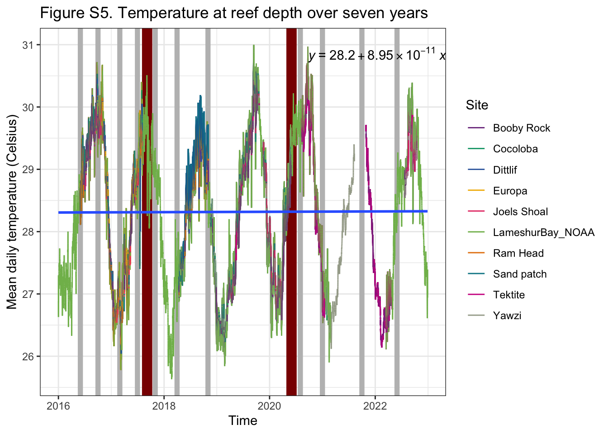

```r
#ggsave("figures/Temp_in_situ.png", width = 8, height = 5, dpi = "retina")
```

# Supplementary Figures S9-11

```r
# Shared is from the section on "How many ASVs were shared?"
# prep the data
ASVshared <- shared %>%
  dplyr::select(.id) %>%
  unique()

ASVshared <- ASVshared$.id # must be a vector

ps.shared.ra <- ps.benthic %>%
  transform_sample_counts(function(x) x / sum(x)) %>%
  subset_taxa(ASV %in% ASVshared) 

ASVorder <- shared %>%
  arrange(Kingdom, desc(Class), Estimate) %>%
  dplyr::select(.id) %>%
  unique()

# plot relative abundance data
shared.ra.long <- ps.shared.ra %>%
  otu_table() %>%
  as_tibble() %>%
  left_join(as_tibble(tax_table(ps.shared.ra)), by = ".otu") %>%
  left_join(as_tibble(sample_data(ps.shared.ra)), by = ".sample") %>%
  mutate(genusasv = paste0(Genus, "_(", .otu, ")")) %>%
  mutate(.otu = factor(.otu, levels = as.vector(ASVorder$.id))) %>%
  mutate(genusasv = factor(genusasv, levels = as.vector(genusASVorder$genusasv))) %>% 
  mutate(Class = factor(Class, levels = c("Alphaproteobacteria", "Bacteroidia", "Bdellovibrionia",
                                                "Cyanobacteriia", "Dehalococcoidia", 
                                                "Gammaproteobacteria", 
                                                "Unclassified Marinimicrobia (SAR406 clade) (Phylum)",
                                                "Unclassified SAR324 clade(Marine group B) (Phylum)",
                                                "Verrucomicrobiae", 
                                                "Thermoplasmata")))

# remove bacteroidia and cyanobacteriia
nobactcyano <- shared.ra.long %>% 
  filter(Class != "Bacteroidia") %>% 
  filter(Class != "Cyanobacteriia")

ggplot(nobactcyano, aes(x = disturbance, y = .abundance)) +
  geom_boxplot(outlier.shape = NA) +
  geom_jitter(position = position_jitter(width=.1, height=0), aes(color = disturbance), size = 3, alpha = 0.7)+
  facet_wrap(~ Class + genusasv, ncol = 4, scales = "free_y") +
  labs(y = "Relative abundance", x = "Disturbance", color = "Disturbance", title = "Figure S9") +
  scale_color_brewer(palette = "Dark2") +
  theme(panel.grid.minor = element_blank(), 
        panel.background = element_blank(),
        legend.position = "none") +
  theme(axis.text.x = element_text(angle = 45, hjust = 1, vjust = 1))
```

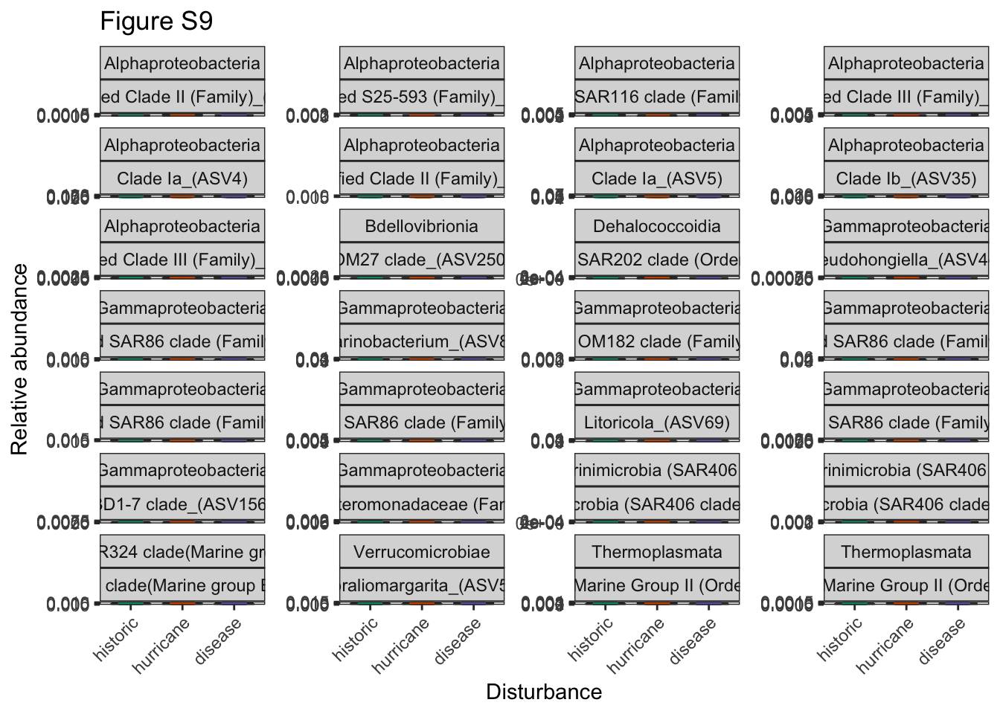

```r
# PLot the differentially abunant bacteroidia
Bacters <- shared.ra.long %>%
  filter(Class == "Bacteroidia") %>%
  mutate(date = as.Date(date)) 

Bacters$genusasv <- factor(Bacters$genusasv, levels = c("NS5 marine group_(ASV100)",
                                               "NS5 marine group_(ASV59)",
                                               "NS5 marine group_(ASV273)",
                                               "NS4 marine group_(ASV14)",
                                               "Tenacibaculum_(ASV268)",
                                               "Unclassified Cryomorphaceae (Family)_(ASV187)"))

ggplot(Bacters, aes(x = disturbance, y = .abundance)) +
  geom_boxplot(outlier.shape = NA) +
  geom_jitter(position = position_jitter(width=.1, height=0), aes(color = disturbance), size = 3, alpha = 0.7)+
  facet_wrap(~ genusasv, ncol = 3, scales = "free_y") +
  labs(y = "Relative abundance", x = "Disturbance", color = "Genus", title = "Figure S10. Bacteroidia significantly changed with disturbances") +
  scale_color_brewer(palette = "Dark2") +
  theme(panel.grid.minor = element_blank(), 
        panel.background = element_blank()) +
  theme(axis.text.x = element_text(angle = 45, hjust = 1, vjust = 1))
```

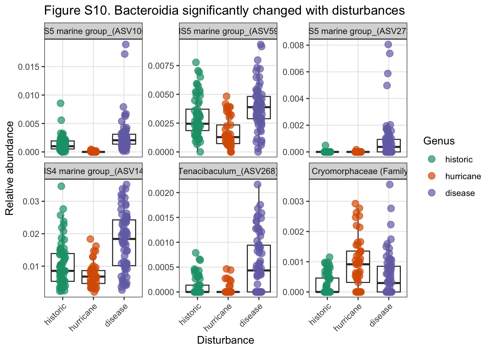

```r
# Plot the differentially abundant cyanobacteria
cyanos <- shared.ra.long %>%
  filter(Class == "Cyanobacteriia") %>%
  mutate(date = as.Date(date)) 

cyanos$genusasv <- factor(cyanos$genusasv, levels = c("Synechococcus CC9902_(ASV44)",
                                               "Synechococcus CC9902_(ASV140)",
                                               "Synechococcus CC9902_(ASV248)",
                                               "Synechococcus CC9902_(ASV24)",
                                               "Prochlorococcus MIT9313_(ASV2)",
                                               "Prochlorococcus MIT9313_(ASV15)",
                                               "Unclassified Cyanobiaceae (Family)_(ASV106)"))

ggplot(cyanos, aes(x = disturbance, y = .abundance)) +
  geom_boxplot(outlier.shape = NA) +
  geom_jitter(position = position_jitter(width=.1, height=0), aes(color = disturbance), size = 3, alpha = 0.7)+
  facet_wrap(~ genusasv, ncol = 4, scales = "free_y") +
  labs(y = "Relative abundance", x = "Disturbance", color = "Genus", title = "Figure S11. Cyanobacteria significantly changed with disturbances") +
  scale_color_brewer(palette = "Dark2") +
  theme(panel.grid.minor = element_blank(), 
        panel.background = element_blank()) +
  theme(axis.text.x = element_text(angle = 45, hjust = 1, vjust = 1))
```

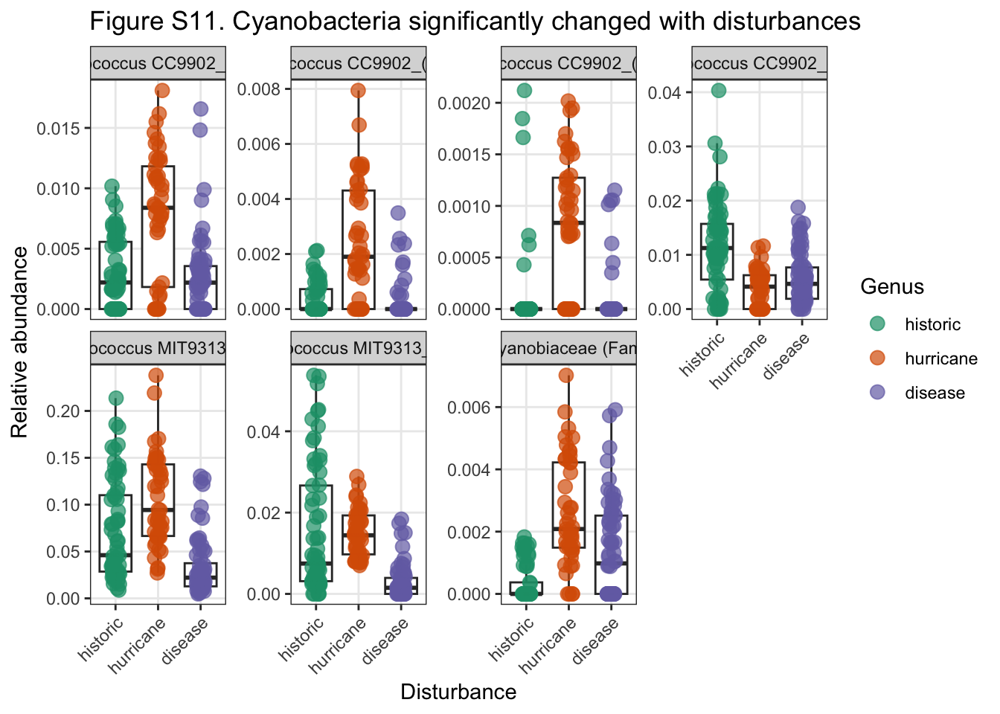

# Supplementary Figure S12 - Precipitation

```r
precip2016to2022 <- precip %>% 
  mutate(DATE =  as.Date(DATE, "%Y-%m-%d")) %>%
  filter(between(DATE, as.Date("2016-01-15"), as.Date("2022-12-15")))

ggplot(precip2016to2022, aes(x = DATE, y = PRCP)) +
  geom_vline(xintercept = as.Date("2017-09-06"), colour = "darkred", linewidth = 4, alpha = 0.8) + # hurricane
  geom_vline(xintercept = as.Date("2020-06-01"), colour = "darkred", linewidth = 4, alpha = 0.8) + # disease emergence
  geom_vline(xintercept = as.Date("2016-06-01"), colour = "gray", linewidth = 2) +
  geom_vline(xintercept = as.Date("2016-10-01"), colour = "gray", linewidth = 2) +
  geom_vline(xintercept = as.Date("2017-03-01"), colour = "gray", linewidth = 2) +
  geom_vline(xintercept = as.Date("2017-07-01"), colour = "gray", linewidth = 2) +
  geom_vline(xintercept = as.Date("2017-11-01"), colour = "gray", linewidth = 2) +
  geom_vline(xintercept = as.Date("2018-04-01"), colour = "gray", linewidth = 2) +
  geom_vline(xintercept = as.Date("2018-11-01"), colour = "gray", linewidth = 2) +
  geom_vline(xintercept = as.Date("2020-08-01"), colour = "gray", linewidth = 2) +
  geom_vline(xintercept = as.Date("2021-01-01"), colour = "gray", linewidth = 2) +
  geom_vline(xintercept = as.Date("2021-10-01"), colour = "gray", linewidth = 2) +
  geom_vline(xintercept = as.Date("2022-06-01"), colour = "gray", linewidth = 2) +
  geom_line(color = "darkblue", linewidth = 1.5) +
  labs(x = "Date", y = "Precipitation", title = "Figure S12. Monthly precipitation at East End, US Virgin Islands")
```

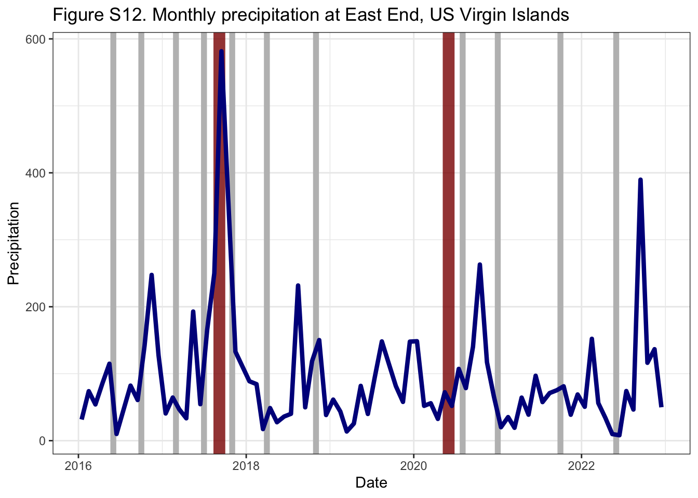


# Bonus Supplementary Figures - Not referenced in the text

```r
benthic.forFigures <- env.long.olrm %>%
  filter(datatype %in% benthic_vars) %>%
  drop_na(value) %>%
  mutate(datatype = factor(datatype, levels = 
                             c("Ramicrusta","TurfAlgae","Macroalgae","HardCoral","SoftCoral")))
# faceted by reef
ggplot(benthic.forFigures, aes(x = disturbance, y = value)) +
  geom_boxplot(outlier.shape = NA) +
  geom_jitter(position = position_jitter(width=.1, height=0), aes(colour = disturbance), size = 3, alpha = 0.7) +
  labs(y = "Relative cover", x = "Disturbance event", color = "Disturbance", title = "Supplementary Figure S14") +
  theme(axis.text.x = element_text(angle = 45, hjust = 1, vjust = 1)) +
  scale_color_brewer(palette = "Dark2") +
  facet_grid(datatype ~ site, scales = "free_y")
```

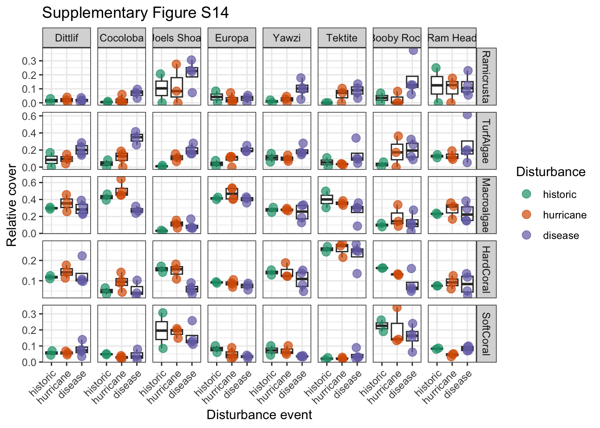

```r
# all values over time (color by reef)
ggplot(benthic.forFigures, aes(x = Date, y = value, color = site)) +
  geom_vline(xintercept = as.POSIXct(as.Date("2017-09-06")), colour = "gray", linewidth = 3) + # Irma and Maria
  geom_vline(xintercept = as.POSIXct(as.Date("2020-06-01")), colour = "gray", linewidth = 3) + # Bleaching event
  geom_point(aes(shape = disturbance), data = benthic.forFigures, size = 4, alpha = 0.8) +
  geom_line(linewidth = 1.2) +
  scale_color_carto_d(palette = "Safe") +
  facet_wrap( ~ datatype, scales = "free_y", ncol = 3) +
  labs(y = "Relative cover", x = "Date", color = "Reef", shape = "Disturbance", title = "Supplementary Figure S15")
```

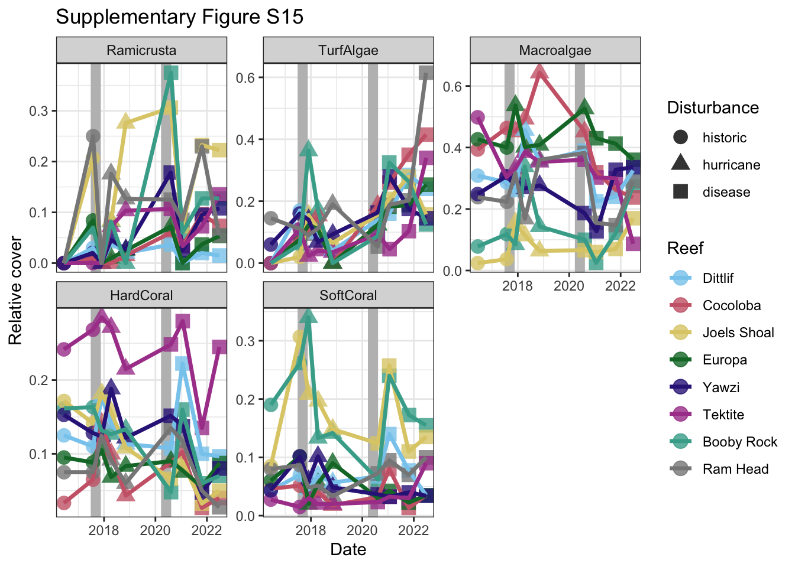

```r
nuts.forFigures <- env.long.olrm %>%
  filter(datatype %in% nuts_vars) %>%
  drop_na(value) %>%
  mutate(datatype = factor(datatype, levels = c("nh4_um","TON","Chl_ug_per_l","po4_um","silicate_um", "npoc_um","no2_um", "no3_um")))

# faceted by reef
ggplot(nuts.forFigures, aes(x = disturbance, y = value)) +
  geom_boxplot(outlier.shape = NA) +
  geom_jitter(position = position_jitter(width=.1, height=0), aes(colour = disturbance, shape = depthtype), size = 3, alpha = 0.7) +
  labs(y = "Concentration", x = "Disturbance event", color = "Disturbance", title = "Supplementary Figure S16") +
  theme(axis.text.x = element_text(angle = 45, hjust = 1, vjust = 1)) +
  scale_color_brewer(palette = "Dark2") +
  facet_grid(datatype ~ site, scales = "free_y")
```

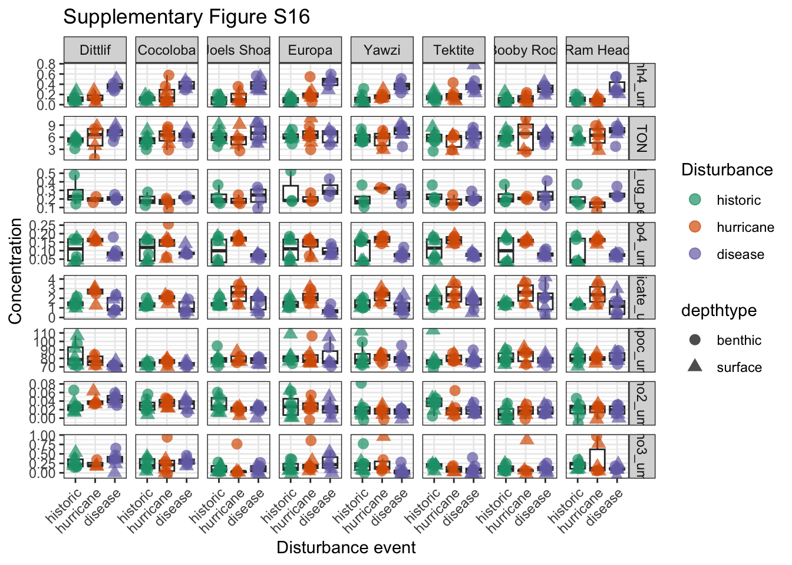

```r
# all values over time (color by reef)
ggplot(nuts.forFigures, aes(x = Date, y = value, color = site)) +
  geom_vline(xintercept = as.POSIXct(as.Date("2017-09-06")), colour = "gray", linewidth = 3) + # Irma and Maria
  geom_vline(xintercept = as.POSIXct(as.Date("2020-06-01")), colour = "gray", linewidth = 3) + # Bleaching event
  geom_point(aes(shape = depthtype), data = nuts.forFigures, size = 4, alpha = 0.8) +
  geom_line(linewidth = 1.2) +
  scale_color_carto_d(palette = "Safe") +
  facet_wrap( ~ datatype, scales = "free_y", ncol = 4) +
  ggtitle("Supplementary Figure S17")
```

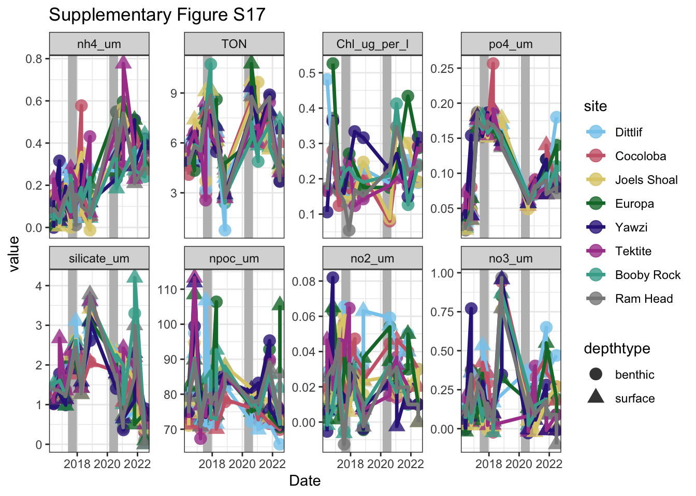

```r
cells.forFigures <- env.long.olrm %>%
  filter(datatype %in% cells_vars) %>%
  drop_na(value) %>%
  mutate(datatype = factor(datatype, levels = c("pro_per_ml","peuk_per_ml","syn_per_ml","hbact_per_ml","biomassRatio")))

# faceted by reef
ggplot(cells.forFigures, aes(x = disturbance, y = value)) +
  geom_boxplot(outlier.shape = NA) +
  geom_jitter(position = position_jitter(width=.1, height=0), aes(colour = disturbance, shape = depthtype), size = 3, alpha = 0.7) +
  labs(y = "Abundance (cells per milliliter)", x = "Disturbance event", color = "Disturbance", title = "Supplementary Figure S18") +
  theme(axis.text.x = element_text(angle = 45, hjust = 1, vjust = 1)) +
  scale_color_brewer(palette = "Dark2") +
  facet_grid(datatype ~ site, scales = "free_y")
```

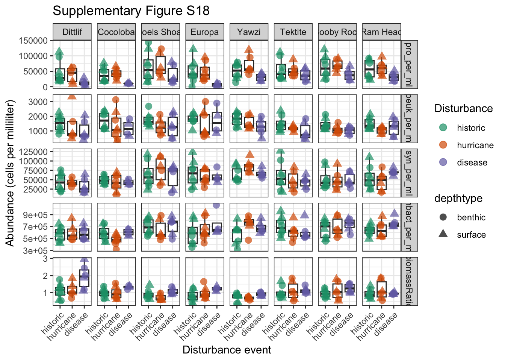

```r
# all values over time (color by reef)
ggplot(cells.forFigures, aes(x = Date, y = value, color = site)) +
  geom_vline(xintercept = as.POSIXct(as.Date("2017-09-06")), colour = "gray", linewidth = 3) + # Irma and Maria
  geom_vline(xintercept = as.POSIXct(as.Date("2020-06-01")), colour = "gray", linewidth = 3) + # Bleaching event
  geom_point(aes(shape = depthtype), data = cells.forFigures, size = 4, alpha = 0.8) +
  geom_line(linewidth = 1.2) +
  scale_color_carto_d(palette = "Safe") +
  facet_wrap( ~ datatype, scales = "free_y", ncol = 3) +
  labs(y = "Abundance (cells per milliliter)", shape = "Depth", color = "Reef", title = "Supplementary Figure S19") 
```

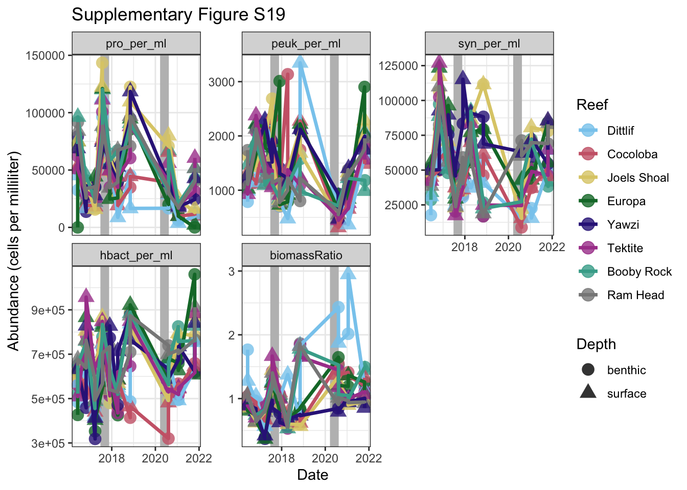

